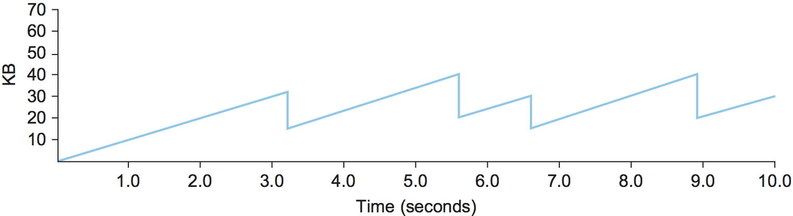
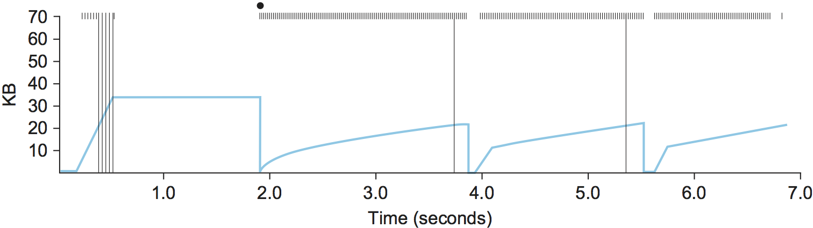

Chapter 3:  Original Algorithm
==============================

This chapter describes the predominant example of end-to-end
congestion control in use today, that implemented by TCP. The
essential strategy of TCP is to send packets into the network without
a reservation and then to react to observable events that occur. TCP
assumes only FIFO queuing in the network’s routers, but also works
with fair queuing.

TCP congestion control was introduced into the Internet in the late
1980s by Van Jacobson, roughly eight years after the TCP/IP protocol
stack had become operational. Immediately preceding this time, the
Internet was suffering from congestion collapse—hosts would send their
packets into the Internet as fast as the advertised window would allow,
congestion would occur at some router (causing packets to be dropped),
and the hosts would time out and retransmit their packets, resulting in
even more congestion.

Broadly speaking, the idea of TCP congestion control is for each source
to determine how much capacity is available in the network, so that it
knows how many packets it can safely have in transit. Once a given
source has this many packets in transit, it uses the arrival of an ACK
as a signal that one of its packets has left the network and that it is
therefore safe to insert a new packet into the network without adding to
the level of congestion. By using ACKs to pace the transmission of
packets, TCP is said to be *self-clocking*. Of course, determining the
available capacity in the first place is no easy task. To make matters
worse, because other connections come and go, the available bandwidth
changes over time, meaning that any given source must be able to adjust
the number of packets it has in transit. This section describes the
algorithms used by TCP to address these and other problems.

Note that, although we describe the TCP congestion-control mechanisms
one at a time, thereby giving the impression that we are talking about
three independent mechanisms, it is only when they are taken as a whole
that we have TCP congestion control. Also, while we are going to begin
here with the variant of TCP congestion control most often referred to
as *standard TCP*, we will see that there are actually quite a few
variants of TCP congestion control in use today, and researchers
continue to explore new approaches to addressing this problem. Some of
these new approaches are discussed below.

3.1 Adaptive Retransmission
---------------------------

*[Although arguably independent of congestion control, this topic
is probably best discussed here (as opposed to Chapter 2), although we
could move the original approach there.]*

Because TCP guarantees the reliable delivery of data, it retransmits
each segment if an ACK is not received in a certain period of time. TCP
sets this timeout as a function of the RTT it expects between the two
ends of the connection. Unfortunately, given the range of possible RTTs
between any pair of hosts in the Internet, as well as the variation in
RTT between the same two hosts over time, choosing an appropriate
timeout value is not that easy. To address this problem, TCP uses an
adaptive retransmission mechanism. We now describe this mechanism and
how it has evolved over time as the Internet community has gained more
experience using TCP.

Original Algorithm
~~~~~~~~~~~~~~~~~~

We begin with a simple algorithm for computing a timeout value between a
pair of hosts. This is the algorithm that was originally described in
the TCP specification—and the following description presents it in those
terms—but it could be used by any end-to-end protocol.

The idea is to keep a running average of the RTT and then to compute
the timeout as a function of this RTT. Specifically, every time TCP
sends a data segment, it records the time. When an ACK for that
segment arrives, TCP reads the time again, and then takes the
difference between these two times as a ``SampleRTT``. TCP then
computes an ``EstimatedRTT`` as a weighted average between the
previous estimate and this new sample. That is,

::

   EstimatedRTT = alpha x EstimatedRTT + (1 - alpha) x SampleRTT

The parameter ``alpha`` is selected to *smooth* the
``EstimatedRTT``. A small ``alpha`` tracks changes in the RTT but is
perhaps too heavily influenced by temporary fluctuations. On the other
hand, a large ``alpha`` is more stable but perhaps not quick enough to
adapt to real changes. The original TCP specification recommended a
setting of ``alpha`` between 0.8 and 0.9. TCP then uses
``EstimatedRTT`` to compute the timeout in a rather conservative way:

::

   TimeOut = 2 x EstimatedRTT

Karn/Partridge Algorithm
~~~~~~~~~~~~~~~~~~~~~~~~

After several years of use on the Internet, a rather obvious flaw was
discovered in this simple algorithm. The problem was that an ACK does
not really acknowledge a transmission; it actually acknowledges the
receipt of data. In other words, whenever a segment is retransmitted
and then an ACK arrives at the sender, it is impossible to determine
if this ACK should be associated with the first or the second
transmission of the segment for the purpose of measuring the sample
RTT. It is necessary to know which transmission to associate it with
so as to compute an accurate ``SampleRTT``. As illustrated in
:numref:`Figure %s <fig-tcp-karn>`, if you assume that the ACK is for
the original transmission but it was really for the second, then the
``SampleRTT`` is too large (a); if you assume that the ACK is for the
second transmission but it was actually for the first, then the
``SampleRTT`` is too small (b).

.. _fig-tcp-karn:
.. figure:: figures/f05-10-9780123850591.png
   :width: 500px
   :align: center

   Associating the ACK with (a) original transmission
   versus (b) retransmission.

The solution, which was proposed in 1987, is surprisingly simple.
Whenever TCP retransmits a segment, it stops taking samples of the RTT;
it only measures ``SampleRTT`` for segments that have been sent only
once. This solution is known as the Karn/Partridge algorithm, after its
inventors. Their proposed fix also includes a second small change to
TCP’s timeout mechanism. Each time TCP retransmits, it sets the next
timeout to be twice the last timeout, rather than basing it on the last
``EstimatedRTT``. That is, Karn and Partridge proposed that TCP use
exponential backoff, similar to what the Ethernet does. The motivation
for using exponential backoff is simple: Congestion is the most likely
cause of lost segments, meaning that the TCP source should not react too
aggressively to a timeout. In fact, the more times the connection times
out, the more cautious the source should become. We will see this idea
again, embodied in a much more sophisticated mechanism, in the next
chapter.

Jacobson/Karels Algorithm
~~~~~~~~~~~~~~~~~~~~~~~~~

The Karn/Partridge algorithm was introduced at a time when the Internet
was suffering from high levels of network congestion. Their approach was
designed to fix some of the causes of that congestion, but, although it
was an improvement, the congestion was not eliminated. The following
year (1988), two other researchers—Jacobson and Karels—proposed a more
drastic change to TCP to battle congestion. The bulk of that proposed
change is described in the next chapter. Here, we focus on the aspect of
that proposal that is related to deciding when to time out and
retransmit a segment.

As an aside, it should be clear how the timeout mechanism is related to
congestion—if you time out too soon, you may unnecessarily retransmit a
segment, which only adds to the load on the network. The other reason
for needing an accurate timeout value is that a timeout is taken to
imply congestion, which triggers a congestion-control mechanism.
Finally, note that there is nothing about the Jacobson/Karels timeout
computation that is specific to TCP. It could be used by any end-to-end
protocol.

The main problem with the original computation is that it does not take
the variance of the sample RTTs into account. Intuitively, if the
variation among samples is small, then the ``EstimatedRTT`` can be
better trusted and there is no reason for multiplying this estimate by 2
to compute the timeout. On the other hand, a large variance in the
samples suggests that the timeout value should not be too tightly
coupled to the ``EstimatedRTT``.

In the new approach, the sender measures a new ``SampleRTT`` as before.
It then folds this new sample into the timeout calculation as follows:

::

   Difference = SampleRTT - EstimatedRTT
   EstimatedRTT = EstimatedRTT + ( delta x Difference)
   Deviation = Deviation + delta (|Difference| - Deviation)

where ``delta`` is between 0 and 1. That is, we calculate both the
mean RTT and the variation in that mean.

TCP then computes the timeout value as a function of both
``EstimatedRTT`` and ``Deviation`` as follows:

::

   TimeOut = mu x EstimatedRTT + phi x Deviation

where based on experience, ``mu`` is typically set to 1 and ``phi`` is
set to 4.  Thus, when the variance is small, ``TimeOut`` is close to
``EstimatedRTT``; a large variance causes the ``Deviation`` term to
dominate the calculation.

Implementation
~~~~~~~~~~~~~~

There are two items of note regarding the implementation of timeouts in
TCP. The first is that it is possible to implement the calculation for
``EstimatedRTT`` and ``Deviation`` without using floating-point
arithmetic. Instead, the whole calculation is scaled by 2\ :sup:`n`, 
with delta selected to be 1/2\ :sup:`n`. This allows us to do integer 
arithmetic, implementing multiplicationand division using shifts, 
thereby achieving higher performance. The resulting calculation is given 
by the following code fragment, where n=3
(i.e., ``delta = 1/8``). Note that ``EstimatedRTT`` and ``Deviation`` are
stored in their scaled-up forms, while the value of ``SampleRTT`` at the
start of the code and of ``TimeOut`` at the end are real, unscaled
values. If you find the code hard to follow, you might want to try
plugging some real numbers into it and verifying that it gives the same
results as the equations above.

::

   {
       SampleRTT -= (EstimatedRTT >> 3);
       EstimatedRTT += SampleRTT;
       if (SampleRTT < 0)
           SampleRTT = -SampleRTT;
       SampleRTT -= (Deviation >> 3);
       Deviation += SampleRTT;
       TimeOut = (EstimatedRTT >> 3) + (Deviation >> 1);
   }

The second point of note is that the Jacobson/Karels algorithm is only
as good as the clock used to read the current time. On typical Unix
implementations at the time, the clock granularity was as large as
500 ms, which is significantly larger than the average cross-country RTT
of somewhere between 100 and 200 ms. To make matters worse, the Unix
implementation of TCP only checked to see if a timeout should happen
every time this 500-ms clock ticked and would only take a sample of the
round-trip time once per RTT. The combination of these two factors could
mean that a timeout would happen 1 second after the segment was
transmitted. Once again, the extensions to TCP include a mechanism that
makes this RTT calculation a bit more precise.

All of the retransmission algorithms we have discussed are based on
acknowledgment timeouts, which indicate that a segment has probably been
lost. Note that a timeout does not, however, tell the sender whether any
segments it sent after the lost segment were successfully received. This
is because TCP acknowledgments are cumulative; they identify only the
last segment that was received without any preceding gaps. The reception
of segments that occur after a gap grows more frequent as faster
networks lead to larger windows. If ACKs also told the sender which
subsequent segments, if any, had been received, then the sender could be
more intelligent about which segments it retransmits, draw better
conclusions about the state of congestion, and make better RTT
estimates. A TCP extension supporting this is described in a later
section.

.. _key-open-source:
.. admonition::  Key Takeaway

   There is one other point to make about computing timeouts. It is a
   surprisingly tricky business, so much so, that there is an entire RFC
   dedicated to the topic: `RFC
   6298 <https://tools.ietf.org/html/rfc6298>`__. The takeaway is that
   sometimes fully specifying a protocol involves so much minutiae that
   the line between specification and implementation becomes blurred.
   That has happened more than once with TCP, causing some to argue that
   “the implementation **is** the specification.” But that’s not
   necessarily a bad thing as long as the reference implementation is
   available as open source software. More generally, the industry is
   seeing open source software grow in importance as open standards
   receed in importance.

3.2 Additive Increase/Multiplicative Decrease
---------------------------------------------

TCP maintains a new state variable for each connection, called
``CongestionWindow``, which is used by the source to limit how much data
it is allowed to have in transit at a given time. The congestion window
is congestion control’s counterpart to flow control’s advertised window.
TCP is modified such that the maximum number of bytes of unacknowledged 
data allowed is now the minimum of the congestion window and the
advertised window. Thus, using the variables defined in the previous
chapter, TCP’s effective window is revised as follows:

::

   MaxWindow = MIN(CongestionWindow, AdvertisedWindow)
   EffectiveWindow = MaxWindow -  (LastByteSent - LastByteAcked)

That is, ``MaxWindow`` replaces ``AdvertisedWindow`` in the calculation
of ``EffectiveWindow``. Thus, a TCP source is allowed to send no
faster than the slowest component—the network or the destination
host—can accommodate.

The problem, of course, is how TCP comes to learn an appropriate value
for ``CongestionWindow``. Unlike the ``AdvertisedWindow``, which is sent
by the receiving side of the connection, there is no one to send a
suitable ``CongestionWindow`` to the sending side of TCP. The answer is
that the TCP source sets the ``CongestionWindow`` based on the level of
congestion it perceives to exist in the network. This involves
decreasing the congestion window when the level of congestion goes up
and increasing the congestion window when the level of congestion goes
down. Taken together, the mechanism is commonly called *additive
increase/multiplicative decrease* (AIMD); the reason for this mouthful
of a name will become apparent below.

The key question, then, is how does the source determine that the
network is congested and that it should decrease the congestion window?
The answer is based on the observation that the main reason packets are
not delivered, and a timeout results, is that a packet was dropped due
to congestion. It is rare that a packet is dropped because of an error
during transmission. Therefore, TCP interprets timeouts as a sign of
congestion and reduces the rate at which it is transmitting.
Specifically, each time a timeout occurs, the source sets
``CongestionWindow`` to half of its previous value. This halving of the
``CongestionWindow`` for each timeout corresponds to the “multiplicative
decrease” part of AIMD.

Although ``CongestionWindow`` is defined in terms of bytes, it is
easiest to understand multiplicative decrease if we think in terms of
whole packets. For example, suppose the ``CongestionWindow`` is
currently set to 16 packets. If a loss is detected, ``CongestionWindow``
is set to 8. (Normally, a loss is detected when a timeout occurs, but as
we see below, TCP has another mechanism to detect dropped packets.)
Additional losses cause ``CongestionWindow`` to be reduced to 4, then 2,
and finally to 1 packet. ``CongestionWindow`` is not allowed to fall
below the size of a single packet, or in TCP terminology, the *maximum
segment size* .

.. _fig-linear:
.. figure:: figures/f06-08-9780123850591.png
   :width: 200px
   :align: center

   Packets in transit during additive increase, with one 
   packet being added each RTT.

A congestion-control strategy that only decreases the window size is
obviously too conservative. We also need to be able to increase the
congestion window to take advantage of newly available capacity in the
network. This is the “additive increase” part of AIMD, and it works as
follows. Every time the source successfully sends a
``CongestionWindow``\ ’s worth of packets—that is, each packet sent
out during the last round-trip time (RTT) has been ACKed—it adds the
equivalent of 1 packet to ``CongestionWindow``. This linear increase
is illustrated in :numref:`Figure %s <fig-linear>`. Note that, in
practice, TCP does not wait for an entire window’s worth of ACKs to
add 1 packet’s worth to the congestion window, but instead increments
``CongestionWindow`` by a little for each ACK that
arrives. Specifically, the congestion window is incremented as follows
each time an ACK arrives:

::

   Increment = MSS x (MSS/CongestionWindow)
   CongestionWindow += Increment

That is, rather than incrementing ``CongestionWindow`` by an entire
``MSS`` bytes each RTT, we increment it by a fraction of ``MSS`` every
time an ACK is received. Assuming that each ACK acknowledges the receipt
of ``MSS`` bytes, then that fraction is ``MSS/CongestionWindow``.

.. _fig-sawtooth:

   Typical TCP sawtooth pattern.

This pattern of continually increasing and decreasing the congestion
window continues throughout the lifetime of the connection. In fact,
if you plot the current value of ``CongestionWindow`` as a function of
time, you get a sawtooth pattern, as illustrated in :numref:`Figure %s
<fig-sawtooth>`. The important concept to understand about AIMD is
that the source is willing to reduce its congestion window at a much
faster rate than it is willing to increase its congestion window. This
is in contrast to an additive increase/additive decrease strategy in
which the window would be increased by 1 packet when an ACK arrives
and decreased by 1 when a timeout occurs. It has been shown that AIMD
is a necessary condition for a congestion-control mechanism to be
stable.

An intuitive explanation for why TCP decreases the window aggressively
and increases it conservatively is that the consequences of having too
large a window are compounding. This is because when the window is too
large, packets that are dropped will be retransmitted, making
congestion even worse. It is important to get out of this state quickly.

Finally, since a timeout is an indication of congestion that triggers
multiplicative decrease, TCP needs the most accurate timeout mechanism
it can afford. We already covered TCP’s timeout mechanism in an earlier
chapter, so we do not repeat it here. The two main things to remember
about that mechanism are that (1) timeouts are set as a function of both
the average RTT and the standard deviation in that average, and (2) due
to the cost of measuring each transmission with an accurate clock, TCP
only samples the round-trip time once per RTT (rather than once per
packet) using a coarse-grained (500-ms) clock.

3.3 Slow Start
--------------

The additive increase mechanism just described is the right approach to
use when the source is operating close to the available capacity of the
network, but it takes too long to ramp up a connection when it is
starting from scratch. TCP therefore provides a second mechanism,
ironically called *slow start*, which is used to increase the congestion
window rapidly from a cold start. Slow start effectively increases the
congestion window exponentially, rather than linearly.

Specifically, the source starts out by setting ``CongestionWindow`` to
one packet. When the ACK for this packet arrives, TCP adds 1 to
``CongestionWindow`` and then sends two packets. Upon receiving the
corresponding two ACKs, TCP increments ``CongestionWindow`` by 2—one
for each ACK—and next sends four packets. The end result is that TCP
effectively doubles the number of packets it has in transit every RTT.
:numref:`Figure %s <fig-exponential>` shows the growth in the number
of packets in transit during slow start. Compare this to the linear
growth of additive increase illustrated in :numref:`Figure %s
<fig-linear>`.

.. _fig-exponential:
.. figure:: figures/f06-10-9780123850591.png
   :width: 200px
   :align: center

   Packets in transit during slow start.

Why any exponential mechanism would be called “slow” is puzzling at
first, but it can be explained if put in the proper historical context.
We need to compare slow start not against the linear mechanism of the
previous subsection, but against the original behavior of TCP. Consider
what happens when a connection is established and the source first
starts to send packets—that is, when it currently has no packets in
transit. If the source sends as many packets as the advertised window
allows—which is exactly what TCP did before slow start was
developed—then even if there is a fairly large amount of bandwidth
available in the  network, the routers may not be able to consume this
burst of packets. It all depends on how much buffer space is available
at the routers. Slow start was therefore designed to space packets out
so that this burst does not occur. In other words, even though its
exponential growth is faster than linear growth, slow start is much
“slower” than sending an entire advertised window’s worth of data all at
once.

There are actually two different situations in which slow start runs.
The first is at the very beginning of a connection, at which time the
source has no idea how many packets it is going to be able to have in
transit at a given time. (Keep in mind that today TCP runs over
everything from 1-Mbps links to 40-Gbps links, so there is no way for
the source to know the network’s capacity.) In this situation, slow
start continues to double ``CongestionWindow`` each RTT until there is a
loss, at which time a timeout causes multiplicative decrease to divide
``CongestionWindow`` by 2.

The second situation in which slow start is used is a bit more subtle;
it occurs when the connection goes dead while waiting for a timeout to
occur. Recall how TCP’s sliding window algorithm works—when a packet is
lost, the source eventually reaches a point where it has sent as much
data as the advertised window allows, and so it blocks while waiting for
an ACK that will not arrive. Eventually, a timeout happens, but by this
time there are no packets in transit, meaning that the source will
receive no ACKs to “clock” the transmission of new packets. The source
will instead receive a single cumulative ACK that reopens the entire
advertised window, but, as explained above, the source then uses slow
start to restart the flow of data rather than dumping a whole window’s
worth of data on the network all at once.

Although the source is using slow start again, it now knows more
information than it did at the beginning of a connection. Specifically,
the source has a current (and useful) value of ``CongestionWindow``;
this is the value of ``CongestionWindow`` that existed prior to the last
packet loss, divided by 2 as a result of the loss. We can think of this
as the *target* congestion window. Slow start is used to rapidly
increase the sending rate up to this value, and then additive increase
is used beyond this point. Notice that we have a small bookkeeping
problem to take care of, in that we want to remember the target
congestion window resulting from multiplicative decrease as well as the
*actual* congestion window being used by slow start. To address this
problem, TCP introduces a temporary variable to store the target window,
typically called ``CongestionThreshold``, that is set equal to the
``CongestionWindow`` value that results from multiplicative decrease.
The variable ``CongestionWindow`` is then reset to one packet, and it is
incremented by one packet for every ACK that is received until it
reaches ``CongestionThreshold``, at which point it is incremented by one
packet per RTT.

In other words, TCP increases the congestion window as defined by the
following code fragment:

.. code-block:: c

   {
       u_int    cw = state->CongestionWindow;
       u_int    incr = state->maxseg;

       if (cw > state->CongestionThreshold)
           incr = incr * incr / cw;
       state->CongestionWindow = MIN(cw + incr, TCP_MAXWIN);
   }

where ``state`` represents the state of a particular TCP connection and
defines an upper bound on how large the congestion window is allowed to
grow.

:numref:`Figure %s <fig-trace1>` traces how TCP’s ``CongestionWindow``
increases and decreases over time and serves to illustrate the
interplay of slow start and additive increase/multiplicative
decrease. This trace was taken from an actual TCP connection and shows
the current value of ``CongestionWindow``—the colored line—over time.

.. _fig-trace1:

   Behavior of TCP congestion control. Colored line = value
   of CongestionWindow over time; solid bullets at top of graph
   = timeouts; hash marks at top of graph = time when each packet is
   transmitted; vertical bars = time when a packet that was
   eventually retransmitted was first transmitted.

There are several things to notice about this trace. The first is the
rapid increase in the congestion window at the beginning of the
connection. This corresponds to the initial slow start phase. The slow
start phase continues until several packets are lost at about 0.4
seconds into the connection, at which time ``CongestionWindow`` flattens
out at about 34 KB. (Why so many packets are lost during slow start is
discussed below.) The reason why the congestion window flattens is that
there are no ACKs arriving, due to the fact that several packets were
lost. In fact, no new packets are sent during this time, as denoted by
the lack of hash marks at the top of the graph. A timeout eventually
happens at approximately 2 seconds, at which time the congestion window
is divided by 2 (i.e., cut from approximately 34 KB to around 17 KB) and
``CongestionThreshold`` is set to this value. Slow start then causes
``CongestionWindow`` to be reset to one packet and to start ramping up
from there.

There is not enough detail in the trace to see exactly what happens when
a couple of packets are lost just after 2 seconds, so we jump ahead to
the linear increase in the congestion window that occurs between 2 and
4 seconds. This corresponds to additive increase. At about 4 seconds,
``CongestionWindow`` flattens out, again due to a lost packet. Now, at
about 5.5 seconds:

1. A timeout happens, causing the congestion window to be divided by 2,
   dropping it from approximately 22 KB to 11 KB, and
   ``CongestionThreshold`` is set to this amount.

2. ``CongestionWindow`` is reset to one packet, as the sender enters
   slow start.

3. Slow start causes ``CongestionWindow`` to grow exponentially until it
   reaches ``CongestionThreshold``.

4. ``CongestionWindow`` then grows linearly.

The same pattern is repeated at around 8 seconds when another timeout
occurs.

We now return to the question of why so many packets are lost during the
initial slow start period. At this point, TCP is attempting to learn how
much bandwidth is available on the network. This is a difficult
task. If the source is not aggressive at this stage—for example, if it
only increases the congestion window linearly—then it takes a long time
for it to discover how much bandwidth is available. This can have a
dramatic impact on the throughput achieved for this connection. On the
other hand, if the source is aggressive at this stage, as TCP is during
exponential growth, then the source runs the risk of having half a
window’s worth of packets dropped by the network.

To see what can happen during exponential growth, consider the situation
in which the source was just able to successfully send 16 packets
through the network, causing it to double its congestion window to 32.
Suppose, however, that the network happens to have just enough capacity
to support 16 packets from this source. The likely result is that 16 of
the 32 packets sent under the new congestion window will be dropped by
the network; actually, this is the worst-case outcome, since some of the
packets will be buffered in some router. This problem will become
increasingly severe as the delay × bandwidth product of networks
increases. For example, a delay × bandwidth product of 500 KB means that
each connection has the potential to lose up to 500 KB of data at the
beginning of each connection. Of course, this assumes that both the
source and the destination implement the “big windows” extension.

Alternatives to slow start, whereby the source tries to estimate the
available bandwidth by more sophisticated means, have also been
explored. One example is called *quick-start*. The basic idea is that a
TCP sender can ask for an initial sending rate greater than slow start
would allow by putting a requested rate in its SYN packet as an IP
option. Routers along the path can examine the option, evaluate the
current level of congestion on the outgoing link for this flow, and
decide if that rate is acceptable, if a lower rate would be acceptable,
or if standard slow start should be used. By the time the SYN reaches
the receiver, it will contain either a rate that was acceptable to all
routers on the path or an indication that one or more routers on the
path could not support the quick-start request. In the former case, the
TCP sender uses that rate to begin transmission; in the latter case, it
falls back to standard slow start. If TCP is allowed to start off
sending at a higher rate, a session could more quickly reach the point
of filling the pipe, rather than taking many round-trip times to do so.

Clearly one of the challenges to this sort of enhancement to TCP is that
it requires substantially more cooperation from the routers than
standard TCP does. If a single router in the path does not support
quick-start, then the system reverts to standard slow start. Thus, it
could be a long time before these types of enhancements could make it
into the Internet; for now, they are more likely to be used in
controlled network environments (e.g., research networks).

3.4 Fast Retransmit and Fast Recovery
-------------------------------------

The mechanisms described so far were part of the original proposal to
add congestion control to TCP. It was soon discovered, however, that the
coarse-grained implementation of TCP timeouts led to long periods of
time during which the connection went dead while waiting for a timer to
expire. Because of this, a new mechanism called *fast retransmit* was
added to TCP. Fast retransmit is a heuristic that sometimes triggers the
retransmission of a dropped packet sooner than the regular timeout
mechanism. The fast retransmit mechanism does not replace regular
timeouts; it just enhances that facility.

The idea of fast retransmit is straightforward. Every time a data packet
arrives at the receiving side, the receiver responds with an
acknowledgment, even if this sequence number has already been
acknowledged. Thus, when a packet arrives out of order—when TCP cannot
yet acknowledge the data the packet contains because earlier data has
not yet arrived—TCP resends the same acknowledgment it sent the last
time. This second transmission of the same acknowledgment is called a
*duplicate ACK*. When the sending side sees a duplicate ACK, it knows
that the other side must have received a packet out of order, which
suggests that an earlier packet might have been lost. Since it is also
possible that the earlier packet has only been delayed rather than lost,
the sender waits until it sees some number of duplicate ACKs and then
retransmits the missing packet. In practice, TCP waits until it has seen
three duplicate ACKs before retransmitting the packet.

.. _fig-tcp-fast:
.. figure:: figures/f06-12-9780123850591.png
   :width: 300px
   :align: center

   Fast retransmit based on duplicate ACKs.

:numref:`Figure %s <fig-tcp-fast>` illustrates how duplicate ACKs lead
to a fast retransmit. In this example, the destination receives
packets 1 and 2, but packet 3 is lost in the network. Thus, the
destination will send a duplicate ACK for packet 2 when packet 4
arrives, again when packet 5 arrives, and so on. (To simplify this
example, we think in terms of packets 1, 2, 3, and so on, rather than
worrying about the sequence numbers for each byte.) When the sender
sees the third duplicate ACK for packet 2—the one sent because the
receiver had gotten packet 6—it retransmits packet 3. Note that when
the retransmitted copy of packet 3 arrives at the destination, the
receiver then sends a cumulative ACK for everything up to and
including packet 6 back to the source.

.. _fig-trace2:

   Trace of TCP with fast retransmit. Colored line 
   = CongestionWindow; solid bullet = timeout; hash marks = time 
   when each packet is transmitted; vertical bars = time when a 
   packet that was eventually retransmitted was first 
   transmitted.

:numref:`Figure %s <fig-trace2>` illustrates the behavior of a version
of TCP with the fast retransmit mechanism. It is interesting to
compare this trace with that given in :numref:`Figure %s
<fig-trace1>`, where fast retransmit was not implemented—the long
periods during which the congestion window stays flat and no packets
are sent has been eliminated. In general, this technique is able to
eliminate about half of the coarse-grained timeouts on a typical TCP
connection, resulting in roughly a 20% improvement in the throughput
over what could otherwise have been achieved. Notice, however, that
the fast retransmit strategy does not eliminate all coarse-grained
timeouts. This is because for a small window size there will not be
enough packets in transit to cause enough duplicate ACKs to be
delivered. Given enough lost packets—for example, as happens during
the initial slow start phase—the sliding window algorithm eventually
blocks the sender until a timeout occurs. In practice, TCP’s fast
retransmit mechanism can detect up to three dropped packets per
window.

Finally, there is one last improvement we can make. When the fast
retransmit mechanism signals congestion, rather than drop the
congestion window all the way back to one packet and run slow start,
it is possible to use the ACKs that are still in the pipe to clock the
sending of packets. This mechanism, which is called *fast recovery*,
effectively removes the slow start phase that happens between when
fast retransmit detects a lost packet and additive increase
begins. For example, fast recovery avoids the slow start period
between 3.8 and 4 seconds in :numref:`Figure %s <fig-trace2>` and
instead simply cuts the congestion window in half (from 22 KB to
11 KB) and resumes additive increase. In other words, slow start is
only used at the beginning of a connection and whenever a
coarse-grained timeout occurs. At all other times, the congestion
window is following a pure additive increase/multiplicative decrease
pattern.

