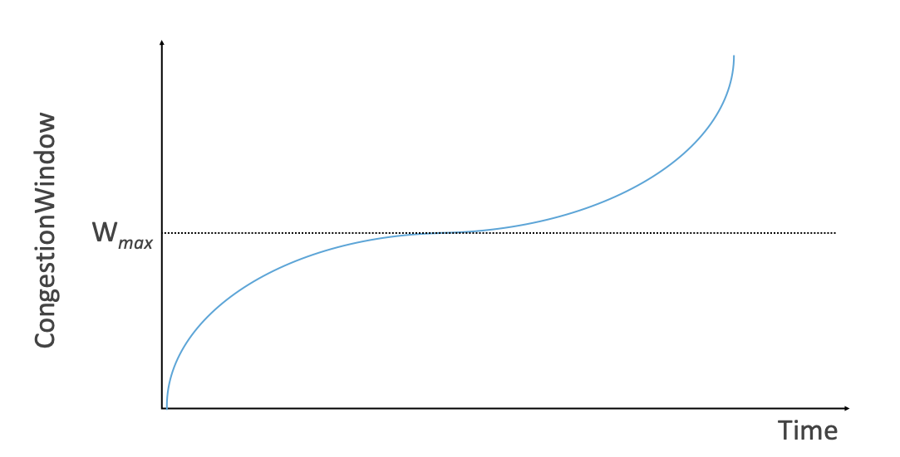

Chapter 4:  Control-Based Algorithms
====================================
	
This chapter describes the dominant congestion-control algorithm in
use today on the Internet. The approach was introduced in 1988 by Van
Jacobson and Mike Karels, and refined multiple times over the years.
The variant in widespread use today is called CUBIC, for reasons that
will become clear at the end of the chapter.

The general idea is straightforward. Having transmitted a set of
packets according to its current estimate of the available bandwidth,
a TCP sender reacts to two "signals" from the network. On the one
hand, the arrival of an ACK signals that one of its packets
has left the network and that it is therefore safe to transmit a new
packet without adding to the level of congestion.  By using ACKs to
pace the transmission of packets, TCP is said to be *self-clocking*.
On the other hand, a timeout signals that a packet was lost, implying that the network is congested,
and thus TCP needs to reduce its sending rate. Because using packet
loss as a signal means congestion has already occurred and we are
reacting after the fact, we refer to this approach as
*control-based*.

There are many subtle issues that must be addressed to make this a
practical approach to congestion control.  This chapter describes the
collection of techniques that address these issues, and as such, can
be read as a case study of the experience of identifying and solving a
sequence of problems. We will trace the historical context as we visit
each of the techniques in the sections that follow.

4.1 Timeout Calculation
-----------------------

Timeouts and retransmissions are a central part TCP's approach to
implementing a reliable byte-stream, but timeouts also play a key role
in congestion control because they signal packet loss, which in turn
indicates the likelihood of congestion. In other words, TCP's timeout
mechanism is a building block for its overall approach to congestion
control.

Note that a timeout can happen because a packet was lost, or
because the corresponding acknowledgment was lost, or because nothing
was lost but the ACK took longer to arrive than we were
expecting. Hence it is important to know how long it might take an ACK
to arrive, because otherwise we risk responding as if there was
congestion when there was not.

TCP has an adaptive approach to setting a timeout, computed as a
function of the measured RTT. As simple as this sounds, the full
implementation is more involved than you might expect, and has
been through multiple refinements over the years. This section
revisits that experience.

4.1.1 Original Algorithm
~~~~~~~~~~~~~~~~~~~~~~~~

We begin with the simple algorithm that was originally described in
the TCP specification.  The idea is to keep a running average of the
RTT and then to compute the timeout as a function of this RTT.
Specifically, every time TCP sends a data segment, it records the
time. When an ACK for that segment arrives, TCP reads the time again,
and then takes the difference between these two times as a
``SampleRTT``. TCP then computes an ``EstimatedRTT`` as a weighted
average between the previous estimate and this new sample. That is,

.. math::

   \mathsf{EstimatedRTT} = \alpha \times \mathsf{EstimatedRTT} + (1 - \alpha{}) \times \mathsf{SampleRTT}

The parameter :math:`\alpha` is selected to *smooth* the
``EstimatedRTT``. A small :math:`\alpha` tracks changes in the RTT but is
perhaps too heavily influenced by temporary fluctuations. On the other
hand, a large :math:`\alpha` is more stable but perhaps not quick enough to
adapt to real changes. The original TCP specification recommended a
setting of :math:`\alpha` between 0.8 and 0.9. TCP then uses
``EstimatedRTT`` to compute the timeout in a rather conservative way:

.. math::

   \mathsf{TimeOut = 2} \times \mathsf{EstimatedRTT}

4.1.2 Karn/Partridge Algorithm
~~~~~~~~~~~~~~~~~~~~~~~~~~~~~~

After several years, a rather obvious flaw was discovered in this
simple approach: An ACK does not really acknowledge a transmission,
but rather, it acknowledges the receipt of data. In other words,
whenever a segment is retransmitted and then an ACK arrives at the
sender, it is impossible to determine if this ACK should be associated
with the first or the second transmission of the segment for the
purpose of measuring the sample RTT.

It is necessary to know which transmission to associate it with so as
to compute an accurate ``SampleRTT``. As illustrated in
:numref:`Figure %s <fig-tcp-karn>`, if you assume that the ACK is for
the original transmission but it was really for the second, then the
``SampleRTT`` is too large (a); if you assume that the ACK is for the
second transmission but it was actually for the first, then the
``SampleRTT`` is too small (b).

.. _fig-tcp-karn:

   Associating the ACK with (a) original transmission
   versus (b) retransmission.

The solution at first looks surprisingly simple. It is known as the
Karn/Partridge algorithm, after its inventors. With this algorithm,
whenever TCP retransmits a segment, it stops taking samples of the
RTT; it only measures ``SampleRTT`` for segments that have been sent
only once.  But the algorithm also includes a second change to TCP’s
timeout mechanism. Each time TCP retransmits, it sets the next timeout
to be twice the last timeout, rather than basing it on the last
``EstimatedRTT``. That is, Karn and Partridge proposed that RTT
estimation uses exponential backoff. The motivation for using
exponential backoff is that timeouts cause retransmission, and
retransmitted segments are no longer contributing to an update in the
RTT estimate. So the idea is to be more cautious in declaring that a
packet has been lost, rather than getting into a possible cycle of
aggressively timing out and then retransmitting.  We will see this
idea of exponential backoff again, embodied in a much
more sophisticated mechanism, in a later section.

4.1.3 Jacobson/Karels Algorithm
~~~~~~~~~~~~~~~~~~~~~~~~~~~~~~~

The Karn/Partridge algorithm was an improvement to RTT estimation, but it did not
eliminate congestion. The 1988 congestion-control mechanism proposed
by Jacobson and Karels includes (along with several other components) a new way to decide when to time out
and retransmit a segment.

The main problem with the original computation is that it does not
take the variance of the sample RTTs into account. Intuitively, if the
variation among samples is small, then the ``EstimatedRTT`` can be
better trusted and there is no reason for multiplying this estimate by
2 to compute the timeout. On the other hand, a large variance in the
samples suggests that the timeout value should not be too tightly
coupled to the ``EstimatedRTT``.

In the new approach, the sender measures a new ``SampleRTT`` as before.
It then folds this new sample into the timeout calculation as follows:

.. math:: \mathsf{Difference = SampleRTT - EstimatedRTT}

.. math:: \mathsf{EstimatedRTT = EstimatedRTT} + ( \delta \times \mathsf{Difference)}

.. math:: \mathsf{Deviation = Deviation} + \delta \mathsf{(| Difference | - Deviation)}

where :math:`\delta` is between 0 and 1. That is, we calculate both
the mean RTT and the variation in that mean. TCP then computes the
timeout value as a function of both ``EstimatedRTT`` and ``Deviation``
as follows:

.. math:: \mathsf{TimeOut} = \mu \times \mathsf{EstimatedRTT} + \phi \times \mathsf{Deviation}

where based on experience, :math:`\mu` is typically set to 1 and :math:`\phi` is
set to 4.  Thus, when the variance is small, ``TimeOut`` is close to
``EstimatedRTT``; a large variance causes the ``Deviation`` term to
dominate the calculation.

4.1.4 Implementation
~~~~~~~~~~~~~~~~~~~~

There are two items of note regarding the implementation of timeouts
in TCP. The first is that it is possible to implement the calculation
for ``EstimatedRTT`` and ``Deviation`` without using floating-point
arithmetic. Instead, the whole calculation is scaled by 2\ :sup:`n`,
with :math:`\delta` selected to be 1/2\ :sup:`n`. This allows us to do
integer arithmetic, implementing multiplication and division using
shifts, thereby achieving higher performance. The resulting
calculation is given by the following code fragment, where n=3 (i.e.,
:math:`\delta` = 1/8). Note that ``EstimatedRTT`` and ``Deviation`` are
stored in their scaled-up forms, while the value of ``SampleRTT`` at
the start of the code and of ``TimeOut`` at the end are real, unscaled
values. If you find the code hard to follow, you might want to try
plugging some real numbers into it and verifying that it gives the
same results as the equations above.

.. literalinclude:: code/timeout.c

The second is that the algorithm is only as good as the clock used to
read the current time. On typical Unix implementations at the time,
the clock granularity was as large as 500 ms, which is significantly
larger than the average cross-country RTT of somewhere between 100 and
200 ms. To make matters worse, the Unix implementation of TCP only
checked to see if a timeout should happen every time this 500-ms clock
ticked and would only take a sample of the round-trip time once per
RTT. The combination of these two factors could mean that a timeout
would happen 1 second after the segment was transmitted. An extension
to TCP, described in the next section, makes this RTT calculation a
bit more precise.

For additional details about the implementation of timeouts in TCP, we
refer the reader to the authoritative RFC:

.. _reading_timeout:
.. admonition::  Further Reading

   `RFC 6298: Computing TCP's Retransmission Timer
   <https://tools.ietf.org/html/rfc6298>`__. June 2011.

4.1.5 TCP Timestamp Extension
~~~~~~~~~~~~~~~~~~~~~~~~~~~~~

The changes to TCP described up to this point have been adjustments to
how the sender computes timeouts, with no changes to the over-the-wire
protocol. But there are also extensions to the TCP header that help
improve its ability to manage timeouts and retransmissions. We discuss
one that relates to RTT estimation here. Another extension, establishing a scaling factor for
``AdvertisedWindow``, was described in Section 2.3., and a third,
selective acknowledgment or SACK is discussed below.

The TCP timestamp extension helps to improve TCP’s timeout mechanism. Instead of
measuring the RTT using a coarse-grained event, TCP can read the actual
system clock when it is about to send a segment, and put this time—think
of it as a 32-bit *timestamp*\ —in the segment’s header. The receiver then
echoes this timestamp back to the sender in its acknowledgment, and the
sender subtracts this timestamp from the current time to measure the
RTT. In essence, the timestamp option provides a convenient place for
TCP to store the record of when a segment was transmitted; it stores the
time in the segment itself. Note that the endpoints in the connection do
not need synchronized clocks, since the timestamp is written and read at
the same end of the connection. This improves the measurement of RTT
and hence reduces the risk of incorrect timeouts due to poor RTT estimates.

This timestamp extension serves a second purpose, in that it also
provides a way to create a 64-bit sequence number field, addressing
the shortcomings of TCP's 32-bit timestamp outlined in Section 2.3.
Specifically, TCP decides whether to accept or reject a segment based
on a logical 64-bit identifier that has the ``SequenceNum`` field in
the low-order 32 bits and the timestamp in the high-order 32 bits.
Since the timestamp is always increasing, it serves to distinguish
between two different incarnations of the same sequence number. Note
that the timestamp is being used in this setting only to protect
against wraparound; it is not treated as part of the sequence number
for the purpose of ordering or acknowledging data.

4.2 Additive Increase/Multiplicative Decrease
---------------------------------------------

A better way to compute timeouts is a necessary building block, but it
does not get at the heart of controlling congestion. The central
challenge is computing an estimate of how much traffic the network
this sender can safely transmit. To this end, TCP maintains a new
state variable for each connection, which we refer to as
``CongestionWindow`` (but you will often see it called ``cwnd`` in the
literature, based on the variable name used in the code). It is used
by the source to limit how much data it is allowed to have in transit
at a given time.

The congestion window is congestion control’s counterpart to flow
control’s advertised window.  The TCP sender is modified such that the
maximum number of bytes of unacknowledged data allowed is now the
minimum of the congestion window and the advertised window. Thus,
using the variables defined in Chapter 2, TCP’s effective window is
revised as follows:

.. math:: \mathsf{MaxWindow = MIN(CongestionWindow, AdvertisedWindow)}
	  
.. math:: \mathsf{EffectiveWindow = MaxWindow -  (LastByteSent - LastByteAcked)}

That is, ``MaxWindow`` replaces ``AdvertisedWindow`` in the calculation
of ``EffectiveWindow``. Thus, a TCP source is allowed to send no
faster than the slowest component—the network or the destination
host—can accommodate.

The problem, of course, is how TCP comes to learn an appropriate value
for ``CongestionWindow``. Unlike the ``AdvertisedWindow``, which is
sent by the receiving side of the connection, there is no one to send
a suitable ``CongestionWindow`` to the sending side of TCP. The answer
is that the TCP source sets the ``CongestionWindow`` based on the
level of congestion it perceives to exist in the network. This
involves decreasing the congestion window when the level of congestion
goes up and increasing the congestion window when the level of
congestion goes down. Taken together, the mechanism is commonly called
*additive increase/multiplicative decrease (AIMD)* due to the
approach it adopts.

The key question then becomes: How does the source determine that the
network is congested and that it should decrease the congestion
window?  The answer is based on the observation that the main reason
packets are not delivered, and a timeout results, is that a packet was
dropped due to congestion. It is rare that a packet is dropped because
of an error during transmission. Therefore, TCP interprets timeouts as
a sign of congestion and reduces the rate at which it is transmitting.
Specifically, each time a timeout occurs, the source sets
``CongestionWindow`` to half of its previous value. This halving of
the ``CongestionWindow`` for each timeout corresponds to the
“multiplicative decrease” part of AIMD.

Although ``CongestionWindow`` is defined in terms of bytes, it is
easiest to understand multiplicative decrease if we think in terms of
whole packets. For example, suppose the ``CongestionWindow`` is
currently set to 16 packets. If a loss is detected,
``CongestionWindow`` is set to 8. (Normally, a loss is detected when a
timeout occurs, but as we see below, TCP has another mechanism to
detect dropped packets.)  Additional losses cause ``CongestionWindow``
to be reduced to 4, then 2, and finally to 1 packet.
``CongestionWindow`` is not allowed to fall below the size of a single
packet, which we know from Chapter 2 to be the ``MSS``.

.. _fig-linear:
.. figure:: figures/f06-08-9780123850591.png
   :width: 200px
   :align: center

   Packets in transit during additive increase, with one 
   packet being added each RTT.

A congestion-control strategy that only decreases the window size is
obviously too conservative. We also need to be able to increase the
congestion window to take advantage of newly available capacity in the
network. This is the “additive increase” part of AIMD, and it works as
follows. Every time the source successfully sends a
``CongestionWindow``\ ’s worth of packets—that is, each packet sent
out during the last round-trip time (RTT) has been ACKed—it adds the
equivalent of 1 packet to ``CongestionWindow``. This linear increase
is illustrated in :numref:`Figure %s <fig-linear>`.

In practice, TCP does not wait for an entire window’s worth of ACKs to
add 1 packet’s worth to the congestion window, but instead increments
``CongestionWindow`` by a little for each ACK that
arrives. Specifically, the congestion window is incremented as follows
each time an ACK arrives:

.. math:: \mathsf{Increment = MSS} \times \mathsf{(MSS\ /\ CongestionWindow)}

.. math:: \mathsf{CongestionWindow = CongestionWindow\ +\ Increment}

That is, rather than incrementing ``CongestionWindow`` by an entire
``MSS`` bytes each RTT, we increment it by a fraction of ``MSS`` every
time an ACK is received. Assuming that each ACK acknowledges the receipt
of ``MSS`` bytes, then that fraction is ``MSS/CongestionWindow``.

.. _fig-sawtooth:
.. figure:: figures/f06-09-9780123850591.png
   :width: 600px
   :align: center

   Typical TCP sawtooth pattern.

This pattern of continually increasing and decreasing the congestion
window continues throughout the lifetime of the connection. In fact,
if you plot the current value of ``CongestionWindow`` as a function of
time, you get a sawtooth pattern, as illustrated in :numref:`Figure %s
<fig-sawtooth>`. The important concept to understand about AIMD is
that the source is willing to reduce its congestion window at a much
faster rate than it is willing to increase its congestion window. One
could imagine an additive increase/additive decrease strategy in
which the window would be increased by 1 packet when an ACK arrives
and decreased by 1 when a timeout occurs, but this turns out to be too
aggressive. Responding quickly to congestion 
is important to stability. 

An intuitive explanation for why TCP decreases the window aggressively
and increases it conservatively is that the consequences of having too
large a window are compounding. This is because when the window is too
large, packets that are dropped will be retransmitted, making
congestion even worse. It is important to get out of this state
quickly. You can think of AIMD as gently increasing the data in flight
to probe for the level at which congestion begins, then aggressively
stepping back from the brink of congestion collapse when that level is
detected by a timeout.

Finally, since a timeout is an indication of congestion that triggers
multiplicative decrease, TCP needs the most accurate timeout mechanism
it can afford. We already covered TCP’s timeout mechanism in Section
4.1, but two main things to remember about that mechanism are that
(1) timeouts are set as a function of both the average RTT and the
standard deviation in that average, and (2) due to the cost of
measuring each transmission with an accurate clock, TCP only samples
the round-trip time once per RTT (rather than once per packet) using a
coarse-grained (500-ms) clock.

4.3 Slow Start
--------------

The additive increase mechanism just described is a reasonable approach to
use when the source is operating close to the available capacity of the
network, but it takes too long to ramp up a connection when it is
starting from scratch. TCP therefore provides a second mechanism,
counter-intuitively called *slow start*, which is used to increase the congestion
window rapidly from a cold start. Slow start effectively increases the
congestion window exponentially, rather than linearly.

Specifically, the source starts out by setting ``CongestionWindow`` to
one packet. When the ACK for this packet arrives, TCP adds 1 to
``CongestionWindow`` and then sends two packets. Upon receiving the
corresponding two ACKs, TCP increments ``CongestionWindow`` by 2—one
for each ACK—and next sends four packets. The end result is that TCP
effectively doubles the number of packets it has in transit every RTT.
:numref:`Figure %s <fig-exponential>` shows the growth in the number
of packets in transit during slow start. Compare this to the linear
growth of additive increase illustrated in :numref:`Figure %s
<fig-linear>`.

.. _fig-exponential:

   Packets in transit during slow start.

Why any exponential mechanism would be called “slow” is puzzling at
first, but it makes sense in its historical
context.  We need to compare slow start not against the linear
mechanism of the previous section, but against the original behavior
of TCP. Consider what happens when a connection is established and the
source first starts to send packets—that is, when it currently has no
packets in transit. If the source sends as many packets as the
advertised window allows—which is exactly what TCP did before slow
start was developed—then even if there is a fairly large amount of
bandwidth available in the network, the routers may not be able to
consume this burst of packets. It all depends on how much buffer space
is available at the routers. Slow start was therefore designed to
space packets out so that this burst does not occur. In other words,
even though its exponential growth is faster than linear growth, slow
start is much “slower” than sending an entire advertised window’s
worth of data all at once.

There are actually two different situations in which slow start runs.
The first is at the very beginning of a connection, at which time the
source has no idea how many packets it is going to be able to have in
transit at a given time. (Keep in mind that today TCP runs over
everything from 1-Mbps links to 40-Gbps links, so there is no way for
the source to know the network’s capacity.) In this situation, slow
start continues to double ``CongestionWindow`` each RTT until there is a
loss, at which time a timeout causes multiplicative decrease to divide
``CongestionWindow`` by 2.

The second situation in which slow start is used is a bit more subtle;
it occurs when the connection goes dead while waiting for a timeout to
occur. Recall how TCP’s sliding window algorithm works—when a packet is
lost, the source eventually reaches a point where it has sent as much
data as the advertised window allows, and so it blocks while waiting for
an ACK that will not arrive. Eventually, a timeout happens, but by this
time there are no packets in transit, meaning that the source will
receive no ACKs to “clock” the transmission of new packets. The source
will instead receive a single cumulative ACK that reopens the entire
advertised window, but, as explained above, the source then uses slow
start to restart the flow of data rather than dumping a whole window’s
worth of data on the network all at once.

Although the source is using slow start again, it now knows more
information than it did at the beginning of a connection. Specifically,
the source has a current (and useful) value of ``CongestionWindow``;
this is the value of ``CongestionWindow`` that existed prior to the last
packet loss, divided by 2 as a result of the loss. We can think of this
as the *target* congestion window. Slow start is used to rapidly
increase the sending rate up to this value, and then additive increase
is used beyond this point. Notice that we have a small bookkeeping
problem to take care of, in that we want to remember the target
congestion window resulting from multiplicative decrease as well as the
*actual* congestion window being used by slow start. To address this
problem, TCP introduces a temporary variable to store the target window,
typically called ``CongestionThreshold``, that is set equal to the
``CongestionWindow`` value that results from multiplicative decrease.
The variable ``CongestionWindow`` is then reset to one packet, and it is
incremented by one packet for every ACK that is received until it
reaches ``CongestionThreshold``, at which point it is incremented by one
packet per RTT.

In other words, TCP increases the congestion window as defined by the
following code fragment:

.. literalinclude:: code/cwin.c

where ``state`` represents the state of a particular TCP connection and
defines an upper bound on how large the congestion window is allowed to
grow.

:numref:`Figure %s <fig-trace1>` traces how TCP’s ``CongestionWindow``
increases and decreases over time and serves to illustrate the
interplay of slow start and additive increase/multiplicative
decrease. This trace was taken from an actual TCP connection and shows
the current value of ``CongestionWindow``\ —the colored line—over time.

.. _fig-trace1:
.. figure:: figures/f06-11-9780123850591.png
   :width: 600px
   :align: center

   Behavior of TCP congestion control. Colored line = value
   of CongestionWindow over time; solid bullets at top of graph
   = timeouts; hash marks at top of graph = time when each packet is
   transmitted; vertical bars = time when a packet that is
   eventually retransmitted was first transmitted.

There are several things to notice about this trace. The first is the
rapid increase in the congestion window at the beginning of the
connection. This corresponds to the initial slow start phase. The slow
start phase continues until several packets are lost at about 0.4
seconds into the connection, at which time ``CongestionWindow`` flattens
out at about 34 KB. (Why so many packets are lost during slow start is
discussed below.) The reason why the congestion window flattens is that
there are no ACKs arriving, due to the fact that several packets were
lost. In fact, no new packets are sent during this time, as denoted by
the lack of hash marks at the top of the graph. A timeout eventually
happens at approximately 2 seconds, at which time the congestion window
is divided by 2 (i.e., cut from approximately 34 KB to around 17 KB) and
``CongestionThreshold`` is set to this value. Slow start then causes
``CongestionWindow`` to be reset to one packet and to start ramping up
from there.

There is not enough detail in the trace to see exactly what happens when
a couple of packets are lost just after 2 seconds, so we jump ahead to
the linear increase in the congestion window that occurs between 2 and
4 seconds. This corresponds to additive increase. At about 4 seconds,
``CongestionWindow`` flattens out, again due to a lost packet. Now, at
about 5.5 seconds:

1. A timeout happens, causing the congestion window to be divided by 2,
   dropping it from approximately 22 KB to 11 KB, and
   ``CongestionThreshold`` is set to this amount.

2. ``CongestionWindow`` is reset to one packet, as the sender enters
   slow start.

3. Slow start causes ``CongestionWindow`` to grow exponentially until it
   reaches ``CongestionThreshold``.

4. ``CongestionWindow`` then grows linearly.

The same pattern is repeated at around 8 seconds when another timeout
occurs.

We now return to the question of why so many packets are lost during the
initial slow start period. At this point, TCP is attempting to learn how
much bandwidth is available on the network. This is a difficult
task. If the source is not aggressive at this stage—for example, if it
only increases the congestion window linearly—then it takes a long time
for it to discover how much bandwidth is available. This can have a
dramatic impact on the throughput achieved for this connection. On the
other hand, if the source is aggressive at this stage, as TCP is during
exponential growth, then the source runs the risk of having half a
window’s worth of packets dropped by the network.

To see what can happen during exponential growth, consider the
situation in which the source was just able to successfully send
16 packets through the network, causing it to double its congestion
window to 32.  Suppose, however, that the network happens to have just
enough capacity to support 16 packets from this source. The likely
result is that 16 of the 32 packets sent under the new congestion
window will be dropped by the network; actually, this is the
worst-case outcome, since some of the packets will be buffered in some
router. This problem will become increasingly severe as the 
bandwidth-delay product of networks increases. For example, a 
bandwidth-delay product of 1.8 MB means that each connection has the
potential to lose up to 1.8 MB of data at the beginning of each
connection. Of course, this assumes that both the source and the
destination implement the "big windows” extension.

Alternatives to slow start, whereby the source tries to estimate the
available bandwidth by more sophisticated means, have also been
explored. One example is called *quick-start*. The basic idea is that a
TCP sender can ask for an initial sending rate greater than slow start
would allow by putting a requested rate in its SYN packet as an IP
option. Routers along the path can examine the option, evaluate the
current level of congestion on the outgoing link for this flow, and
decide if that rate is acceptable, if a lower rate would be acceptable,
or if standard slow start should be used. By the time the SYN reaches
the receiver, it will contain either a rate that was acceptable to all
routers on the path or an indication that one or more routers on the
path could not support the quick-start request. In the former case, the
TCP sender uses that rate to begin transmission; in the latter case, it
falls back to standard slow start. If TCP is allowed to start off
sending at a higher rate, a session could more quickly reach the point
of filling the pipe, rather than taking many round-trip times to do so.

Clearly one of the challenges to this sort of enhancement to TCP is that
it requires substantially more cooperation from the routers than
standard TCP does. If a single router in the path does not support
quick-start, then the system reverts to standard slow start. Thus, it
could be a long time before these types of enhancements could make it
into the Internet; for now, they are more likely to be used in
controlled network environments (e.g., research networks).

4.4 Fast Retransmit and Fast Recovery
-------------------------------------

The mechanisms described so far were part of the original proposal to
add congestion control to TCP, and they have collectively become known
as *TCP Tahoe* because they were included in the *Tahoe* release of
4.3 BSD Unix in 1988. Once widely deployed, experience revealed some
problems in Tahoe that were subsequently addressed by *TCP Reno* (part
of the 4.3BSD-Reno release) in early 1990. This section describes that
experience and Reno's approach to addressing it.

In short, the coarse-grained implementation of TCP timeouts led to
long periods of time during which the connection went dead while
waiting for a timer to expire. A heuristic, called *fast retransmit*,
sometimes triggers the retransmission of a dropped packet sooner than
the regular timeout mechanism. The fast retransmit mechanism does not
replace regular timeouts; it just adds another way of detecting lost
packets that can be more timely.

The idea is that every time a data packet arrives at the receiving
side, the receiver responds with an acknowledgment, even if this
sequence number has already been acknowledged. Thus, when a packet
arrives out of order—when TCP cannot yet acknowledge the data the
packet contains because earlier data has not yet arrived—TCP resends
the same acknowledgment it sent the last time.

This second transmission of the same acknowledgment is called a
*duplicate ACK*. When the sending side sees a duplicate ACK, it knows
that the other side must have received a packet out of order, which
suggests that an earlier packet might have been lost. Since it is also
possible that the earlier packet has only been delayed rather than
lost, the sender waits until it sees some number of duplicate ACKs (in
practice, three) and
then retransmits the missing packet. The built-in assumption here,
which is well tested in practice, is that out-of-order packets are
less common by far than lost packets. 

.. _fig-tcp-fast:
.. figure:: figures/f06-12-9780123850591.png
   :width: 300px
   :align: center

   Fast retransmit based on duplicate ACKs.

:numref:`Figure %s <fig-tcp-fast>` illustrates how duplicate ACKs lead
to a fast retransmit. In this example, the destination receives
packets 1 and 2, but packet 3 is lost in the network. Thus, the
destination will send a duplicate ACK for packet 2 when packet 4
arrives, again when packet 5 arrives, and so on. (To simplify this
example, we think in terms of packets 1, 2, 3, and so on, rather than
worrying about the sequence numbers for each byte.) When the sender
sees the third duplicate ACK for packet 2—the one sent because the
receiver had gotten packet 6—it retransmits packet 3. Note that when
the retransmitted copy of packet 3 arrives at the destination, the
receiver then sends a cumulative ACK for everything up to and
including packet 6 back to the source.

.. _fig-trace2:
.. figure:: figures/f06-13-9780123850591.png
   :width: 600px
   :align: center

   Trace of TCP with fast retransmit. Colored line 
   = CongestionWindow; solid bullet = timeout; hash marks = time 
   when each packet is transmitted; vertical bars = time when a 
   packet that was eventually retransmitted was first 
   transmitted.

:numref:`Figure %s <fig-trace2>` illustrates the behavior of a version
of TCP with the fast retransmit mechanism. It is interesting to
compare this trace with that given in :numref:`Figure %s
<fig-trace1>`, where fast retransmit was not implemented—the long
periods during which the congestion window stays flat and no packets
are sent has been eliminated. In general, this technique is able to
eliminate about half of the coarse-grained timeouts on a typical TCP
connection, resulting in roughly a 20% improvement in the throughput
over what could otherwise have been achieved. Notice, however, that
the fast retransmit strategy does not eliminate all coarse-grained
timeouts. This is because for a small window size there will not be
enough packets in transit to cause enough duplicate ACKs to be
delivered. Given enough lost packets—for example, as happens during
the initial slow start phase—the sliding window algorithm eventually
blocks the sender until a timeout occurs. In practice, TCP’s fast
retransmit mechanism can detect up to three dropped packets per
window.

There is one further improvement we can make. When the fast retransmit
mechanism signals congestion, rather than drop the congestion window
all the way back to one packet and run slow start, it is possible to
use the ACKs that are still in the pipe to clock the sending of
packets. This mechanism, which is called *fast recovery*, effectively
removes the slow start phase that happens between when fast retransmit
detects a lost packet and additive increase begins. For example, fast
recovery avoids the slow start period between 3.8 and 4 seconds in
:numref:`Figure %s <fig-trace2>` and instead simply cuts the
congestion window in half (from 22 KB to 11 KB) and resumes additive
increase. In other words, slow start is only used at the beginning of
a connection and whenever a coarse-grained timeout occurs. At all
other times, the congestion window is following a pure additive
increase/multiplicative decrease pattern.

4.5 Incremental Enhancements
-------------------------------

If a study of TCP congestion control teaches us one thing, it's how
complex the problem is, and how many details you have to get right.
This happens only through a sequence of incremental improvements that are
the result of experience. The following gives two additional examples
of that lesson.

4.5.1 TCP SACK
~~~~~~~~~~~~~~

The original TCP specification uses cumulative
acknowledgments, meaning that the receiver acknowledges the last
packet it received prior to any lost packets. You can think of the
receiver having a collection of received packets where any lost
packets are represented by holes in the received byte stream. With the
original specification, it's only possible to tell the sender where
the first hole starts, even if several packets have 
been lost. Intuitively, this lack of detail could limit the sender's
ability to respond effectively to packet loss. The approach taken to
address this is called *selective acknowledgments* or *SACK*.
SACK is another optional extension to TCP that was first proposed soon
after the early work of Jacobson and Karels but took some years to
gain acceptance, as it was hard to prove that it would be beneficial.

Without SACK, there are only two reasonable strategies for a sender to
adopt when segments are received out-of-order. The pessimistic
strategy responds to a duplicate ACK or a timeout by retransmitting not just the segment
that was clearly lost (the first packet missing at the receiver), but
any segments transmitted subsequently.  In effect, 
the pessimistic strategy assumes the worst: that all those segments
were lost. The disadvantage of the pessimistic strategy is that it may
unnecessarily retransmit segments that were successfully received the
first time. The other strategy is to respond to a loss signal (timeout
or duplicate ACK) by
retransmitting only the segment that triggered that signal.  This optimistic
approach assumes the rosiest scenario: that only the one segment has
been lost. The disadvantage of the optimistic strategy is that it is
very slow to recover when a series of consecutive segments has been
lost, as might happen when there is congestion. It is slow because
each segment’s loss is not discovered until the sender receives an ACK
for its retransmission of the previous segment. This means it consumes
one RTT per segment until it has retransmitted all the segments in the
lost series. With the SACK option, a better strategy is available to
the sender: retransmit just the segments that fill the gaps between
the segments that have been selectively acknowledged.

SACK is first negotiated at the start of a connection by the sender
telling the receiver that it can handle the SACK option. When the SACK
option is used, the receiver continues to acknowledge segments
normally—the meaning of the ``Acknowledge`` field does not change—but
it also extends the header with additional acknowledgments for any
blocks received out-of-order.  This allows the sender to identify the
holes that exist at the receiver, and retransmit just the segments
that are missing instead of all the segments that follow a dropped
segment.

SACK was shown to improve the performance of TCP Reno particularly in
the case where multiple packets were dropped in a single RTT, as would
be expected (since cumulative ACK and SACK are the same thing when only
one packet is dropped). This scenario became more likely over time as
bandwidth-delay products increased, leaving more packets in the pipe
for a given RTT. Hence SACK, which became a proposed IETF standard in
1996, was a timely addition to TCP. 

4.5.2 NewReno
~~~~~~~~~~~~~

Starting with some research by Janey Hoe at MIT in
the mid-1990s, the enhancement known as *NewReno* incrementally improves
the performance of TCP by making more intelligent decisions about
which packets to retransmit under certain packet loss conditions.

.. _reading_newreno:
.. admonition::  Further Reading

   J. Hoe. `Improving the start-up behavior of a congestion control
   scheme for TCP
   <https://dl.acm.org/doi/10.1145/248156.248180>`__.
   SIGCOMM '96. August 1996.

The key insight behind NewReno is that even without SACK, duplicate
ACKs can convey information to the sender about how many packets have
been dropped and which ones they were, so that the sender can make
more intelligent choices about when to retransmit a packet. Furthermore,
in the presence of multiple losses from a single window, NewReno can
avoid the multiple halvings of the congestion window that occurred in
prior versions.

The details of NewReno are extensive, but the intuition is as
follows. If a single packet is lost, then after three duplicate ACKs,
the sender will retransmit the lost packet. When it arrives, the
receiver will acknowledge all the outstanding data, as it has now
filled the one hole in its receive buffer. Conversely, if multiple
packets were lost, the first ACK after that retransmitted packet is
received will only partially cover the outstanding packets. From this,
the sender can infer that there were more packets lost, and
immediately start to try to fill the gaps by sending the next packet
that has not yet been acknowledged. This can lead to fewer timeouts
and hence less idle time and fewer reductions in the congestion
window.

It's worth noting that NewReno was documented in three RFCs published
between 1999 and 2012, each one of which fixed some issues in its
predecessor's algorithms. This is a case study in how complex it can
be to understand the fine detail of congestion control (especially
with respect to the subtleties of TCP's retransmission mechanism),
adding to the challenge of getting new algorithms into deployment.

4.6 TCP CUBIC 
--------------

It should be clear by now that trying to find the appropriate rate at
which to send traffic into the network is at the heart of congestion
control, and that it's possible to err in either direction. Send too
little traffic and the network is underutilized leading to poor application
performance. Send too much and the network becomes congested,
leading to congestion collapse in the worst case. Between these two
failure modes, sending too much traffic is generally the more serious,
because of the way congestion can quickly compound itself as lost
packets are retransmitted. The AIMD approach that is built into Tahoe,
Reno and NewReno reflects this: increase the window slowly (additive
increase) and decrease it quickly (multiplicative decrease) in an
effort to step back from the brink of congestion collapse before it
gets too severe. But in high bandwidth-delay environments, the cost of
being too conservative in probing for congestion is quite high, as it
can take many RTTs before the "pipe is full". So this has led to some
rethinking on how to probe for the appropriate window size.

This idea that the window should open quickly at some times and more
slowly at others was captured in a new approach called
*Binary Increase Congestion Control (BIC)*. Rather than abruptly
switching from exponential window growth to linear, as TCP Reno does,
BIC effectively does a binary search for the "right" window
size. After a packet loss, the congestion window is cut by a multiplicative factor
:math:`\beta`. With each successful iteration of sending packets at the new window size,
the window is increased to the midpoint of its current value and the
old value that caused congestion. In this way, it asymptotes towards
the old value—first quickly then slowly. (Taken to the extreme, the window would
never get back to its old value—see Zeno's paradox—but when it gets
within a certain threshold it is set to the old value).

At this point, if there is no congestion, we can conclude that the
network conditions have changed, and it is OK to probe for a new
congestion window size. BIC does this first slowly and then more
rapidly. You can see the approximate shape of how BIC grows its window
in :numref:`Figure %s <fig-cubic>`, asymptoting towards
:math:`W_{max}` (the old congestion window prior to the last loss) and
then moving beyond it.

BIC eventually evolved into a new variant called *CUBIC*, which today is the
default congestion control algorithm distributed with Linux. CUBIC improved
upon BIC in a number of ways, one of which was to use a smooth curve described
by a cubic function rather than the piecewise linear function of BIC. More on
this below.

Another important aspect of CUBIC’s approach is to adjust its congestion 
window at regular intervals, based on the amount of time that has 
elapsed since the last congestion event (e.g., the arrival of a 
duplicate ACK), rather than only when ACKs arrive (the latter being a 
function of RTT). This allows CUBIC to behave fairly when long-RTT
flows compete with 
short-RTT flows, which have ACKs arriving more frequently. This
is an interesting departure from prior versions of TCP, in which a
flow with a short RTT holds a definite advantage in terms of the
share of a bottleneck link it will obtain.

.. _fig-cubic:

   Generic cubic function illustrating the change in the congestion 
   window as a function of time. 

The cubic function, shown in :numref:`Figure %s <fig-cubic>`, has three 
phases: slowing growth, flatten plateau, increasing growth. The maximum congestion 
window size achieved just before the last congestion event is the initial target 
(denoted :math:`\mathsf{W}_{max}`). You can see how the window growth starts
fast but slows as you get close to :math:`\mathsf{W}_{max}`; then there is a
phase of cautious growth when close to :math:`\mathsf{W}_{max}`, and finally a
phase of probing for a new achievable :math:`\mathsf{W}_{max}`. 

Specifically, CUBIC computes the congestion window (``CongestionWindow``) as a function of time 
(t) since the last congestion event 

.. math::

   \mathsf{CongestionWindow(t)} = \mathsf{C} \times \mathsf{(t-K)}^{3} + \mathsf{W}_{max}

where 

.. math::

   \mathsf{K} =  \sqrt[3]{\mathsf{W}_{max} \times (1 - \beta{})/\mathsf{C}}

C is a scaling constant and :math:`\beta` is the multiplicative 
decrease factor.  CUBIC sets the latter to 0.7 rather than the 0.5 
that standard TCP uses. Looking back at :numref:`Figure %s 
<fig-cubic>`, CUBIC is often described as shifting between a concave 
function to being convex (whereas standard TCP’s additive function is 
only convex).

Interestingly, CUBIC is either more aggressive or less aggressive than
earlier variants of TCP, depending on the conditions. Short RTT TCP
Reno flows tend to be effective in acquiring bottleneck
bandwidth, so CUBIC includes a "TCP-friendly" mode where it aims to be
just as aggressive as TCP Reno. But in other circumstances—notably high
bandwidth-delay networks—CUBIC will
be able to obtain a bigger share of the bottleneck bandwidth because
CUBIC is increasing its window size more quickly. This brings us back
to the discussion of Section 3.3 as to whether "fairness" to incumbent
algorithms is the right design goal. Ultimately, CUBIC was extensively
analyzed, showed good performance under many conditions without
causing undue harm, and was widely deployed.

.. _reading_cubic:
.. admonition::  Further Reading

   S. Ha, I. Rhee, and L. Xu. `CUBIC: a new TCP-friendly high-speed TCP variant
   <https://www.cs.princeton.edu/courses/archive/fall16/cos561/papers/Cubic08.pdf>`__.
   ACM SIGOPS Operating Systems Review, July 2008.

