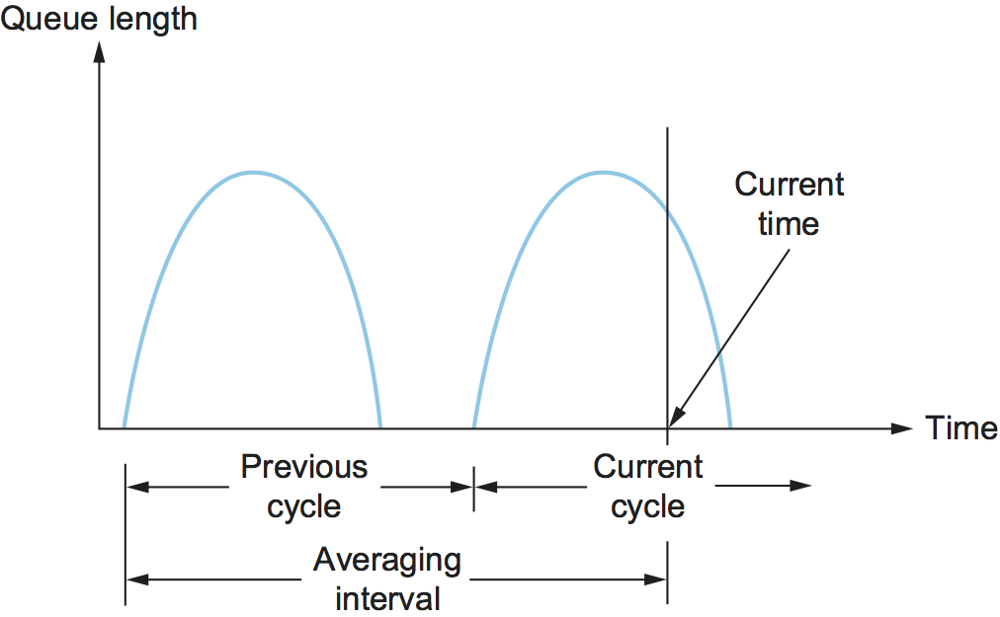
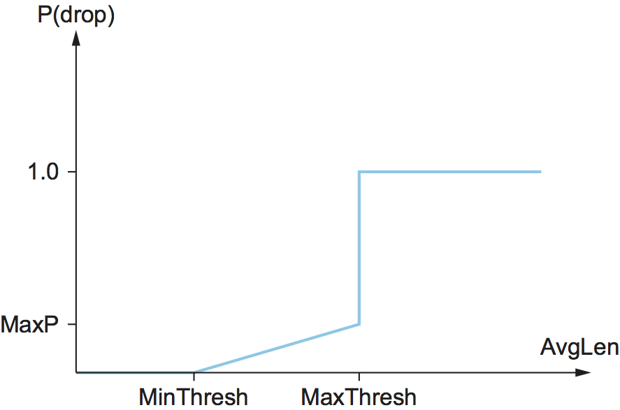
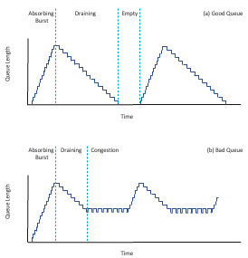
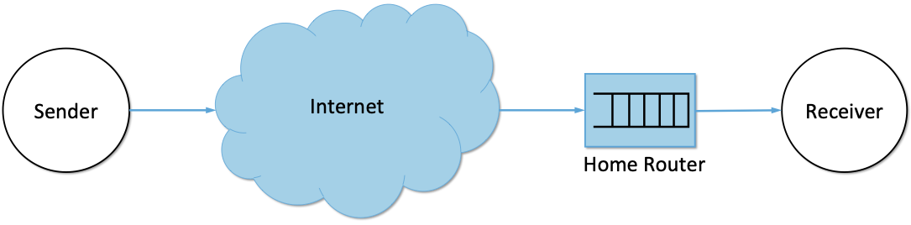
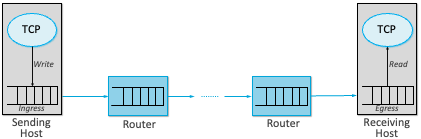

Chapter 6:  Active Queue Management
===================================

We now look at the role routers can play in congestion control, an
approach often referred to as *Active Queue Management* (AQM).  By
its very nature, AQM introduces an element of avoidance to the
end-to-end solution, even when paired with a control-based approach
like TCP Reno.

Changing router behavior has never been the Internet’s preferred way
of introducing new features, but nonetheless, the approach has been a
constant source of consternation over the last 30 years. The problem
is that while it’s generally agreed that routers are in an ideal
position to detect the onset of congestion—it's their queues that
start to fill up—there has not been a consensus on exactly what the
best algorithm is. The following describes two of the classic
mechanisms, and concludes with a brief discussion of where things
stand today.

6.1 DECbit
----------

The first mechanism was developed for use on the Digital Network
Architecture (DNA), an early peer of the TCP/IP Internet that also
adopted a connectionless/best-effort network model. A description
of the approach, published by K.K. Ramakrishnan and Raj Jain, was
presented at the same SIGCOMM as the Jacobson/Karels paper in 1988.

.. _reading_decbit:
.. admonition:: Further Reading 

      K.K. Ramakrishnan and R. Jain.
      `A Binary Feedback Scheme for
      Congestion Avoidance in Computer Networks with a Connectionless
      Network Layer <https://dl.acm.org/doi/pdf/10.1145/52324.52355>`__.
      ACM SIGCOMM, August 1988.

The idea is to more evenly split the responsibility for congestion
control between the routers and the end hosts. Each router monitors
the load it is experiencing and explicitly notifies the end nodes when
congestion is about to occur. This notification is implemented by
setting a binary congestion bit in the packets that flow through the
router, which came to be known as the *DECbit*. The destination host
then copies this congestion bit into the ACK it sends back to the
source. Finally, the source adjusts its sending rate so as to avoid
congestion. The following discussion describes the algorithm in more
detail, starting with what happens in the router.

A single congestion bit is added to the packet header. A router sets
this bit in a packet if its average queue length is greater than or
equal to 1 at the time the packet arrives. This average queue length
is measured over a time interval that spans the last busy+idle cycle,
plus the current busy cycle. (The router is *busy* when it is
transmitting and *idle* when it is not.) :numref:`Figure %s
<fig-decbit>` shows the queue length at a router as a function of
time. Essentially, the router calculates the area under the curve and
divides this value by the time interval to compute the average queue
length. Using a queue length of 1 as the trigger for setting the
congestion bit is a trade-off between significant queuing (and hence
higher throughput) and increased idle time (and hence lower delay). In
other words, a queue length of 1 seems to optimize the power function.

.. _fig-decbit:

   Computing average queue length at a router.

Now turning our attention to the host half of the mechanism, the source
records how many of its packets resulted in some router setting the
congestion bit. In particular, the source maintains a congestion window,
just as in TCP, and watches to see what fraction of the last window’s
worth of packets resulted in the bit being set. If less than 50% of the
packets had the bit set, then the source increases its congestion window
by one packet. If 50% or more of the last window’s worth of packets had
the congestion bit set, then the source decreases its congestion window
to 0.875 times the previous value. The value 50% was chosen as the
threshold based on analysis that showed it to correspond to the peak of
the power curve. The “increase by 1, decrease by 0.875” rule was
selected because additive increase/multiplicative decrease makes the
mechanism stable.

6.2 Random Early Detection
--------------------------

A second mechanism, called *random early detection* (RED), is similar to
the DECbit scheme in that each router is programmed to monitor its own
queue length and, when it detects that congestion is imminent, to notify
the source to adjust its congestion window. RED, invented by Sally Floyd
and Van Jacobson in the early 1990s, differs from the DECbit scheme in
two major ways.

.. _reading_red:
.. admonition:: Further Reading 

	S. Floyd and V.  Jacobson `Random Early Detection (RED)
	Gateways for Congestion Avoidance <http://www.icir.org/floyd/papers/early.twocolumn.pdf>`__.
	IEEE/ACM Transactions on Networking. August 1993.

The first is that rather than explicitly sending a congestion
notification message to the source, RED is most commonly implemented
such that it *implicitly* notifies the source of congestion by dropping
one of its packets. The source is, therefore, effectively notified by
the subsequent timeout or duplicate ACK. In case you haven’t already
guessed, RED is designed to be used in conjunction with TCP, which
currently detects congestion by means of timeouts (or some other means
of detecting packet loss such as duplicate ACKs). As the “early” part of
the RED acronym suggests, the gateway drops the packet earlier than it
would have to, so as to notify the source that it should decrease its
congestion window sooner than it would normally have. In other words,
the router drops a few packets before it has exhausted its buffer space
completely, so as to cause the source to slow down, with the hope that
this will mean it does not have to drop lots of packets later on.

The second difference between RED and DECbit is in the details of how
RED decides when to drop a packet and what packet it decides to drop. To
understand the basic idea, consider a simple FIFO queue. Rather than
wait for the queue to become completely full and then be forced to drop
each arriving packet (the tail drop policy described in Section 2.1.3), we
could decide to drop each arriving packet with some *drop probability*
whenever the queue length exceeds some *drop level*. This idea is called
*early random drop*. The RED algorithm defines the details of how to
monitor the queue length and when to drop a packet.

In the following paragraphs, we describe the RED algorithm as originally
proposed by Floyd and Jacobson. We note that several modifications have
since been proposed both by the inventors and by other researchers.
However, the key ideas are the same as those presented below, and most
current implementations are close to the algorithm that follows.

First, RED computes an average queue length using a weighted running
average similar to the one used in the original TCP timeout computation.
That is, ``AvgLen`` is computed as

.. math:: \mathsf{AvgLen = (1 - Weight)\ x\ AvgLen + Weight\ x\ SampleLen}

where 0 < ``Weight`` < 1 and ``SampleLen`` is the length of the queue
when a sample measurement is made. In most software implementations, the
queue length is measured every time a new packet arrives at the gateway.
In hardware, it might be calculated at some fixed sampling interval.

The reason for using an average queue length rather than an
instantaneous one is that it more accurately captures the notion of
congestion. Because of the bursty nature of Internet traffic, queues
can become full very quickly and then become empty again. If a queue
is spending most of its time empty, then it’s probably not appropriate
to conclude that the router is congested and to tell the hosts to slow
down. Thus, the weighted running average calculation tries to detect
long-lived congestion, as indicated in the right-hand portion of
:numref:`Figure %s <fig-red-avg>`, by filtering out short-term changes
in the queue length. You can think of the running average as a
low-pass filter, where ``Weight`` determines the time constant of the
filter. The question of how we pick this time constant is discussed
below.

.. _fig-red-avg:
.. figure:: figures/f06-15-9780123850591.png
   :width: 500px
   :align: center

   Weighted running average queue length.

Second, RED has two queue length thresholds that trigger certain
activity: ``MinThreshold`` and ``MaxThreshold``. When a packet arrives
at the gateway, RED compares the current ``AvgLen`` with these two
thresholds, according to the following rules:

.. literalinclude:: code/red.c

If the average queue length is smaller than the lower threshold, no
action is taken, and if the average queue length is larger than the
upper threshold, then the packet is always dropped. If the average
queue length is between the two thresholds, then the newly arriving
packet is dropped with some probability ``P``. This situation is
depicted in :numref:`Figure %s <fig-red>`. The approximate
relationship between ``P`` and ``AvgLen`` is shown in :numref:`Figure
%s <fig-red-prob>`. Note that the probability of drop increases slowly
when ``AvgLen`` is between the two thresholds, reaching ``MaxP`` at
the upper threshold, at which point it jumps to unity. The rationale
behind this is that, if ``AvgLen`` reaches the upper threshold, then
the gentle approach (dropping a few packets) is not working and
drastic measures are called for: dropping all arriving packets. Some
research has suggested that a smoother transition from random dropping
to complete dropping, rather than the discontinuous approach shown
here, may be appropriate.

.. _fig-red:
.. figure:: figures/f06-16-9780123850591.png
   :width: 300px
   :align: center

   RED thresholds on a FIFO queue.

.. _fig-red-prob:

   Drop probability function for RED.

Although :numref:`Figure %s <fig-red-prob>` shows the probability of
drop as a function only of ``AvgLen``, the situation is actually a
little more complicated. In fact, ``P`` is a function of both
``AvgLen`` and how long it has been since the last packet was
dropped. Specifically, it is computed as follows:

.. math:: \mathsf{TempP = MaxP\ x\ (AvgLen - MinThreshold)\ /\ (MaxThreshold - MinThreshold)}

.. math:: \mathsf{P = TempP\ /\ (1 - count\ x\ TempP)}

``TempP`` is the variable that is plotted on the y-axis in :numref:`Figure
%s <fig-red-prob>`, ``count`` keeps track of how many newly arriving
packets have been queued (not dropped), and ``AvgLen`` has been between
the two thresholds. ``P`` increases slowly as ``count`` increases,
thereby making a drop increasingly likely as the time since the last
drop increases. This makes closely spaced drops relatively less likely
than widely spaced drops. This extra step in calculating ``P`` was
introduced by the inventors of RED when they observed that, without it,
the packet drops were not well distributed in time but instead tended to
occur in clusters. Because packet arrivals from a certain connection are
likely to arrive in bursts, this clustering of drops is likely to cause
multiple drops in a single connection. This is not desirable, since only
one drop per round-trip time is enough to cause a connection to reduce
its window size, whereas multiple drops might send it back into slow
start.

As an example, suppose that we set ``MaxP`` to 0.02 and ``count`` is
initialized to zero. If the average queue length were halfway between
the two thresholds, then ``TempP``, and the initial value of ``P``,
would be half of ``MaxP``, or 0.01. An arriving packet, of course, has a
99 in 100 chance of getting into the queue at this point. With each
successive packet that is not dropped, ``P`` slowly increases, and by
the time 50 packets have arrived without a drop, ``P`` would have
doubled to 0.02. In the unlikely event that 99 packets arrived without
loss, ``P`` reaches 1, guaranteeing that the next packet is dropped. The
important thing about this part of the algorithm is that it ensures a
roughly even distribution of drops over time.

The intent is that, if RED drops a small percentage of packets when
``AvgLen`` exceeds ``MinThreshold``, this will cause a few TCP
connections to reduce their window sizes, which in turn will reduce the
rate at which packets arrive at the router. All going well, ``AvgLen``
will then decrease and congestion is avoided. The queue length can be
kept short, while throughput remains high since few packets are dropped.

Note that, because RED is operating on a queue length averaged over
time, it is possible for the instantaneous queue length to be much
longer than ``AvgLen``. In this case, if a packet arrives and there is
nowhere to put it, then it will have to be dropped. When this happens,
RED is operating in tail drop mode. One of the goals of RED is to
prevent tail drop behavior if possible.

The random nature of RED confers an interesting property on the
algorithm. Because RED drops packets randomly, the probability that RED
decides to drop a particular flow’s packet(s) is roughly proportional to
the share of the bandwidth that flow is currently getting at that
router. This is because a flow that is sending a relatively large number
of packets is providing more candidates for random dropping. Thus, there
is some sense of fair resource allocation built into RED, although it is
by no means precise. While arguably fair, because RED punishes
high-bandwidth flows more than low-bandwidth flows, it increases the
probability of a TCP restart, which is doubly painful for those
high-bandwidth flows.

A fair amount of analysis has gone into setting the various RED
parameters—for example, ``MaxThreshold``, ``MinThreshold``, ``MaxP``
and ``Weight``—all in the name of optimizing the power function
(throughput-to-delay ratio). The performance of these parameters has
also been confirmed through simulation, and the algorithm has been
shown not to be overly sensitive to them. It is important to keep in
mind, however, that all of this analysis and simulation hinges on a
particular characterization of the network workload. The real
contribution of RED is a mechanism by which the router can more
accurately manage its queue length. Defining precisely what
constitutes an optimal queue length depends on the traffic mix and is
a subject of ongoing study.

Consider the setting of the two thresholds, ``MinThreshold`` and
``MaxThreshold``. If the traffic is fairly bursty, then ``MinThreshold``
should be sufficiently large to allow the link utilization to be
maintained at an acceptably high level. Also, the difference between the
two thresholds should be larger than the typical increase in the
calculated average queue length in one RTT. Setting ``MaxThreshold`` to
twice ``MinThreshold`` seems to be a reasonable rule of thumb given the
traffic mix on today’s Internet. In addition, since we expect the
average queue length to hover between the two thresholds during periods
of high load, there should be enough free buffer space *above*
``MaxThreshold`` to absorb the natural bursts that occur in Internet
traffic without forcing the router to enter tail drop mode.

We noted above that ``Weight`` determines the time constant for the
running average low-pass filter, and this gives us a clue as to how we
might pick a suitable value for it. Recall that RED is trying to send
signals to TCP flows by dropping packets during times of congestion.
Suppose that a router drops a packet from some TCP connection and then
immediately forwards some more packets from the same connection. When
those packets arrive at the receiver, it starts sending duplicate ACKs
to the sender. When the sender sees enough duplicate ACKs, it will
reduce its window size. So, from the time the router drops a packet
until the time when the same router starts to see some relief from the
affected connection in terms of a reduced window size, at least one
round-trip time must elapse for that connection. There is probably not
much point in having the router respond to congestion on time scales
much less than the round-trip time of the connections passing through
it. As noted previously, 100 ms is not a bad estimate of average
round-trip times in the Internet. Thus, ``Weight`` should be chosen such
that changes in queue length over time scales much less than 100 ms are
filtered out.

Since RED works by sending signals to TCP flows to tell them to slow
down, you might wonder what would happen if those signals are ignored.
This is often called the *unresponsive flow* problem. Unresponsive
flows use more than their fair share of network resources and could
cause congestive collapse if there were enough of them, just as in the
days before TCP congestion control. Some queueing techniques, such as
weighted fair queueing, could help with this problem by isolating
certain classes of traffic from others. There was also discussion of
creating a variant of RED that could drop more heavily from flows that
are unresponsive to the initial hints that it sends. However this
turns out to be challenging because it can be hard to distinguish
between non-responsive behavior and \"correct\" behavior, especially
when flows have a wide variety of different RTTs and bottleneck bandwidths.

As a footnote, 15 prominent network researchers urged for the
widespread adoption of RED-inspired AQM in 1998. The recommendation
was largely ignored, for reasons that we touch on below. AQM
approaches based on RED have, however, been applied with some success
in datacenters.

.. _reading_rfc:
.. admonition:: Further Reading 

      R. Braden, *et al*. 
      `Recommendations on Queue Management and Congestion Avoidance in the Internet
      <https://tools.ietf.org/html/rfc2309>`__.
      RFC 2309, April 1998.

6.3 Controlled Delay
--------------------

As noted in the preceding section, RED has never been widely
adopted. Certainly it never reached the level necessary to have a
significant impact on congestion in the Internet. One reason
is that RED is difficult to configure in a
way that consistently improves performance. Note the large number
of parameters that affect its operation (``MinThreshold``,
``MaxThreshold``, and ``Weight``). There is enough research
showing that RED produces a wide range of outcomes (not all of
them helpful) depending on the type of traffic and parameter settings.
This created uncertainty around the merits of deploying it.

Over a period of years, Van Jacobson (well known for his work on TCP
Congestion and a co-author of the original RED paper) collaborated
with Kathy Nichols and eventually other researchers to come up with an
AQM approach that improves upon RED. This work became known as CoDel
(pronounced *coddle*) for Controlled Delay AQM. CoDel builds on several
key insights that emerged over decades of experience with TCP and
AQM.

.. _reading_codel:
.. admonition:: Further Reading 

      K. Nichols and V. Jacobson.
      `Controlling Queue Delay
      <https://queue.acm.org/detail.cfm?id=2209336>`__.
      ACM Queue, 10(5), May 2012.

First, queues are an important aspect of networking and it is expected
that queues will build up from time to time. For example, a newly opened
connection may dump a window's worth of packets into the network, and
these are likely to form a queue at the bottleneck link. This is not
in itself a problem. There should be enough buffer capacity to
absorb such bursts. Problems arise when there is not enough buffer
capacity to absorb bursts, leading to excessive loss. This came to be
understood in the 1990s as a requirement that buffers be able to hold
at least one bandwidth-delay product of packets—a requirement that
was probably too large and subsequently questioned by further
research. But the fact is that buffers are necessary, and it is
expected that they will be used to absorb bursts. The CoDel authors
refer to this as \"good queue\", as illustrated in :numref:`Figure
%s <fig-good-bad>` (a).

.. _fig-good-bad:

   Good and Bad Queue Scenarios

Queues become a problem when they are persistently full. A
persistently full queue is doing nothing except adding delay to the
network, and it is also less able to absorb bursts if it never drains
fully. The combination of large buffers and persistent queues within
those buffers is a phenomenon that Jim Gettys has named
*Bufferbloat*. It is clear that persistently full queues are what a
well-designed AQM mechanism would seek to avoid. Queues that stay full
for long periods without draining are referred to, unsurprisingly, as
\"bad queue\", as shown in :numref:`Figure %s <fig-good-bad>` (b).

.. _reading_bloat:
.. admonition::  Further Reading 

   J. Gettys. `Bufferbloat: Dark Buffers in the Internet 
   <https://ieeexplore.ieee.org/document/5755608>`__. IEEE 
   Internet Computing, April 2011.

In a sense, then, the challenge for an AQM algorithm is to distinguish
between \"good\" and \"bad\" queues, and to trigger packet loss only when
the queue is determined to be \"bad\". Indeed, this is what RED is
trying to do with its ``weight`` parameter (which filters out
transient queue length).

One of the innovations of CoDel is to focus on *sojourn time*: the
time that any given packet waits in the queue. Sojourn time is
independent of the bandwidth of a link and provides useful indication
of congestion even on links whose bandwidth varies over time, such as
wireless links. A queue that is behaving well will frequently drain to
zero, and thus, some packets will experience a sojourn time close to
zero, as in :numref:`Figure %s <fig-good-bad>` (a). Conversely, a
congested queue will delay every packet, and the minimum sojourn time
will never be close to zero, as seen in :numref:`Figure %s
<fig-good-bad>` (b). CoDel therefore measures the sojourn
time—something that is easy to do for every packet—and tracks whether
it is consistently sitting above some small target. \"Consistently\"
is defined as \"lasting longer than a typical RTT\".

Rather than asking operators to determine the parameters to make
CoDel work well, the algorithm chooses reasonable defaults. A target
sojourn time of 5ms is used, along with a sliding measurement window
of 100ms. The intuition, as with RED, is that 100ms is a typical RTT
for traffic traversing the Internet, and that if congestion is lasting
longer than 100ms, we may be moving into the \"bad queue\" region. So
CoDel monitors the sojourn time relative to the target of 5ms. If it
is above target for more than 100ms, it is time to start taking action
to reduce the queue via drops (or marking if explicit congestion
notification, described below, is available). 5ms is chosen as being
close to zero (for better delay) but not so small that the queue would
run empty. It should be noted that a great deal of experimentation and
simulation has gone into these numerical choices, but more importantly, the
algorithm does not seem to be overly sensitive to them.

To summarize, CoDel largely ignore queues that last less than an RTT,
but starts taking action as soon as a queue persists for more than
an RTT. By making reasonable assumptions about Internet RTTs, the algorithm
requires no configuration parameters.

An additional subtlety is that CoDel drops a slowly increasing percentage of
traffic as long as the observed sojourn time remains above the target. As
discussed further in Section 7.4, TCP throughput has been shown to
depend inversely on the square root of loss rate. Thus, as long as the
sojourn time stays above the target, CoDel steadily 
increases its drop rate in proportion to the square root
of the number of drops since the target was exceeded. The effect of
this, in theory, is to cause a linear decrease in throughput of the
affected TCP connections. Eventually this should lead to enough
reduction in arriving traffic to allow the queue to drain, bringing
the sojourn time back below the target.

.. _fig-codel:

   Home routers can suffer from bufferbloat, a situation CoDel is
   well-suited to address.

There are more details to CoDel presented in the Nichols and Jacobson
paper, including extensive simulations to indicate its effectiveness
across a wide range of scenarios. The algorithm has been standardized
as \"experimental\" by the IETF in RFC 8289. It is also implemented in
the Linux kernel, which has aided in its deployment. In particular,
CoDel provides value in home routers (which are often Linux-based), a
point along the end-to-end path (see :numref:`Figure %s <fig-codel>`)
that commonly experiences bufferbloat.

6.4 Explicit Congestion Notification
------------------------------------

While TCP's congestion control mechanism was initially based on packet
loss as the primary congestion signal, it has long been recognized
that TCP could do a better job if routers were to send a more explicit
congestion signal. That is, instead of *dropping* a packet and assuming TCP will eventually
notice (e.g., due to the arrival of a duplicate ACK), any AQM
algorithm can potentially do a better job if it instead *marks* the
packet and continues to send it along its way to the destination. This
idea was codified in changes to the IP and TCP headers known as
*Explicit Congestion Notification* (ECN), as specified in RFC 3168.

.. _reading_ecn:
.. admonition::  Further Reading

   K. Ramakrishnan, S. Floyd, and D. Black.
   `The Addition of Explicit Congestion Notification (ECN) to IP
   <https://datatracker.ietf.org/doc/html/rfc3168>`__.
   RFC 3168, September 2001.

Specifically, this feedback is implemented by treating two bits in the
IP ``TOS`` field as ECN bits. One bit is set by the source to indicate
that it is ECN-capable, that is, able to react to a congestion
notification. This is called the ``ECT`` bit (ECN-Capable Transport).
The other bit is set by routers along the end-to-end path when
congestion is encountered, as computed by whatever AQM algorithm it is
running. This is called the ``CE`` bit (Congestion Encountered).

In addition to these two bits in the IP header (which are
transport-agnostic), ECN also includes the addition of two optional
flags to the TCP header. The first, ``ECE`` (ECN-Echo), communicates
from the receiver to the sender that it has received a packet with the
``CE`` bit set. The second, ``CWR`` (Congestion Window Reduced)
communicates from the sender to the receiver that it has reduced the
congestion window.

While ECN is now the standard interpretation of two of the eight bits in
the ``TOS`` field of the IP header and support for ECN is highly
recommended, it is not required. Moreover, there is no single
recommended AQM algorithm, but instead, there is a list of requirements
a good AQM algorithm should meet. Like TCP congestion control
algorithms, every AQM algorithm has its advantages and disadvantages,
and so we need a lot of them to argue about.

6.5 Ingress/Egress Queues
-------------------------

We have been drawing a clear line between approaches to congestion
control that happen *inside the network* (i.e., the AQM algorithms
described in this chapter) and *at the edge of the network* (i.e., the
TCP-based algorithms described in earlier chapters). But the line
isn’t necessarily that crisp. To see this, you just have to think of
the end-to-end path as having a *ingress queue* at the kernel/device
interface on the sending host and an *egress queue* at the
device/kernel interface on the receiving host.\ [#]_ These edge queues
are likely to become increasingly important as virtual switches and
NIC support for virtualization become more and more common.

.. [#]
	Confusingly, the *ingress queue* from the perspective of the
	network path is the outbound (egress) queue on the sending host
	and, the *egress queue* from the perspective of the network
	path is the inbound (ingress) queue on the receiving host. As
	shown in :numref:`Figure %s <fig-ingress_egress>`, we use the
	terms ingress and egress from the network's perspective.

This perspective is illustrated in :numref:`Figure %s
<fig-ingress_egress>`, where both locations sit below TCP, and provide
an opportunity to inject a second piece of congestion control logic
into the end-to-end path. CoDel and ECN are examples of this idea: They
have been implemented at the device queue level of the Linux kernel.
	
.. _fig-ingress_egress:

   Ingress and egress queues along the end-to-end path, implemented in
   the sending and receiving hosts, respectively.

Does this work? One issue is whether packets are dropped at the ingress
or the egress.  When dropping at the ingress (on the sending host),
TCP is notified in the return value of the *Write* function, which
causes it to "forget" that it sent the packet. This means this packet
will be sent next, although TCP does decrease its congestion window in
response to the failed write. In contrast, dropping packets at the
egress queue (on the receiving host), means the TCP sender will not
know to retransmit the packet until it detects the loss using one of
its standard mechanisms (e.g., three duplicate ACKs, a timeout). Of
course, having the egress implement ECN helps.

When we consider this discussion in the context of the bigger
congestion control picture, we can make
two interesting observations. One is that Linux provides a convenient
and safe way to inject new code—including congestion control
logic—into the kernel, namely, using the *extended Berkeley Packet
Filter (eBPF)*. eBPF is becoming an important technology in many other
contexts as well. The standard kernel API for congestion control has
been ported to eBPF and most existing congestion control algorithms
have been ported to this framework. This simplifies the task of
experimenting with new algorithms or tweaking existing algorithms by
side-stepping the hurdle of waiting for the relevant Linux kernel to
be deployed.

.. _reading_bpf:
.. admonition:: Further Reading 

      The Linux Kernel.
      `BPF Documentation
      <https://www.kernel.org/doc/html/latest/bpf/index.html>`__.

A second observation is that by explicitly exposing the ingress/egress
queues to the decision-making process, we open the door to building a
congestion control mechanism that contains both a “decide when to
transmit a packet” component and a “decide to queue-or-drop a packet”
component.  We’ll see an example of a mechanism that takes an innovative
approach to using these two components in Section 7.1 when we describe
On-Ramp.

