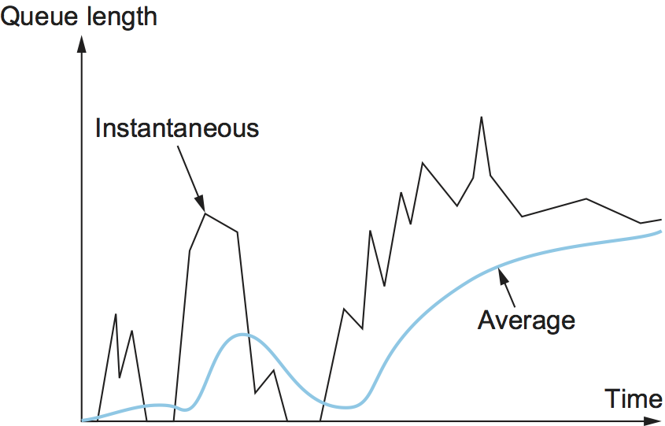

Chapter 7:  Active Queue Management
===================================

We now look at the role routers can play in congestion control, an
appproach often referred to as *Active Queue Management* (AQM).  By
their very nature, AQM introduces an element of avoidance to the
end-to-end solution, even when paired with a contro-based approach
like TCP Reno.

Changing router behavior has never been the Internet’s preferred way
of introducing new features, but nonetheless, has been a constant
source of consternation over the last 30 years. The problem is that
while it’s generally agreed that routers are in an ideal position to
detect the onset of congestion—i.e., their queues start to fill
up—there has not been a consensus on exactly what the best algorithm
is. The following describes two of the classic mechanisms, and
concludes with a brief discussion of where things stand today.

7.1 DECbit
----------

The first mechanism was developed for use on the Digital Network
Architecture (DNA), an early peer of the TCP/IP Internet that also
adopted a connectionless/best-effort network model. A description
of the approach, published by K.K. Ramakrishnan and Raj Jain, was
presented at the same SIGCOMM as the Jacobson/Karels paper in 1988.

.. _reading_decbit:
.. admonition:: Further Reading 

      K.K. Ramakrishnan and R. Jain.
      `A Binary Feedback Scheme for
      Congestion Avoidance in Computer Networks with a Connectionless
      Network Layer <https://dl.acm.org/doi/pdf/10.1145/52324.52355>`__.
      ACM SIGCOMM, August 1988.

The idea was to more evenly split the responsibility for congestion
control between the routers and the end hosts. Each router monitors
the load it is experiencing and explicitly notifies the end nodes when
congestion is about to occur. This notification was implemented by
setting a binary congestion bit in the packets that flow through the
router, which came to be known as the *DECbit*. The destination host
then copies this congestion bit into the ACK it sends back to the
source. Finally, the source adjusts its sending rate so as to avoid
congestion. The following discussion describes the algorithm in more
detail, starting with what happens in the router.

A single congestion bit is added to the packet header. A router sets
this bit in a packet if its average queue length is greater than or
equal to 1 at the time the packet arrives. This average queue length
is measured over a time interval that spans the last busy+idle cycle,
plus the current busy cycle. (The router is *busy* when it is
transmitting and *idle* when it is not.) :numref:`Figure %s
<fig-decbit>` shows the queue length at a router as a function of
time. Essentially, the router calculates the area under the curve and
divides this value by the time interval to compute the average queue
length. Using a queue length of 1 as the trigger for setting the
congestion bit is a trade-off between significant queuing (and hence
higher throughput) and increased idle time (and hence lower delay). In
other words, a queue length of 1 seems to optimize the power function.

.. _fig-decbit:
.. figure:: figures/f06-14-9780123850591.png
   :width: 500px
   :align: center

   Computing average queue length at a router.

Now turning our attention to the host half of the mechanism, the source
records how many of its packets resulted in some router setting the
congestion bit. In particular, the source maintains a congestion window,
just as in TCP, and watches to see what fraction of the last window’s
worth of packets resulted in the bit being set. If less than 50% of the
packets had the bit set, then the source increases its congestion window
by one packet. If 50% or more of the last window’s worth of packets had
the congestion bit set, then the source decreases its congestion window
to 0.875 times the previous value. The value 50% was chosen as the
threshold based on analysis that showed it to correspond to the peak of
the power curve. The “increase by 1, decrease by 0.875” rule was
selected because additive increase/multiplicative decrease makes the
mechanism stable.

7.2 Random Early Detection
--------------------------

A second mechanism, called *random early detection* (RED), is similar to
the DECbit scheme in that each router is programmed to monitor its own
queue length and, when it detects that congestion is imminent, to notify
the source to adjust its congestion window. RED, invented by Sally Floyd
and Van Jacobson in the early 1990s, differs from the DECbit scheme in
two major ways.

.. _reading_red:
.. admonition:: Further Reading 

	S. Floyd and V.  Jacobson `Random Early Detection (RED)
	Gateways for Congestion Avoidance <http://www.icir.org/floyd/papers/early.twocolumn.pdf>`__.
	IEEE/ACM Transactions on Networking. August 1993.

The first is that rather than explicitly sending a congestion
notification message to the source, RED is most commonly implemented
such that it *implicitly* notifies the source of congestion by dropping
one of its packets. The source is, therefore, effectively notified by
the subsequent timeout or duplicate ACK. In case you haven’t already
guessed, RED is designed to be used in conjunction with TCP, which
currently detects congestion by means of timeouts (or some other means
of detecting packet loss such as duplicate ACKs). As the “early” part of
the RED acronym suggests, the gateway drops the packet earlier than it
would have to, so as to notify the source that it should decrease its
congestion window sooner than it would normally have. In other words,
the router drops a few packets before it has exhausted its buffer space
completely, so as to cause the source to slow down, with the hope that
this will mean it does not have to drop lots of packets later on.

The second difference between RED and DECbit is in the details of how
RED decides when to drop a packet and what packet it decides to drop. To
understand the basic idea, consider a simple FIFO queue. Rather than
wait for the queue to become completely full and then be forced to drop
each arriving packet (the tail drop policy of the previous section), we
could decide to drop each arriving packet with some *drop probability*
whenever the queue length exceeds some *drop level*. This idea is called
*early random drop*. The RED algorithm defines the details of how to
monitor the queue length and when to drop a packet.

In the following paragraphs, we describe the RED algorithm as originally
proposed by Floyd and Jacobson. We note that several modifications have
since been proposed both by the inventors and by other researchers.
However, the key ideas are the same as those presented below, and most
current implementations are close to the algorithm that follows.

First, RED computes an average queue length using a weighted running
average similar to the one used in the original TCP timeout computation.
That is, ``AvgLen`` is computed as

::

   AvgLen = (1 - Weight) x AvgLen + Weight x SampleLen

where 0 < ``Weight`` < 1 and ``SampleLen`` is the length of the queue
when a sample measurement is made. In most software implementations, the
queue length is measured every time a new packet arrives at the gateway.
In hardware, it might be calculated at some fixed sampling interval.

The reason for using an average queue length rather than an
instantaneous one is that it more accurately captures the notion of
congestion. Because of the bursty nature of Internet traffic, queues
can become full very quickly and then become empty again. If a queue
is spending most of its time empty, then it’s probably not appropriate
to conclude that the router is congested and to tell the hosts to slow
down. Thus, the weighted running average calculation tries to detect
long-lived congestion, as indicated in the right-hand portion of
:numref:`Figure %s <fig-red-avg>`, by filtering out short-term changes
in the queue length. You can think of the running average as a
low-pass filter, where ``Weight`` determines the time constant of the
filter. The question of how we pick this time constant is discussed
below.

.. _fig-red-avg:

   Weighted running average queue length.

Second, RED has two queue length thresholds that trigger certain
activity: ``MinThreshold`` and ``MaxThreshold``. When a packet arrives
at the gateway, RED compares the current ``AvgLen`` with these two
thresholds, according to the following rules:

::

   if AvgLen <= MinThreshold
       queue the packet
   if MinThreshold < AvgLen < MaxThreshold
       calculate probability P
       drop the arriving packet with probability P
   if MaxThreshold <= AvgLen
       drop the arriving packet

If the average queue length is smaller than the lower threshold, no
action is taken, and if the average queue length is larger than the
upper threshold, then the packet is always dropped. If the average
queue length is between the two thresholds, then the newly arriving
packet is dropped with some probability ``P``. This situation is
depicted in :numref:`Figure %s <fig-red>`. The approximate
relationship between ``P`` and ``AvgLen`` is shown in :numref:`Figure
%s <fig-red-prob>`. Note that the probability of drop increases slowly
when ``AvgLen`` is between the two thresholds, reaching ``MaxP`` at
the upper threshold, at which point it jumps to unity. The rationale
behind this is that, if ``AvgLen`` reaches the upper threshold, then
the gentle approach (dropping a few packets) is not working and
drastic measures are called for: dropping all arriving packets. Some
research has suggested that a smoother transition from random dropping
to complete dropping, rather than the discontinuous approach shown
here, may be appropriate.

.. _fig-red:
.. figure:: figures/f06-16-9780123850591.png
   :width: 300px
   :align: center

   RED thresholds on a FIFO queue.

.. _fig-red-prob:
.. figure:: figures/f06-17-9780123850591.png
   :width: 400px
   :align: center

   Drop probability function for RED.

Although :numref:`Figure %s <fig-red-prob>` shows the probability of
drop as a function only of ``AvgLen``, the situation is actually a
little more complicated. In fact, ``P`` is a function of both
``AvgLen`` and how long it has been since the last packet was
dropped. Specifically, it is computed as follows:

::

   TempP = MaxP x (AvgLen - MinThreshold) / (MaxThreshold - MinThreshold)
   P = TempP/(1 - count x TempP)

``TempP`` is the variable that is plotted on the y-axis in :numref:`Figure
%s <fig-red-prob>`, ``count`` keeps track of how many newly arriving
packets have been queued (not dropped), and ``AvgLen`` has been between
the two thresholds. ``P`` increases slowly as ``count`` increases,
thereby making a drop increasingly likely as the time since the last
drop increases. This makes closely spaced drops relatively less likely
than widely spaced drops. This extra step in calculating ``P`` was
introduced by the inventors of RED when they observed that, without it,
the packet drops were not well distributed in time but instead tended to
occur in clusters. Because packet arrivals from a certain connection are
likely to arrive in bursts, this clustering of drops is likely to cause
multiple drops in a single connection. This is not desirable, since only
one drop per round-trip time is enough to cause a connection to reduce
its window size, whereas multiple drops might send it back into slow
start.

As an example, suppose that we set ``MaxP`` to 0.02 and ``count`` is
initialized to zero. If the average queue length were halfway between
the two thresholds, then ``TempP``, and the initial value of ``P``,
would be half of ``MaxP``, or 0.01. An arriving packet, of course, has a
99 in 100 chance of getting into the queue at this point. With each
successive packet that is not dropped, ``P`` slowly increases, and by
the time 50 packets have arrived without a drop, ``P`` would have
doubled to 0.02. In the unlikely event that 99 packets arrived without
loss, ``P`` reaches 1, guaranteeing that the next packet is dropped. The
important thing about this part of the algorithm is that it ensures a
roughly even distribution of drops over time.

The intent is that, if RED drops a small percentage of packets when
``AvgLen`` exceeds ``MinThreshold``, this will cause a few TCP
connections to reduce their window sizes, which in turn will reduce the
rate at which packets arrive at the router. All going well, ``AvgLen``
will then decrease and congestion is avoided. The queue length can be
kept short, while throughput remains high since few packets are dropped.

Note that, because RED is operating on a queue length averaged over
time, it is possible for the instantaneous queue length to be much
longer than ``AvgLen``. In this case, if a packet arrives and there is
nowhere to put it, then it will have to be dropped. When this happens,
RED is operating in tail drop mode. One of the goals of RED is to
prevent tail drop behavior if possible.

The random nature of RED confers an interesting property on the
algorithm. Because RED drops packets randomly, the probability that RED
decides to drop a particular flow’s packet(s) is roughly proportional to
the share of the bandwidth that flow is currently getting at that
router. This is because a flow that is sending a relatively large number
of packets is providing more candidates for random dropping. Thus, there
is some sense of fair resource allocation built into RED, although it is
by no means precise. While arguably fair, because RED punishes
high-bandwidth flows more than low-bandwidth flows, it increases the
probability of a TCP restart, which is doubly painful for those
high-bandwidth flows.

A fair amount of analysis has gone into setting the various RED
parameters—for example, ``MaxThreshold``, ``MinThreshold``, ``MaxP``
and ``Weight``—all in the name of optimizing the power function
(throughput-to-delay ratio). The performance of these parameters has
also been confirmed through simulation, and the algorithm has been
shown not to be overly sensitive to them. It is important to keep in
mind, however, that all of this analysis and simulation hinges on a
particular characterization of the network workload. The real
contribution of RED is a mechanism by which the router can more
accurately manage its queue length. Defining precisely what
constitutes an optimal queue length depends on the traffic mix and is
still a subject of research, with real information now being gathered
from operational deployment of RED in the Internet.

Consider the setting of the two thresholds, ``MinThreshold`` and
``MaxThreshold``. If the traffic is fairly bursty, then ``MinThreshold``
should be sufficiently large to allow the link utilization to be
maintained at an acceptably high level. Also, the difference between the
two thresholds should be larger than the typical increase in the
calculated average queue length in one RTT. Setting ``MaxThreshold`` to
twice ``MinThreshold`` seems to be a reasonable rule of thumb given the
traffic mix on today’s Internet. In addition, since we expect the
average queue length to hover between the two thresholds during periods
of high load, there should be enough free buffer space *above*
``MaxThreshold`` to absorb the natural bursts that occur in Internet
traffic without forcing the router to enter tail drop mode.

We noted above that ``Weight`` determines the time constant for the
running average low-pass filter, and this gives us a clue as to how we
might pick a suitable value for it. Recall that RED is trying to send
signals to TCP flows by dropping packets during times of congestion.
Suppose that a router drops a packet from some TCP connection and then
immediately forwards some more packets from the same connection. When
those packets arrive at the receiver, it starts sending duplicate ACKs
to the sender. When the sender sees enough duplicate ACKs, it will
reduce its window size. So, from the time the router drops a packet
until the time when the same router starts to see some relief from the
affected connection in terms of a reduced window size, at least one
round-trip time must elapse for that connection. There is probably not
much point in having the router respond to congestion on time scales
much less than the round-trip time of the connections passing through
it. As noted previously, 100 ms is not a bad estimate of average
round-trip times in the Internet. Thus, ``Weight`` should be chosen such
that changes in queue length over time scales much less than 100 ms are
filtered out.

Since RED works by sending signals to TCP flows to tell them to slow
down, you might wonder what would happen if those signals are ignored.
This is often called the *unresponsive flow* problem. Unresponsive flows
use more than their fair share of network resources and could cause
congestive collapse if there were enough of them, just as in the days
before TCP congestion control. Some of the techniques described in the
next section can help with this problem by isolating certain classes of
traffic from others. There is also the possibility that a variant of RED
could drop more heavily from flows that are unresponsive to the initial
hints that it sends.

As a footnote, 15 prominant network researcher urged for the
widespread adoption of RED-inspired AQM in 1998. The recommendation
was largely ignored, although subsequently, the approach has been
applied with success in datacenters.

.. _reading_rfc:
.. admonition:: Further Reading 

      R. Braden, et. al. 
      `Recommendations on Queue Management and Congestion Avoidance in the Internet
      <https://tools.ietf.org/html/rfc2309>`__.
      RFC 2309, April 1998.

7.3 Explicit Congestion Notification
------------------------------------

RED is the most extensively studied AQM mechanism, but it has not been
widely deployed, due in part to the fact that it does not result in
ideal behavior in all circumstances. It is, however, the benchmark for
understanding AQM behavior. The other thing that came out of RED is the
recognition that TCP could do a better job if routers were to send a
more explicit congestion signal.

That is, instead of *dropping* a packet and assuming TCP will eventually
notice (e.g., due to the arrival of a duplicate ACK), RED (or any AQM
algorithm for that matter) can do a better job if it instead *marks* the
packet and continues to send it along its way to the destination. This
idea was codified in changes to the IP and TCP headers known as
*Explicit Congestion Notification* (ECN).

Specifically, this feedback is implemented by treating two bits in the
IP ``TOS`` field as ECN bits. One bit is set by the source to indicate
that it is ECN-capable, that is, able to react to a congestion
notification. This is called the ``ECT`` bit (ECN-Capable Transport).
The other bit is set by routers along the end-to-end path when
congestion is encountered, as computed by whatever AQM algorithm it is
running. This is called the ``CE`` bit (Congestion Encountered).

In addition to these two bits in the IP header (which are
transport-agnostic), ECN also includes the addition of two optional
flags to the TCP header. The first, ``ECE`` (ECN-Echo), communicates
from the receiver to the sender that it has received a packet with the
``CE`` bit set. The second, ``CWR`` (Congestion Window Reduced)
communicates from the sender to the receiver that it has reduced the
congestion window.

While ECN is now the standard interpretation of two of the eight bits in
the ``TOS`` field of the IP header and support for ECN is highly
recommended, it is not required. Moreover, there is no single
recommended AQM algorithm, but instead, there is a list of requirements
a good AQM algorithm should meet. Like TCP congestion control
algorithms, every AQM algorithm has its advantages and disadvantages,
and so we need a lot of them.

