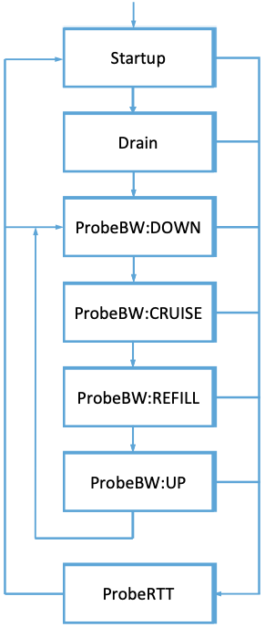

Chapter 5:  Avoidance-Based Algorithms
======================================

.. include:: <isogrk3.txt>

A review of the academic literature on TCP congestion control shows a
notable gap between the original TCP Tahoe and Reno mechanisms
introduced in 1988 and 1990, respectively, and the next major flurry
of activity starting in 1994, marked by the introduction of an
alternative approach known as TCP Vegas. This triggered an avalanche
of comparative studies and alternative designs that would persist for
the next 25+ years.

.. _reading_vegas:
.. admonition:: Further Reading 

      L. Brakmo, S. O'Malley and L. Peterson
      `TCP Vegas: New Technique for Congestion Detection and Avoidance
      <https://sites.cs.ucsb.edu/~almeroth/classes/F05.276/papers/vegas.pdf>`__.
      ACM SIGCOMM '94 Symposium. August 1994. (Reprinted in IEEE/ACM Transactions 
      on Networking, October 1995).

Whereas every approach described to date sees packet loss as a
congestion signal and tries to react to *control* congestion after the
onset, TCP Vegas takes an *avoidance-based* approach to congestion: it
tries to detect changes in the measured throughput rate, and adjust
the sending rate *before* congestion becomes severe enough to cause
packet loss. This chapter describes the general "Vegas strategy",
along with three example variations to that strategy introduced over
time. This case study culminates in the BBR algorithm championed by
Google today.

5.1 TCP Vegas
-------------

The essential idea behind TCP Vegas is to adapt the sending rate based
on a comparison of the *measured* throughput rate with the *expected*
throughput rate. The intuition can be seen in the trace of TCP Reno
given in :numref:`Figure %s <fig-trace3>`. The top graph traces the
connection’s congestion window; it shows the same information as the
traces given in the previous chapter.  The middle and bottom graphs
depict new information: The middle graph shows the average sending
rate as measured at the source, and the bottom graph shows the average
queue length as measured at the bottleneck router. All three graphs
are synchronized in time. In the period between 4.5 and 6.0 seconds
(shaded region), the congestion window increases (top graph). We
expect the observed throughput to also increase, but instead it stays
flat (middle graph). This is because the throughput cannot increase
beyond the available bandwidth. Beyond this point, any increase in the
window size only results in packets taking up buffer space at the
bottleneck router (bottom graph).

.. _fig-trace3:
.. figure:: figures/f06-18-9780123850591.png
   :width: 600px
   :align: center

   Congestion window versus observed throughput rate (the
   three graphs are synchronized). Top, congestion window; middle,
   observed throughput; bottom, buffer space taken up at the
   router. Colored line = `CongestionWindow`; solid bullet = timeout;
   hash marks = time when each packet is transmitted; vertical bars =
   time when a packet that was eventually retransmitted was first
   transmitted.

A useful metaphor that describes the phenomenon illustrated in
:numref:`Figure %s <fig-trace3>` is driving on ice. The speedometer
(congestion window) may say that you are going 30 miles an hour, but
by looking out the car window and seeing people pass you on foot
(measured throughput rate) you know that you are going no more than 5
miles an hour. The uselessly spinning wheels in this analogy are like
the extra packets being sent only to sit uselessly in router buffers.

TCP Vegas uses this idea to measure and control the amount of extra data
this connection has in transit, where by “extra data” we mean data that
the source would not have transmitted had it been able to match
exactly the available bandwidth of the network. The goal of TCP Vegas is
to maintain the “right” amount of extra data in the network. Obviously,
if a source is sending too much extra data, it will cause long delays
and possibly lead to congestion. Less obviously, if a connection is
sending too little extra data, it cannot respond rapidly enough to
transient increases in the available network bandwidth. TCP Vegas’s
congestion-avoidance actions are based on changes in the estimated
amount of extra data in the network, not only on dropped packets. We now
describe the algorithm in detail.

First, define a given flow’s ``BaseRTT`` to be the RTT of a packet when
the flow is not congested. In practice, TCP Vegas sets ``BaseRTT`` to
the minimum of all measured round-trip times; it is commonly the RTT of
the first packet sent by the connection, before the router queues
increase due to traffic generated by this flow. If we assume that we are
not overflowing the connection, then the expected throughput is given by

.. math:: \mathsf{ExpectedRate = CongestionWindow\ /\ BaseRTT}

where ``CongestionWindow`` is the TCP congestion window, which we
assume (for the purpose of this discussion) to be equal to the number
of bytes in transit.

Second, TCP Vegas calculates the current sending rate, ``ActualRate``.
This is done by recording the sending time for a distinguished packet,
recording how many bytes are transmitted between the time that packet
is sent and when its acknowledgment is received, computing the sample
RTT for the distinguished packet when its acknowledgment arrives, and
dividing the number of bytes transmitted by the sample RTT. This
calculation is done once per round-trip time.

Third, TCP Vegas compares ``ActualRate`` to ``ExpectedRate`` and
adjusts the window accordingly. We let ``Diff = ExpectedRate -
ActualRate``.  Note that ``Diff`` is positive or 0 by definition,
since the only way ``ActualRate > ExpectedRate`` is if the measured
sample RTT is less than ``BaseRTT``. If that happens we change
``BaseRTT`` to the latest sampled RTT. We also define two thresholds,
|alpha| < |beta|, corresponding to having too little and too much
extra data in the network, respectively. When ``Diff`` < |alpha|, TCP
Vegas increases the congestion window linearly during the next RTT,
and when ``Diff`` > |beta|, TCP Vegas decreases the congestion window
linearly during the next RTT.  TCP Vegas leaves the congestion window
unchanged when |alpha| < ``Diff`` < |beta|.

Intuitively, we can see that the farther away the actual throughput
gets from the expected throughput, the more congestion there is in the
network, which implies that the sending rate should be reduced. The
*β* threshold triggers this decrease. On the other hand, when the
actual throughput rate gets too close to the expected throughput, the
connection is in danger of not utilizing the available bandwidth. The
|alpha| threshold triggers this increase. The overall goal is to keep
between |alpha| and |beta| extra bytes in the network.

.. _fig-vegas:
.. figure:: figures/f06-19-9780123850591.png
   :width: 600px
   :align: center

   Trace of TCP Vegas congestion-avoidance mechanism.
   Top, congestion window; bottom, expected (colored line) and actual
   (black line) throughput. The shaded area is the region between the
   |alpha| and |beta| thresholds.

:numref:`Figure %s <fig-vegas>` traces the TCP Vegas
congestion-avoidance algorithm. The top graph traces the congestion
window, showing the same information as the other traces given
throughout this chapter. The bottom graph traces the expected and
actual throughput rates that govern how the congestion window is
set. It is this bottom graph that best illustrates how the algorithm
works. The colored line tracks the ``ExpectedRate``, while the black
line tracks the ``ActualRate``. The wide shaded strip gives the region
between the |alpha| and |beta| thresholds; the top of the shaded strip is
|alpha| KBps away from ``ExpectedRate``, and the bottom of the shaded
strip is|beta| KBps away from ``ExpectedRate``.  The goal is to keep the
``ActualRate`` between these two thresholds, within the shaded
region. Whenever ``ActualRate`` falls below the shaded region (i.e.,
gets too far from ``ExpectedRate``), TCP Vegas decreases the
congestion window because it fears that too many packets are being
buffered in the network. Likewise, whenever ``ActualRate`` goes above
the shaded region (i.e., gets too close to the ``ExpectedRate``), TCP
Vegas increases the congestion window because it fears that it is
underutilizing the network.

Because the algorithm, as just presented, compares the difference
between the actual and expected throughput rates to the |alpha| and |beta|
thresholds, these two thresholds are defined in terms of KBps. However,
it is perhaps more accurate to think in terms of how many extra
*packet buffers* the connection is occupying in the network. For example, on a
connection with a ``BaseRTT`` of 100 ms and a packet size of 1 KB, if
|alpha| = 30 KBps and |beta| = 60 KBps, then we can think of |alpha| as specifying
that the connection needs to be occupying at least 3 extra buffers in
the network and |beta| as specifying that the connection should occupy no
more than 6 extra buffers in the network. In practice, a setting of |alpha|
to 1 buffer and |beta| to 3 buffers works well.

Finally, you will notice that TCP Vegas decreases the congestion window
linearly, seemingly in conflict with the rule that multiplicative
decrease is needed to ensure stability. The explanation is that TCP
Vegas does use multiplicative decrease when a timeout occurs; the linear
decrease just described is an *early* decrease in the congestion window
that should happen before congestion occurs and packets start being
dropped.

5.2 Varied Assumptions
----------------------

TCP Vegas—and Vegas-like approaches to avoiding congestion—have been
adapted over time, often in response to different assumptions about
the network.  Vegas was never as widely deployed as Reno, so the
modifications were often driven more by lab studies than extensive
real-world experience, but they have collectively refined and
contributed to our understanding avoidance-based algorithms. We
summarize some of those insights here, but return to the general topic
of customizing the congestion control algorithm for specific use cases
in Chapter 7.

FAST TCP
~~~~~~~~~~~~~~~~

The first Vegas-inspired mechanism was FAST TCP, which modified Vegas
to be more efficient on high-speed networks with large delay-bandwidth
products. The idea was to increase the congestion window more
aggressively during the phase when the algorithm is trying to find the
available "in transit" bandwidth (before packets are buffered in the
network), and then more conservatively as the algorithm starts to
compete with other flows for buffers at the bottleneck router. FAST
also recommended adjusting the value of |alpha| from roughly four
packets to 30 packets.

Beyond managing congestion in networks with large delay-bandwidth
products, where keeping the pipe full is a substantial challenge,
there are two other items of note about FAST. First, whereas both TCP
Reno and TCP Vegas were the result of a little intuition and a lot of
trial-and-error, FAST was grounded in optimization theory (which was
subsequently used to explain why Vegas works). Second, unlike all
other congestion control algorithms of which we are aware, an
implementation of FAST was made available only as a proprietary
solution.

.. _reading_fast:
.. admonition:: Further Reading

	S. Low, L. Peterson, and L. Wang. `Understanding TCP Vegas: A
	Duality Model. <https://dl.acm.org/doi/10.1145/506147.506152>`__.
	Journal of the ACM, Volume 49, Issue 2, March 2002.

TCP Westwood
~~~~~~~~~~~~~~

While Vegas was motivated by the idea that congestion can be detected
and averted *before* a loss occurs, TCP Westwood (TCPW) is motivated
primarily by the realization that packet loss is not always a reliable
indicator of congestion. This is particularly noticeable with wireless
links, which were a novelty at the time of Vegas but becoming common
by the time of TCPW. Wireless links often lose packets due to
uncorrected errors on the wireless channel, which are unrelated to
congestion. Hence, congestion needs to be detected another
way. Interestingly, the end result is somewhat similar to Vegas, in
that TCPW also tries to determine the bottleneck bandwidth by looking
at the rate at which ACKs are coming back for those packets that were
delivered successfully.

When a packet loss occurs, TCPW does not immediately cut the
congestion window in half, as it does not yet know if the loss was due
to congestion or a link-related packet loss. So instead it estimates
the rate at which traffic was flowing right before the packet loss
occurred. This is a less aggressive form of backoff that TCP Reno. If
the loss was congestion-related, TCPW should send at the rate that was
acceptable before the loss. And if the loss was caused by a wireless
error, TCPW has not backed off so much, and will start to ramp up
again to fully utilize the network. The result was a protocol which
performed similarly to Reno for fixed links but outperformed it by
substantial margins when lossy links were involved.

New Vegas
~~~~~~~~~~~~~~~~

Our final example is New Vegas (NV), an adaptation of Vegas's
delay-based approach to data centers, where link bandwidths are 10Gbps
or higher and RTTs are typically measured in the ten's of
microseconds. This is an important use case that we return to in
Chapter 7; our goal here is to build some intuition.

To understand the basic idea of NV, suppose that we plot ``Rate``
versus ``CongestionWindow`` for every packet for which an ACK is
received. For the purpose of this exercise, ``Rate`` is simply the
ratio of ``CongestionWindow`` (in bytes) to the RTT of packets that
have been ACKed (in seconds).  Note that we use ``CongestionWindow``
in this discussion for simplicity, while in practice NV uses in-flight
(unacknowledged) bytes. When plotted over time, as shown in
:numref:`Figure %s <fig-nv>`, we end up with vertical bars (rather
than points) for values of ``CongestionWindow`` due to transient
congestion or noise in the measurements.

.. _fig-nv:

   Plotting measured rate vs congestion window.

The maximum slope of the top of the bars indicates the best we have
been able to do in the past. In a well tuned system, the top of the
bars is bounded by a straight line going through the origin. The idea
is that as long as the network is not congested, doubling the amount
of data we send per RTT should double the rate.

New measurements of ``Rate`` and ``CongestionWindow`` can either fall close to the
boundary line (blue diamond in the figure) or below (red diamond in the
figure).  A measurement above the line causes NV to automatically
update the line by increasing its slope so the measurement will fall
on the new line. If the new measurement is close to the line, then NV
increases ``CongestionWindow``. If the measurement is below the line, it means
that we have seen equal performance in the past with a lower
``CongestionWindow``. In the example shown in :numref:`Figure %s <fig-nv>`, we see
similar performance with ``CongestionWindow=12``, so we decrease ``CongestionWindow``. The
decrease is done multiplicative, rather than instantaneously, in case
the new measurement is noisy. To filter out bad measurements, NV
collects many measurements and then use the best one before making a
congestion determination.

5.3 TCP BBR 
---------------

BBR (Bottleneck Bandwidth and RTT) is a new TCP congestion control
algorithm developed by researchers at Google. Like Vegas, BBR is delay
based, which means it tries to detect buffer growth so as to avoid
congestion and packet loss. Both BBR and Vegas use the minimum RTT and
the observed bottleneck bandwidth, as calculated over some time
interval, as their main control signals.

.. _fig-bbr:
.. figure:: figures/Slide5.png
   :width: 500px
   :align: center

   Determining the optimal sending rate based on observed throughput
   and RTT.

:numref:`Figure %s <fig-bbr>` shows the basic idea underlying
BBR. Assume a network has a single bottleneck link with some available
bandwidth and queuing capacity. As the congestion window opens and
more data is put in flight, initially there is an increase in
throughput (on the lower graph) but no increase in delay as the
bottleneck is not full. Then once the data rate reaches the bottleneck
bandwidth, a queue starts to build. At this point, RTT rises, and no
rise in throughput is observed. This is the beginning of the
congestion phase. This graph is really a simplified version of what we
see in the 4.5 to 6.0 second timeframe in :numref:`Figure %s
<fig-trace3>`.

Like Vegas, BBR aims to accurately determine that point where the
queue has just started to build, as opposed to continuing all the way
to the point of filling the buffer and causing packet drops as Reno
does. A lot of the work in BBR has been around improving the
sensitivity of the mechanisms that locate that sweet spot. There are
numerous challenges: measurements of bandwidth and delay are noisy;
network conditions are not static; and the perennial quest for
fairness when competing for bandwidth against both BBR and non-BBR
flows.

One striking feature of BBR compared to the other approaches we have
seen is that it does not rely solely on ``CongestionWindow`` to determine how much
data is put in flight. Notably, BBR also tries to smooth out the rate
at which a sender puts data into the network in an effort to avoid
bursts that would lead to excessive queuing. Under ideal conditions,
we would like to send data exactly at the rate of the bottleneck, thus
achieving the highest possible throughput without causing a queue to
build up. Whereas most TCP variants use the arrival of an ACK to
"clock" the sending of data, thus ensuring that the amount of
unacknowledged data in flight remains constant, BBR creates an
estimate of the bottleneck bandwidth and uses a local scheduling
algorithm to send data at that rate. ACKs still play an important role
in updating knowledge about the state of the network, but they are not
directly used to pace transmissions. This means that delayed ACKs do
not lead to sudden bursts of transmission. Of course, ``CongestionWindow`` is
still used to ensure that enough data is sent to keep the pipe full,
and to ensure that the amount of data in flight is not so much greater
than the bandwidth-delay product as to cause queues to overflow.

In order to maintain an up-to-date view of the current RTT and
bottleneck bandwidth, it is necessary to keep probing above and below
the current estimate of the bottleneck bandwidth. More bandwidth can
become available due to a reduction in the traffic from competing
flows, changes in link properties (e.g. on wireless links), or routing
changes. Changes in RTT are also possible, particularly if the path
changes. To detect a change in RTT it is necessary to send less
traffic, hence draining queues. To detect a change in available
bandwidth, it is necessary to send more traffic. Hence, BBR probes
both above and below its current estimate of the bottleneck
bandwidth. If necessary, the estimates are updated, and the sending
rate and ``CongestionWindow`` are updated accordingly.

.. _fig-bbrstate:

   State machine diagram for BBR.

The process of sequentially probing for the available bandwidth and
the minimum RTT is captured in the state diagram of :numref:`Figure %s
<fig-bbrstate>`. After an aggressive startup phase to try to establish
the available bandwidth on the path, the sending rate is reduced to
drain the queue, and then the algorithm settles into the inner loop of
the diagram, in which it periodically checks for better delay at lower
sending rates, or better throughput at higher sending rates. On a
relatively long timescale (multiple seconds) the algorithm moves into
the ``ProbeRTT`` state, lowering its sending rate by a factor of two in an
effort to fully drain the queue and test for lower RTT.

One interesting aspect of this approach is that when a large flow
reduces its sending rate dramatically in the ``ProbeRTT`` state, that flow's contribution to queuing delay
drops, which causes other flows to simultaneously see a new, lower RTT, and update
their estimates. Hence flows show a tendency to synchronize their RTT
estimation at times when the queue is actually empty or close to it,
improving the accuracy of this estimate.

BBR is actively being worked on and rapidly evolving, with version 2
in use at the time of writing. One major focus is
fairness. For example, some early experiments showed CUBIC flows getting 100x less
bandwidth when competing with BBR flows, and other experiments show that
unfairness among BBR flows is possible. BBR version 1 was insensitive
to loss, which could lead to high loss rates particularly when the
amount of buffering on the path was relatively low. As several
implementations of BBR are now being tried in different environments,
including within Google's internal backbone and in the broader
Internet, experience is being gathered to further refine the design. The
IETF's Congestion Control Working Group is hosting discussions on the
ongoing design and experimentation. 

.. _reading_bbr:
.. admonition:: Further Reading

	N. Cardwell, Y. Cheng, C. S. Gunn, S. Yeganeh, V. Jacobson. `BBR: Congestion-based
        Congestion Control
        <https://cacm.acm.org/magazines/2017/2/212428-bbr-congestion-based-congestion-control/fulltext>`__. 
	Communications of the ACM, Volume 60, Issue 2, February 2017.

 

