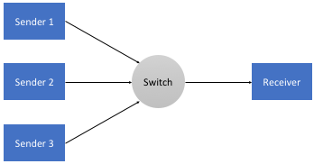
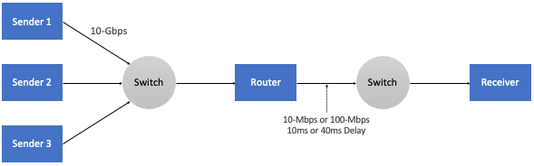

Chapter 3:  Design Space
==========================

With the architectural foundation of TCP/IP in place, we are ready to
explore the design space for addressing congestion.  But to do this,
it is helpful to first take a step back and consider the bigger
picture. The Internet is a complex arrangement of compute, storage,
and communication resources that is shared among millions of
users. The challenge is how to assign those resources—specifically
switching capacity, buffer space, and link bandwidth—to end-to-end
packet flows.

Because the Internet originally adopted a best-effort service model,
and users (or more precisely, TCP running on their behalf) were free
to send as many packets into the network as they could generate, it
was not surprising that the Internet eventually suffered from the
*tragedy of the commons*. And with users starting to experience congestion
collapse, the natural response was to try to control it. Hence the
term *congestion control*, which can be viewed as an implicit
mechanism for allocating resources. It is implicit in the sense that
as the control mechanism detects resources
becoming scarce, it reacts in an effort to alleviate congestion.

A network service model in which resources are *explicitly* allocated to
packet flows is the obvious alternative; for example, an application
could make an explicit request for resources before sending traffic.  The best-effort
assumption of IP meant such an approach was not immediately viable at the time
congestion became a serious issue. Subsequently, work has been done
to retrofit more explicit resource allocation mechanisms to the
Internet's best-effort delivery model. These include the ability to
make *Quality-of-Service (QoS)* guarantees. It is instructive to
consider the Internet's approach to congestion in the context of such
efforts. The first section does so as it explores the set of design
decisions that underlie the control mechanisms outlined in this book.
We then define the criteria by which different
congestion-control mechanisms can be quantitatively evaluated and
compared.

3.1 Implementation Choices
-------------------------------

We start by introducing four implementation choices that a congestion
control mechanism faces, and the design rationale behind the decisions
that were made for TCP/IP. Some of the decision were "obvious" given
the circumstances under which they were made, but for completeness—and
because the Internet's continual evolution means circumstances
change—it is prudent to consider them all.

Centralized versus Distributed
~~~~~~~~~~~~~~~~~~~~~~~~~~~~~~~~~~

In principle, the first design decision is whether a network's
approach to resource allocation is centralized or distributed. In
practice, the Internet's scale—along with the autonomy of the
organizations that connect to it—dictated a distributed
approach. Indeed, distributed management of resources was an
explicitly stated goal of the Internet's design [#]_. But
acknowledging this default decision is important for two reasons.

.. [#] See D. Clark, `The Design Philosophy of the DARPA Internet
       Protocols
       <https://dl.acm.org/doi/10.1145/52324.52336>`__.
       ACM SIGCOMM, 1988.

First, while the Internet's approach to congestion control is
distributed across its millions of hosts and routers, it is fair to
think of them as cooperatively trying to achieve a globally optimal
solution.  From this perspective, there is a shared objective
function, and all the elements are implementing a distributed
algorithm to optimize that function. The various mechanisms described
throughout this book are simply defining different objective
functions, where a persistent challenge has been how to think about
competing objective functions when multiple mechanisms have been
deployed.

Second, while a centralized approach is not practical for the Internet
as a whole, it can be appropriate for limited domains. For example, a
logically centralized controller could collect information about the
state of the network's links and switches, compute a globally optimal
allocation, and then advise (or even police) end hosts as to how much
capacity is available to each of them. Such an approach would certainly
be limited by the time-scale in which the centralized controller could
be responsive to changes in the network, but it has been successfully
applied to the coarse-grained allocations decisions made by traffic
engineering mechanisms like B4 and SWAN.  Exactly where one draws a
line between coarse-grain traffic engineering decisions and fine-grain
congestion control decisions is not clear, but it's good to keep an
open mind about the spectrum of options that are available.

.. _reading_b4:
.. admonition:: Further Reading 

   S. Jain, et. al. `B4: Experience with a 
   Globally-Deployed Software Defined WAN 
   <https://cseweb.ucsd.edu/~vahdat/papers/b4-sigcomm13.pdf>`__.
   ACM SIGCOMM, August 2013.

Centralized control has also been used effectively in datacenters,
which are an interesting environment for congestion control. First,
they have very low RTTs (for traffic between servers in the
datacenter, if not for flows heading in or out of the datacenter).
Second, in many cases a datacenter can be treated as a greenfield,
raising the possibility to try new approaches that don't have to
coexist fairly with incumbent algorithms. Fastpass, developed in a
collaboration between MIT and Facebook researchers, is a good example
of such a centralized approach.

.. _reading_fastpass:
.. admonition:: Further Reading 

   J. Perry, et. al. `Fastpass: A Centralized "Zero-Queue" Datacenter Network 
   <http://fastpass.mit.edu/Fastpass-SIGCOMM14-Perry.pdf>`__.
   ACM SIGCOMM, August 2014.

Router-Centric versus Host-Centric 
~~~~~~~~~~~~~~~~~~~~~~~~~~~~~~~~~~

Given a distributed approach to resource allocation, the next question
is whether to implement the mechanism inside the network (i.e., at
the routers or switches) or at the edges of the network (i.e., in the
hosts, perhaps as part of the transport protocol). This is not
strictly an either/or situation. Both locations are involved, and the
real issue is where the majority of the burden falls. Individual
routers always take responsibility for deciding which packets to
forward and which packets to drop. Where there is a range of options
is how much the router involves the end hosts in specifying how this
decision is made, or learning how this decision was made.

At one end of the spectrum, routers can allow hosts to reserve
capacity and then ensure each flow's packets are delivered
accordingly.  It might do this, for example, by implementing a
signalling protocol along with Fair
Queuing, accepting new flows only when there is sufficient capacity,
and policing hosts to make sure their flows stay within their
reservations. This would correspond to a reservation-based approach in
which the network is able to make QoS guarantees. We consider this
out-of-scope for the purpose of this book.

At the other end of the spectrum is a host-centric approach. The
router makes no guarantees and offers no explicit feedback about the
available capacity (i.e., silently drops packets when its buffers are
full) and it is the host's responsibility to observe the network
conditions (e.g., how many packets they are successfully getting
through the network) and adjust its behavior accordingly.

In the middle, routers can take more proactive action to assist the
end hosts in doing their job, but not by reserving buffer space.  This
involves the router sending *feedback* to the end hosts when its
buffers are full. We describe some of these forms of *Active Queue
Management (AQM)* in Chapter 7, but the host-centric mechanisms
described in the next three chapters assume routers silently tail-drop
packets when their buffers are full.

Historically, a host-centric approach has been implemented in the
transport layer—usually by TCP, or by some other transport protocol
with TCP-like congestion control, such as DCCP (datagram congestion
control protocol) or QUIC (a relatively recent transport protocol
designed for HTTP-based applications). However, it is also possible to
implement congestion control in the application itself. DASH (Dynamic
Adaptive Streaming over HTTP) is an example of this; in fact it can be
viewed as a combination of congestion control in the transport layer
(since it runs over TCP) and the application
layer. Based on measured network performance, the server that is
streaming video to a client switches among a range of different video
encodings, thus changing the rate at which data is sent into the HTTP
stream. In effect, TCP tries to find a sustainable bandwidth for the
flow, and then the application adapts its sending rate to fully
leverage that rate without sending more data than can be sustained
under the current network conditions. Primary responsibility for
congestion control falls to TCP, but the application aims to keep the
pipe full while also maintaining a good user experience. 

.. Need to decide if DASH is getting full treatment elsewhere

Window-Based versus Rate-Based
~~~~~~~~~~~~~~~~~~~~~~~~~~~~~~

Having settled on a host-centric approach, the next implementation
choice is whether the mechanism is *window-based* or *rate-based*.
TCP uses a window-based mechanism to implement flow control, so the
design decision for TCP congestion control seems obvious.  And in
fact, the congestion-control mechanisms described in Chapter 4 are
centered around an algorithm for computing a *congestion window*,
where the sender is throttled by whichever is lesser: the advertised
flow-control window or the computed congestion-control window.

But is also possible to compute the rate at which the network is able
to deliver packets, and to pace transmissions accordingly. The
observed rate is just the number of bytes delivered over some time
period, such as the measured RTT.  We point out this duality between
rates and windows because a rate-based approach is more appropriate
for multimedia applications that generate data at some average rate
and which need at least some minimum throughput to be useful. For
example, a video codec might generate video at an average rate of
1 Mbps with a peak rate of 2 Mbps.

A rate-based approach is the logical choice in a reservation-based
system that supports different QoS levels, but even in a best-effort
network like the Internet, it is possible to implement an adaptive
rate-based congestion-control mechanism that informs the application
when it needs to adjust it transmission rate, for example by adjusting
its codec. This is the core idea of TCP-friendly rate control (TFRC),
which extends the concepts of TCP congestion avoidance to applications
that more naturally send packets at a specific rate (e.g., the bitrate
produced by a video codec at a given quality level). TFRC is typically
integrated into RTP, an alternative transport protocol for real-time
streaming. We will see examples of such mechanisms in Chapter 6.

Interestingly, many video applications that might at first seem like a
natural fit for RTP-with-TFRC actually use TCP (see the discussion of
DASH above for example). The two approaches are similar in that the
application adjusts its sending rate (by adjusting its coding rate)
based on how the transport protocol responds to congestion. DASH runs
on top of regular TCP (which as we'll see in Chapter 4 makes no
attempt to sustain a smooth sending rate), where as RTP-with-TFRC
tries to sustain a more consistent rate while being "fair" with
respect to the TCP flows it is competing against. (More on fairness in
the next section.) The key factor in whether to use RTP-with-TFRC or
DASH-over-TCP is how much buffer-induced delay the application can
tolerate, with interactive videoconferencing preferring RTP and
video-on-demand preferring DASH-over-TCP.

Control-based versus Avoidance-based
~~~~~~~~~~~~~~~~~~~~~~~~~~~~~~~~~~~~~~~~

The final implementation choice we draw attention to is somewhat
subtle.  The challenge is for the end-host, based on feedback and
observations, to compute how much capacity is available in the
network, and adjust its sending rate accordingly. There are two
general strategies for doing this: an aggressive approach that
purposely sends packets at a rate that causes packet loss and then
responds to it, and a conservative approach that tries to detect the
onset of queue build-up and slow down before they actually overflow.
We refer to the mechanisms of the first type as *control-based*, and
we refer to mechanisms of the second type as *avoidance-based*.

.. _reading_avoidance:
.. admonition:: Further Reading 

	R. Jain and K. K. Ramakrishnan. `Congestion Avoidance in
	Computer Networks with a Connectionless Network Layer:
	Concepts, Goals and Methodology. <https://arxiv.org/pdf/cs/9809095.pdf>`__.
	Computer Networking Symposium, April 1988.  

This distinction was first called out by Raj Jain and
K.K. Ramakrishnan Jain in 1988.  It is often overlooked—and the term
"congestion control" is used generically to refer to both—but our take
is that the distinction represents an important difference, and so we
will call it out when appropriate.  Admittedly, we will also fall back
to the generic use of "congestion control" when the distinction is not
critical to the discussion, but we will say "control-based" or
"avoidance-based" when the distinction is relevant.

3.2 Evaluation Criteria
-----------------------

Having identified the set of design decisions that go into crafting a
congestion-control mechanism, the next question is whether any given
solution is good or not. Recall that in Chapter 1 we posed the
question of how a network *effectively* and *fairly* allocates its
resources. This suggests at least two broad measures by which a
resource allocation scheme can be evaluated. We consider each in turn.

Effectiveness
~~~~~~~~~~~~~

A good starting point for evaluating the effectiveness of a
congestion-control mechanism is to consider the two principal metrics
of networking: throughput and delay. Clearly, we want as much
throughput and as little delay as possible. Unfortunately, these goals
can be at odds with each other. One way to increase throughput is to
allow as many packets into the network as possible, so as to drive the
utilization of all the links up to 100%. We would do this to avoid the
possibility of a link becoming idle because an idle link hurts
throughput. The problem with this strategy is that increasing the
number of packets in the network also increases the length of the
queues at each router. Such *persistent queues* mean packets are
delayed in the network, or worse, dropped. Having to drop packets in
the middle of the network not only impacts delay but also hurts
throughput because upstream link bandwidth has been wasted on a packet
that was not successfully delivered all the way to the destination.\ [#]_

.. [#]
	We sometimes use the term *goodput* instead of *throughput* to
	emphasize that we care about data that is successfully delivered
	through the network to the receiver, as opposed to just transmitted
	by the sender.

The ratio of throughput to delay is a general metric for evaluating
the effectiveness of a resource allocation scheme. This ratio is
sometimes referred to as the *power* of the system:

::

   Power = Throughput / Delay

Intuitively, the objective is to maximize this ratio, which is a
function of how much load you place on the system. The load, in turn,
is set by the resource allocation mechanism. :numref:`Figure %s
<fig-power>` gives a representative power curve, where, ideally, the
resource allocation mechanism would operate at the peak of this
curve. To the left of the peak, the mechanism is being too
conservative; that is, it is not allowing enough packets to be sent to
keep the links busy. To the right of the peak, so many packets are
being allowed into the network that either (a) increases in delay
(denominator) due to queuing are starting to dominate any small gains
in throughput, or (b) throughput (numerator) actually starts to drop
due to packets being dropped.
   
.. _fig-power:
.. figure:: figures/f06-03-9780123850591.png
   :width: 350px
   :align: center

   Ratio of throughput to delay as a function of load.

Moreover, we need to be concerned about what happens even when the
system is operating under heavy load—towards the right end of the
curve in :numref:`Figure %s <fig-power>`. Ideally, we would like to
avoid the situation in which the system throughput approaches
zero. The goal is for the mechanism to be *stable*\ —where packets
continue to get through the network even when it is operating under
heavy load. If a mechanism is not stable under heavy load, the
network will suffer from *congestion collapse*.

Fairness
~~~~~~~~~~~~~

The effective utilization of network resources is not the only criterion
for judging a resource allocation scheme. We must also consider the
issue of fairness. However, we quickly get into murky waters when we try
to define what exactly constitutes fair resource allocation. For
example, a reservation-based resource allocation scheme provides an
explicit way to create controlled unfairness. With such a scheme, we
might use reservations to enable a video stream to receive 1 Mbps across
some link while a file transfer receives only 10 kbps over the same
link.

In the absence of explicit information to the contrary, when several
flows share a particular link, we would like for each flow to receive
an equal share of the bandwidth. This definition presumes that a
*fair* share of bandwidth means an *equal* share of bandwidth. But,
even in the absence of reservations, equal shares may not equate to
fair shares.  Should we also consider the length of the paths being
compared? For example, as illustrated in :numref:`Figure %s
<fig-path-len>`, what is fair when one four-hop flow is competing with
three one-hop flows?
   
.. _fig-path-len:
.. figure:: figures/f06-04-9780123850591.png
   :width: 600px
   :align: center

   One four-hop flow competing with three one-hop flows.

Assuming that the most fair situation would be one in which all flows
receive the same bandwidth,
networking researcher Raj Jain proposed a metric that can be used to
quantify the fairness of a congestion-control mechanism. Jain’s fairness
index is defined as follows. Given a set of flow throughputs

.. math::

   (x_{1}, x_{2}, \ldots , x_{n})

(measured in consistent units such as bits/second), the following
function assigns a fairness index to the flows:

.. math::

   f(x_{1}, x_{2}, \ldots ,x_{n}) = \frac{( \sum_{i=1}^{n} x_{i}
   )^{2}} {n  \sum_{i=1}^{n} x_{i}^{2}}

The fairness index always results in a number between 0 and 1, with 1
representing greatest fairness. To understand the intuition behind this
metric, consider the case where all *n* flows receive a throughput of
1 unit of data per second. We can see that the fairness index in this
case is

.. math::

   \frac{n^2}{n \times n} = 1

Now, suppose one flow receives a throughput of :math:`1 + \Delta`. 
Now the fairness index is

.. math::

   \frac{((n - 1) + 1 + \Delta)^2}{n(n - 1 + (1 + \Delta)^2)}
   = \frac{n^2 + 2n\Delta + \Delta^2}{n^2 + 2n\Delta + n\Delta^2}

Note that the denominator exceeds the numerator by :math:`(n-1)\Delta^2`.
Thus, whether the odd flow out was getting more or less than all the
other flows (positive or negative :math:`\Delta`), the fairness index has 
now dropped below one. Another simple case to
consider is where only *k* of the *n* flows receive equal throughput,
and the remaining *n-k* users receive zero throughput, in which case the
fairness index drops to \ *k/n*.

.. _reading_jain:
.. admonition:: Further Reading 

	R. Jain, D. Chiu, and W. Hawe. `A Quantitative Measure of Fairness
	and Discrimination for Resource Allocation in Shared Computer Systems
	<https://www.cse.wustl.edu/~jain/papers/ftp/fairness.pdf>`__.
	DEC Research Report TR-301, 1984.

In the next section we revisit the notion of fairness as it applies to
the deployment of new congestion control algorithms. As noted above,
it is not as clear-cut as it might first appear.

TCP-friendly rate control (TFRC) also uses the notion of
fairness. TFRC uses the TCP throughput equation (discussed in Section
1.3) to estimate the share of a
congested link's bandwidth that
would be obtained by a flow that implemented TCP's congestion control
scheme, and sets that as a target rate for an application to
send data. The application can then make decisions to help it hit that
target rate. For example, a video streaming application might choose among a
set of different encoding quality levels to try to maintain an
average rate at the "fair" level as determined by TFRC.

3.3 Comparative Analysis
---------------------------

The first step in evaluating any congestion control mechanism is to
measure its performance in isolation, including:

* The average throughput (goodput) flows are able to achieve.

* The average end-to-end delay flows experience.

* That the mechanism avoid persistent queues across a range of
  operating scenarios.

* That the mechanism be stable across a range of operating scenarios.

* The degree to which flows receive a fair share of the available
  capacity.

The inevitable second step is to compare two or more mechanisms. This
is because, given the decentralized nature of the Internet, there is
no way to ensure uniform adoption of a just one mechanism.
Comparing quantitative metrics like throughput is easy. The problem is
how to evaluate multiple mechanism that might coexist, competing with
each other for network resources.

The question not whether a given mechanism treats all of its flows
fairly, but whether mechanism A is fair to flows managed by
mechanism B. If mechanism A is able to measure improved throughput
over B, but it does so by being more aggressive, and hence, stealing
bandwidth from B's flows, then A's improvement is not fairly gained
and may be discounted. It should be evident that the Internet's highly
decentralized approach to congestion control
works because a large number of flows respond in a cooperative way to
congestion, which opens the door to more aggressive flows improving
their performance at the expense of those which implement the
accepted, less aggressive algorithms.

.. _reading_ware:
.. admonition:: Further Reading

   R. Ware, et. al. `Beyond Jain's Fairness Index: Setting the Bar for
   the Deployment of Congestion Control Algorithms
   <https://www.cs.cmu.edu/~rware/assets/pdf/ware-hotnets19.pdf>`__.
   ACM SIGCOMM HotNets. November 2019.

Arguments like this have been made many times over the last 30 years,
which has raised a high bar to the deployment of new algorithms. Even
if global deployment of a new algorithm would be a net positive,
incremental deployment (which is the only real option) could
negatively impact flows using existing algorithms, leading to a
reluctance to deploy new approaches. But such
analysis suffers from three problems, as identified by Ranysha Ware and
colleagues:

* **Ideal-Driven Goalposting:** A fairness-based threshold asserts
  new mechanism B should equally share the bottleneck link with
  currently deployed mechanism A. This goal is too idealistic in
  practice, especially when A is sometimes unfair to its own flows.

* **Throughput-Centricity:** A fairness-based threshold focuses on
  how new mechanism B impacts a competitor flow using mechanism A
  by focusing on A’s achieved throughput.  However, this ignores other
  important figures of merit for good performance, such as latency,
  flow completion time, or loss rate.

* **Assumption of Balance:** Inter-mechanism interactions often have
  some bias, but a fairness metric cannot tell whether the outcome
  is biased for or against the status quo. It makes a difference in
  terms a deployability whether a new mechanism B takes a larger
  share of bandwidth than legacy mechanism A or leaves a larger
  share for A to consume: the former might elicit complaints from
  legacy users of A, where the latter would not. Jain’s Fairness
  Index assigns an equivalent score to both scenarios.

Instead of a simple calculation of Jain's fairness index, Ware
advocates for a threshold based on *harm*, as measured by a reduction
in throughput or an increase in latency. Intuitively, if the amount of
harm caused by flows using a new mechanism B on flows using existing
mechanism A is within a bound derived from how much harm A-managed
flows cause other A-managed flows, we can consider B deployable
alongside A without harm. Ware goes on to propose concrete measures of
acceptable harm, which we revisit for specific pairwise comparisons
throughout the book.

3.4 Experimental Methodology
--------------------------------

As described in Chapter 1, our approach to evaluating
congestion-control mechanisms is to measure their performance on real
systems. We now describe one specific way to do that, which we use in
later chapters to understand (and quantify) how the mechanisms work in
practice.

Our approach runs real TCP sending/receiving hosts, where the
implementation of the various congestion-control mechanisms are those
found in the Linux kernel. A range of behaviors are studied using a
combination of kernel packages like ``netem`` and ``tbf qdisc``,
with performance data collected using ``tcpdump``. The network
connecting the end-hosts is constructed from a combination of real
switches and emulated elements, supporting for example, wide-area
delays and low-bandwidth links.

The experiments can be characterized along two orthogonal
dimensions. One is the topology of the network. This includes link
bandwidths, RTTs, buffer sizes, and so on. The other dimension is the
traffic workload we run on the network. This includes the number and
duration of flows, as well as the characteristics of each flow (e.g.,
stream vs. RPC).

With respect to network topology, we evaluate the various algorithms
on three specific configurations:

* LAN with :math:`20\mu\rm{s}` RTT and 10-Gbps link bandwidth. This scenario
  represents servers in the same datacenter rack.

* WAN with 10ms RTT and 10-Gbps link bandwidth, with delay introduced
  on the receiver by configuring a 20,000 packet send queue. The
  bottleneck is a real switch with shallow buffers (1-2 MB). This is a
  good scenario to visualize the algorithm’s dynamics when looking at
  two to three flows.
  
* WAN with 40ms RTT and 10/100-Mbps bottleneck bandwidth, with an intermediate router 
  introduced to reduce the link bandwidth to 10 or 100 Mbps.  This
  scenario reflects a connection an end-user might experience on a
  modern network.

:numref:`Figure %s <fig-10gig>` shows the topology for the first two
scenarios, where the senders and receivers are connected through a
single switch. Delay is achieved using ``netem`` in the Receiver,
which affects only the ACKs being sent back.

.. _fig-10gig:

   Topology for 10-Gbps Tests.

:numref:`Figure %s <fig-100meg>` shows the topology for the third
scenario, where the router is implemented by a server-based forwarder
that throttles outgoing link bandwidth using ``tbf qdisc``.

.. _fig-100meg:

   Topology for 10- and 100-Mbps Tests.   

With respect to traffic workload, we evaluate the dynamics and
fairness of various mechanisms with the following tests:

* 2-flow Test: The 1st flow lasts 60 seconds, and the 2nd flow lasts
  20 seconds and starts 22 seconds after the 1st one.
  
* 3-flow Test: The 1st flow lasts 60 seconds, the 2nd flow lasts 40
  seconds and starts 12 seconds after the 1st one, the 3rd flow lasts
  20 seconds and starts 26 seconds after the 1st one.

These tests make it possible to:

* Examine how quickly existing flows adapt to new flows.
  
* Examine how quickly flows adapt to released bandwidth from terminating flows.

* Measure fairness between flows with the same (or different) congestion algorithm(s).

* Measure levels of congestion.

* Identify conditions under which performance changes abruptly,
  signalling a possible instability.

Additional tests include a combination of streaming, plus 10-KB and
1-MB RPCs. These tests allow us to see if the smaller RPC flows are
penalized, and if so, by how much. These tests make it possible to:

* Study behavior under increasing loads.
  
* Measure the performance (throughput and latency) of 1-MB and 10-KB
  flows, as well as how fairly is the available bandwidth divided
  between them.
  
* Identify conditions when the retransmissions or latency change
  abruptly, signalling an instability.

Finally, we use ``Netesto`` to configure and run the experiments,
collect the data, and produce the following graphs:

* Goodput (payload throughput) graphs. These include output for each
  flow as well as the aggregate goodput.

* Cwnd graphs. These include the congestion window (cwnd) for each flow, annotated to
  indicate the time when one or more packets are retransmitted.

* RTT graphs, as seen by each server sending data.

* Graph of cumulative losses per flow.

You will see examples of these graphs in the following
chapters. Chapter 8 describes ``Netesto`` and the associated software
tools in more detail.
