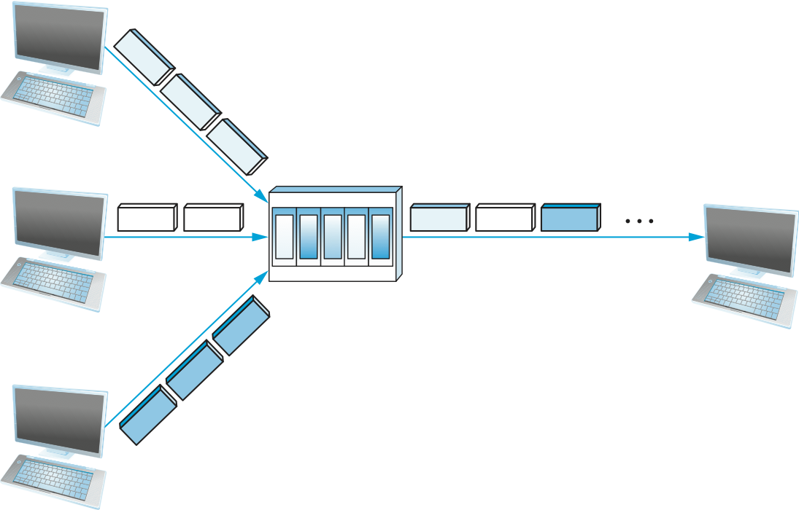

Chapter 1:  Introduction
========================

*[The following is cut-and-pasted from CN:ASA; may be useful here.]*

Cost-Effective Resource Sharing
---------------------------------------

As stated above, this book focuses on packet-switched networks. This
section explains the key requirement of computer
networks—efficiency—that leads us to packet switching as the strategy of
choice.

Given a collection of nodes indirectly connected by a nesting of
networks, it is possible for any pair of hosts to send messages to each
other across a sequence of links and nodes. Of course, we want to do
more than support just one pair of communicating hosts—we want to
provide all pairs of hosts with the ability to exchange messages. The
question, then, is how do all the hosts that want to communicate share
the network, especially if they want to use it at the same time? And, as
if that problem isn’t hard enough, how do several hosts share the same
*link* when they all want to use it at the same time?

To understand how hosts share a network, we need to introduce a
fundamental concept, *multiplexing*, which means that a system resource
is shared among multiple users. At an intuitive level, multiplexing can
be explained by analogy to a timesharing computer system, where a single
physical processor is shared (multiplexed) among multiple jobs, each of
which believes it has its own private processor. Similarly, data being
sent by multiple users can be multiplexed over the physical links that
make up a network.

To see how this might work, consider the simple network illustrated in
:numref:`Figure %s <fig-mux>`, where the three hosts on the left side
of the network (senders S1-S3) are sending data to the three hosts on
the right (receivers R1-R3) by sharing a switched network that
contains only one physical link. (For simplicity, assume that host S1
is sending data to host R1, and so on.) In this situation, three flows
of data—corresponding to the three pairs of hosts—are multiplexed onto
a single physical link by switch 1 and then *demultiplexed* back into
separate flows by switch 2. Note that we are being intentionally vague
about exactly what a “flow of data” corresponds to. For the purposes
of this discussion, assume that each host on the left has a large
supply of data that it wants to send to its counterpart on the right.

.. _fig-mux:
.. figure:: figures/f01-05-9780123850591.png
   :width: 500px
   :align: center
   
   Multiplexing multiple logical flows over a single
   physical link.

There are several different methods for multiplexing multiple flows onto
one physical link. One common method is *synchronous time-division
multiplexing* (STDM). The idea of STDM is to divide time into
equal-sized quanta and, in a round-robin fashion, give each flow a
chance to send its data over the physical link. In other words, during
time quantum 1, data from S1 to R1 is transmitted; during time quantum
2, data from S2 to R2 is transmitted; in quantum 3, S3 sends data to R3.
At this point, the first flow (S1 to R1) gets to go again, and the
process repeats. Another method is *frequency-division multiplexing*
(FDM). The idea of FDM is to transmit each flow over the physical link
at a different frequency, much the same way that the signals for
different TV stations are transmitted at a different frequency over the
airwaves or on a coaxial cable TV link.

Although simple to understand, both STDM and FDM are limited in two
ways. First, if one of the flows (host pairs) does not have any data to
send, its share of the physical link—that is, its time quantum or its
frequency—remains idle, even if one of the other flows has data to
transmit. For example, S3 had to wait its turn behind S1 and S2 in the
previous paragraph, even if S1 and S2 had nothing to send. For computer
communication, the amount of time that a link is idle can be very
large—for example, consider the amount of time you spend reading a web
page (leaving the link idle) compared to the time you spend fetching the
page. Second, both STDM and FDM are limited to situations in which the
maximum number of flows is fixed and known ahead of time. It is not
practical to resize the quantum or to add additional quanta in the case
of STDM or to add new frequencies in the case of FDM.

The form of multiplexing that addresses these shortcomings, and of which
we make most use in this book, is called *statistical multiplexing*.
Although the name is not all that helpful for understanding the concept,
statistical multiplexing is really quite simple, with two key ideas.
First, it is like STDM in that the physical link is shared over
time—first data from one flow is transmitted over the physical link,
then data from another flow is transmitted, and so on. Unlike STDM,
however, data is transmitted from each flow on demand rather than during
a predetermined time slot. Thus, if only one flow has data to send, it
gets to transmit that data without waiting for its quantum to come
around and thus without having to watch the quanta assigned to the other
flows go by unused. It is this avoidance of idle time that gives packet
switching its efficiency.

As defined so far, however, statistical multiplexing has no mechanism to
ensure that all the flows eventually get their turn to transmit over the
physical link. That is, once a flow begins sending data, we need some
way to limit the transmission, so that the other flows can have a turn.
To account for this need, statistical multiplexing defines an upper
bound on the size of the block of data that each flow is permitted to
transmit at a given time. This limited-size block of data is typically
referred to as a *packet*, to distinguish it from the arbitrarily large
*message* that an application program might want to transmit. Because a
packet-switched network limits the maximum size of packets, a host may
not be able to send a complete message in one packet. The source may
need to fragment the message into several packets, with the receiver
reassembling the packets back into the original message.

.. _fig-statmux:

   
   A switch multiplexing packets from multiple sources
   onto one shared link.

In other words, each flow sends a sequence of packets over the
physical link, with a decision made on a packet-by-packet basis as to
which flow’s packet to send next. Notice that, if only one flow has
data to send, then it can send a sequence of packets back-to-back;
however, should more than one of the flows have data to send, then
their packets are interleaved on the link. :numref:`Figure %s
<fig-statmux>` depicts a switch multiplexing packets from multiple
sources onto a single shared link.

The decision as to which packet to send next on a shared link can be
made in a number of different ways. For example, in a network consisting
of switches interconnected by links such as the one in :numref:`Figure
%s <fig-mux>`, the decision would be made by the switch that transmits
packets onto the shared link. (As we will see later, not all
packet-switched networks actually involve switches, and they may use
other mechanisms to determine whose packet goes onto the link next.)
Each switch in a packet-switched network makes this decision
independently, on a packet-by-packet basis. One of the issues that faces
a network designer is how to make this decision in a fair manner. For
example, a switch could be designed to service packets on a first-in,
first-out (FIFO) basis. Another approach would be to transmit the
packets from each of the different flows that are currently sending data
through the switch in a round-robin manner. This might be done to ensure
that certain flows receive a particular share of the link’s bandwidth or
that they never have their packets delayed in the switch for more than a
certain length of time. A network that attempts to allocate bandwidth to
particular flows is sometimes said to support *quality of service*
(QoS).

Also, notice in :numref:`Figure %s <fig-statmux>` that since the
switch has to multiplex three incoming packet streams onto one
outgoing link, it is possible that the switch will receive packets
faster than the shared link can accommodate. In this case, the switch
is forced to buffer these packets in its memory. Should a switch
receive packets faster than it can send them for an extended period of
time, then the switch will eventually run out of buffer space, and
some packets will have to be dropped. When a switch is operating in
this state, it is said to be *congested*.

.. _key-stat-mux:
.. admonition:: Key Takeaway

  The bottom line is that statistical multiplexing defines a
  cost-effective way for multiple users (e.g., host-to-host flows of
  data) to share network resources (links and nodes) in a fine-grained
  manner. It defines the packet as the granularity with which the
  links of the network are allocated to different flows, with each
  switch able to schedule the use of the physical links it is
  connected to on a per-packet basis. Fairly allocating link capacity
  to different flows and dealing with congestion when it occurs are
  the key challenges of statistical multiplexing.

*[The following is probably repetative. It comes from the Issues
scection of chapter 6.]*

Resource allocation and congestion control are complex issues that have
been the subject of much study ever since the first network was
designed. They are still active areas of research. One factor that makes
these issues complex is that they are not isolated to one single level
of a protocol hierarchy. Resource allocation is partially implemented in
the routers, switches, and links inside the network and partially in the
transport protocol running on the end hosts. End systems may use
signalling protocols to convey their resource requirements to network
nodes, which respond with information about resource availability. One
of the main goals of this chapter is to define a framework in which
these mechanisms can be understood, as well as to give the relevant
details about a representative sample of mechanisms.

We should clarify our terminology before going any further. By *resource
allocation*, we mean the process by which network elements try to meet
the competing demands that applications have for network
resources—primarily link bandwidth and buffer space in routers or
switches. Of course, it will often not be possible to meet all the
demands, meaning that some users or applications may receive fewer
network resources than they want. Part of the resource allocation
problem is deciding when to say no and to whom.

We use the term *congestion control* to describe the efforts made by
network nodes to prevent or respond to overload conditions. Since
congestion is generally bad for everyone, the first order of business is
making congestion subside, or preventing it in the first place. This
might be achieved simply by persuading a few hosts to stop sending, thus
improving the situation for everyone else. However, it is more common
for congestion-control mechanisms to have some aspect of fairness—that
is, they try to share the pain among all users, rather than causing
great pain to a few. Thus, we see that many congestion-control
mechanisms have some sort of resource allocation built into them.

It is also important to understand the difference between flow control
and congestion control. Flow control involves keeping a fast sender from
overrunning a slow receiver. Congestion control, by contrast, is
intended to keep a set of senders from sending too much data *into the
network* because of lack of resources at some point. These two concepts
are often confused; as we will see, they also share some mechanisms.

