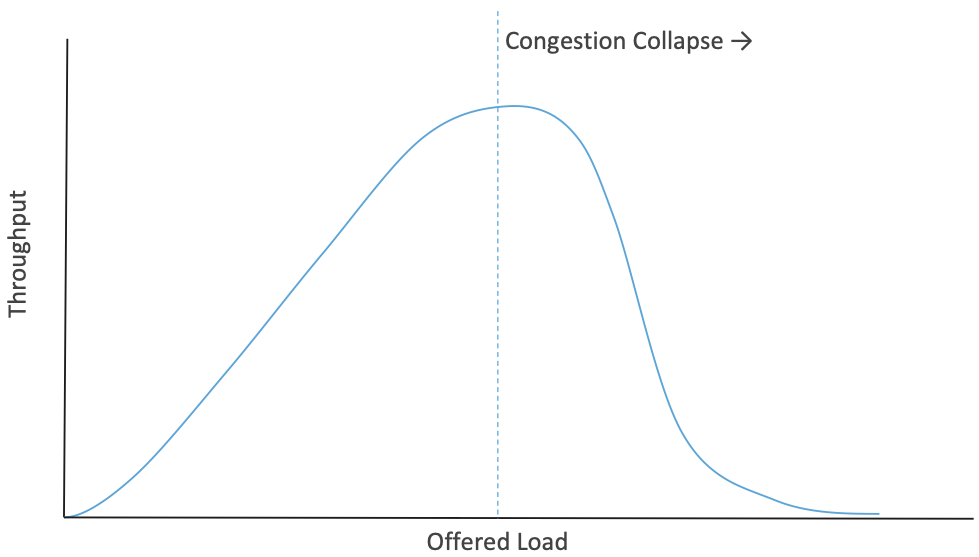

Chapter 1:  Introduction
========================
	
The Internet is considered an engineering success with few peers, and
rightfully so. It has scaled to connect billions of devices, supports
every imagined communications application, and accommodates
transmission rates ranging from tens of bits-per-day to hundreds of
gigabits-per-second. But at its core is a thorny technical challenge
that has drawn widespread attention for the last 30-plus years, from both
practitioners trying to make the Internet perform better and
theoreticians wanting to understand its mathematical underpinnings:
how the Internet’s resources are best allocated to all the competing
interests trying to use it.

Resource allocation is a hard problem in any computer system, but
especially so for a system as complex as the Internet. The problem was
not top-of-mind when the Internet’s TCP/IP protocol stack was first
deployed in the early 1980s.  By the end of the decade, however, with the
Internet gaining serious use in universities (but predating
the World Wide Web's invention by several years), the network began
to experience a
phenomenon known as *congestion collapse* . A solution—congestion
control—was developed and deployed in the late 1980s and the
immediate crisis was addressed. The
Internet community has been studying and refining its approach to
congestion control ever since. This book is about that journey.

The most famous early efforts to manage congestion were undertaken by two
researchers, Van Jacobson and Mike Karels. The resulting paper, 
*Congestion Avoidance and Control*, published in 1988, is one of the
most cited papers in networking of all time. There are
good reasons for that. One is that congestion collapse really did
threaten the nascent Internet, and the work undertaken to
address it was foundational to the Internet's ultimate
success. Without that work it's unlikely we'd have the global Internet
we have today.

Another reason for the citation impact of this work is that congestion
control has been an amazingly fruitful area of research for over three
decades. Congestion control, and resource allocation more broadly, are
wide open design spaces with plenty of room for innovation. Decades of
research and implementation have built on the early foundations, and
it seems fair to assume that new approaches 
or refinements to the existing approaches will continue to appear for
as long as the Internet exists.

In this book, we explore the design space for congestion control in
the Internet and present a description of the major approaches to
managing or avoiding congestion that
have been developed over the last three decades. 

.. _reading_vj:
.. admonition:: Further Reading

   V. Jacobson `Congestion Avoidance and Control
   <https://dl.acm.org/doi/10.1145/52324.52356>`__.
   ACM SIGCOMM '88 Symposium, August 1988.

1.1 What is Congestion?
------------------------

Anyone who has driven on a highway at rush hour has experienced
congestion. There is a limited resource—the space on the highway—and a
set of cars, trucks, etc. that compete for that resource. As rush hour
gets underway, more traffic arrives but the road keeps working as
intended, just with more vehicles on it. But there
comes a point where the number of vehicles becomes so large that
everyone has to slow down (because there is no longer enough space for
everyone to keep a safe distance at the speed limit) at which point the
road actually becomes *less effective* at moving vehicles. So, just at
the point when you would be wanting more capacity, there is actually
less capacity to move traffic, as illustrated in :numref:`Figure %s <fig-collapse>`. This is the essence of *congestion
collapse*, when congestion is so bad that the system starts to perform
significantly worse than it did without congestion. The mechanism of congestion collapse is quite a bit different for
packet networks than for highways, but it is equally problematic [#]_.

.. _fig-collapse:

   As load increases, throughput rises then falls at the point of
   congestion collapse.

   
.. [#] Networking people like making analogies between real-world
       congestion and network congestion, but it's important to
       recognize that analogies are imperfect.
   
This book focuses on congestion control for packet-switched
networks. A fundamental aspect in packet switching is *multiplexing*,
which means that a system resource—such as a link or a queue in a
router— is shared among multiple users or applications. Furthermore,
packet networks are *statistically multiplexed*, which means that, as
packets show up somewhat randomly, we rely on the statistical
properties of those arrivals to ensure that we don't run out of
resources. The existence of congestion collapse shows that sometimes
the statistics don't quite work out as we'd like.

To see how this might work, consider the simple network illustrated in
:numref:`Figure %s <fig-mux>`, where the three hosts on the left side
of the network (senders S1-S3) are sending data to the three hosts on
the right (receivers R1-R3) by sharing a switched network that
contains only one physical link. (For simplicity, assume that host S1
is sending data to host R1, and so on.) In this situation, three flows
of data—corresponding to the three pairs of hosts—are multiplexed onto
a single physical link by switch 1 and then *demultiplexed* back into
separate flows by switch 2. Note that we are being intentionally vague
about exactly what a “flow of data” corresponds to for now, but we
will make this more precise in later chapters.

.. _fig-mux:

   
   Multiplexing multiple logical flows over a single
   physical link.

Statistical multiplexing means that all the hosts in this network send
packets whenever it suits them, and if it happens that several packets
turn up at the same time at a switch, one of them will be transmitted
first while the others are placed into a queue. So both the link and
the queue are shared resources, and both are finite. The link can
only carry so many bits per second, and the queue can only hold so
many packets (or bytes) before it has to start discarding
packets. Managing the access to these shared resources, and trying to
do so in a way that prevents congestion collapse, is the essence
of congestion control. A switch that occasional puts packets in a
queue is operating normally. A switch that has large numbers of
packets in its queues all or most
of the time is congested. We'll get to the definition of congestion
collapse for networks later on, but it starts with congested switches,
routers or links. 

For a deeper introduction to statistical multiplexing, and why it's
the approach of choice for packet networks, we refer to the
following text.

.. _reading_statmux:
.. admonition:: Further Reading

      `Requirements
      <https://book.systemsapproach.org/foundation/requirements.html>`__.
      *Computer Networks: A Systems Approach*, 2020.

When a switch builds a queue of packets awaiting transmission, it
needs to decide which packet gets sent next.  Each switch in a
packet-switched network makes this decision independently, on a
packet-by-packet basis. One of the issues that arises is how to make
this decision in a fair manner. For example, many switches are
designed to service packets on a first-in, first-out (FIFO)
basis. Another approach would be to transmit the packets from each of
the different flows that are currently sending data through the switch
in a round-robin manner. This might be done to ensure that certain
flows receive a particular share of the link’s bandwidth or that they
never have their packets delayed in the switch for more than a certain
length of time. A network that attempts to allocate bandwidth to
particular flows is sometimes said to support *Quality-of-Service
(QoS)*.

One thing to take away from this discussion is that it is in the
nature of packet-switched networks that they will sometimes be
congested. The focus of this book is on the large body of work that
has been done to mitigate congestion, either by responding to it in
effective ways to lessen it, or by preventing it before it occurs.

1.2 Controlling Congestion
---------------------------

Resource allocation and congestion control are complex issues that have
been the subject of much study ever since the first network was
designed. They are still active areas of research. One factor that makes
these issues complex is that they are not isolated to a single level
of a protocol hierarchy. Resource allocation is partially implemented in
the routers, switches, and links inside the network and partially in the
transport protocol running on the end hosts. End systems may use
signalling protocols to convey their resource requirements to network
nodes, which respond with information about resource
availability. Application protocols may themselves be designed to mitigate
congestion, for example, by changing the resolution of video transmission
based on the current network conditions. This is a canonical example
of a *systems issue*: you can't fully understand congestion without
looking at all the places in the system that it touches.

We should clarify our terminology before going any further. By *resource
allocation*, we mean the process by which network elements try to meet
the competing demands that applications have for network
resources—primarily link bandwidth and buffer space in routers or
switches. Of course, it will often not be possible to meet all the
demands, meaning that some users or applications may receive fewer
network resources than they want. Part of the resource allocation
problem is deciding when to say no and to whom.

We use the term *congestion control* to describe the efforts made by
network nodes (including end systems) to prevent or respond to overload conditions. Since
congestion is generally bad for everyone, the first order of business is
making congestion subside, or preventing it in the first place. This
might be achieved simply by persuading a few hosts to stop sending, thus
improving the situation for everyone else. However, it is more common
for congestion-control mechanisms to have some aspect of fairness—that
is, they try to share the pain among all users, rather than causing
great pain to a few. Thus, we see that many congestion-control
mechanisms have some sort of resource allocation built into them.

It is also important to understand the difference between flow control
and congestion control. Flow control involves keeping a fast sender from
overrunning a slow receiver. Congestion control, by contrast, is
intended to keep a set of senders from sending too much data *into the
network* because of lack of resources at some point. These two concepts
are often confused; as we will see, they also share some mechanisms.

Given all the different places and layers where congestion control and resource
allocation can be implemented, it is helpful to start with a simple
approach, which is pretty much what Jacobson and Karels did (although
their solution ended up having quite a few moving parts).

In the early Internet, routers implemented the most basic resource
allocation approach possible: FIFO queuing with tail drop. There was
no awareness of flows or applications, so they simply accepted packets
as they arrived, placed them in a queue whenever the outbound link
capacity was less than the arrival rate, served the queue by the FIFO
discipline, and dropped arriving packets if they queue was full
("tail-drop"). This is still the most common form of queuing
today; we will discuss other approaches to queuing including
*Active Queue Management* in a later chapter.

The reason that congestion collapse occurred in the early Internet is that
dropped packets are not just discarded and forgotten. When the
end-to-end transport protocol is TCP, as it is for most Internet
traffic, a dropped packet will be retransmitted. So as congestion
rises, the number of retransmitted packets rises; in other words, the
number of packets sent into the network increases even if there is no
real increase in the offered load from users and applications. More
packets lead to more drops leading to more retransmissions and so
on. You can see how this leads to collapse.

A useful term in this context is *goodput*, which is distinguished
from throughput in the sense that only packets doing useful work are
counted towards goodput. So, for example, if a link is running at 100%
utilization, but 60% of the packets on that link are retransmitted due
to earlier losses, you could say the goodput was only 40%.

The key insight of early researchers on congestion control was that it
was possible and necessary for TCP to do something other than blindly retransmit
lost packets during times of congestion. TCP would have to detect the
congestion—which it can do, for example, by noticing the loss of
packets—and then respond to the congestion by *reducing* the amount of
traffic sent into the network. This interaction between the end-to-end
protocol and the network during times of congestion formed the basis
for much of today's congestion control and avoidance approaches. We'll
get into the specifics of how these approaches work in subsequent
chapters. 

1.3 Theoretical Underpinnings
------------------------------

There has been a lot of important theoretical work done to understand
congestion. At the core of congestion is queuing, and there is a huge
body of theory behind queuing, much of which extends into other
physical realms such as supermarket checkouts and road congestion. The
standard reference on queuing for packet networks was written by one
of the early pioneers of the ARPANET, Leonard Kleinrock.

.. _reading_queue:
.. admonition:: Further Reading

   L. Kleinrock, `Queueing Systems, Volume 2
   <https://archive.org/details/queueingsystems02klei>`__.

As packet networks became more widespread in the 1980s, there was a
great deal of interest in how traffic behaved, with a growing
realization that it might be more complex than had first been
thought. One of the most popular models for data traffic was the
Poisson model, which had worked well for various systems like call
arrivals in the telephone network and people arriving at a queue in a
supermarket. But the more that people studied the Internet and other
packet networks, the worse the Poisson model started to look. There
are a number of seminal papers that make the case for more complex
models, of which the following are two.

.. _reading_pfail:
.. admonition:: Further Reading

   V. Paxson and S. Floyd, `Wide-Area Traffic: The Failure of Poisson Modeling
   <https://www.icir.org/vern/papers/poisson.TON.pdf>`__.
   IEEE/ACM Transactions on Networking, June 1995.

         
   W. Leland *et al*,  `On the self-similar nature of Ethernet
   traffic
   <https://doi.org/10.1145/167954.166255>`__.
   ACM SIGCOMM '93 Symposium, August 1993.

These papers and others contributed to the consensus that Internet
traffic is much more “bursty”—packets arrive in clumps—than had been
assumed by early models.  Furthermore, this burstiness displays
*self-similarity*—a property of fractals, whereby when you zoom in,
you keep seeing similar complexity at finer resolutions. For Internet
traffic, this means that at any time scale, from microseconds to
hours, you will see similar sorts of patterns.

This research had a number of practical consequences, such as the
realization that packet queues might get to be very long indeed, and
thus routers and switches should have reasonably large packet
buffers. (Correctly sizing those buffers became its own research
topic.) Link utilizations could not be reliably kept close to 100% all
the time, because you had to allow room for unpredictable bursts.

Two topics of particular importance when thinking about congestion
avoidance are *fairness* and *stability*. When the network is
congested, it's going to be necessary for some users or flows to send
less. It is clearly worth asking: which flows should send less? Should
all flows share the pain equally? And what happens if some flows pay
more attention to congestion signals than others? These questions are at the heart of
the fairness issue. Jain's *fairness index* is one of the widely
accepted ways to measure how fair a network is; we will dig into this
topic in Chapter 3.

Stability is a critical property for any sort of control system, which
is what congestion control is. Congestion is detected, some action is
taken to reduce the total amount of traffic, causing congestion to
ease, at which point it would seem reasonable to start sending more
traffic again, leading back to more congestion. You can imagine that
this sort of oscillation between congested and uncongested states
could go on forever, and would be quite detrimental if the network is
swinging from underutilized to collapsing.  We really want it to settle on some
optimum where the network is busy but not so much so that
congestion collapse occurs. Finding these stable control loops has
been one of the key challenges for congestion control system designers
over the decades. The quest for stability features heavily in the
early work of Jacobson and Karels and stability remains a requirement that 
subsequent approaches have to meet.

Once the initial congestion control algorithms of TCP were implemented
and deployed, researchers began to build mathematical models of TCP's
behavior. This enabled the relationship between packet loss rate,
round-trip time, and throughput to be established. The foundation was
laid in the paper by Mathis and colleagues, but there has been a body
of work that is ongoing as the congestion control algorithms
evolve. The idea that TCP would converge to a certain throughput given
stable conditions of RTT and loss also formed the basis for
*TCP-friendly rate control (TFRC)*. TFRC extends TCP-like congestion
control to applications that don't use TCP, based on the idea that
they can still share available capacity in a fair way with those that
do. We return to this topic in a later chapter.

.. _reading_mathis_eqn:
.. admonition:: Further Reading

   M. Mathis, J. Semke, J. Mahdavi, and T. Ott. `The Macroscopic
   Behavior of the TCP Congestion Avoidance Algorithm
   <https://dl.acm.org/doi/abs/10.1145/263932.264023>`__.
   SIGCOMM CCR, 27(3), July 1997.                

Finally, much of the theoretical work on congestion control has framed
the problem as *"a distributed algorithm to share network resources
among competing sources, where the goal is to choose source rate so as
to maximize aggregate source utility subject to capacity
constraints."* Formulating a congestion-control mechanism as an algorithm
to optimize an objective function is traceable to a paper by Frank
Kelly in 1997, and later extended by Sanjeewa Athuraliya and Steven
Low to take into account both traffic sources (TCP) and router queuing
techniques (AQM).

.. _reading_kelly_low:
.. admonition:: Further Reading

   F. Kelly, `Charging and Rate Control for Elastic Traffic
   <http://www.statslab.cam.ac.uk/~frank/elastic.pdf>`__.
   European Transactions on Telecommunications, 8:33–37, 1997.

   S. Athuraliya and S. Low, `An Empirical Validation of a Duality
   Model of TCP and Active Queue Management Algorithms
   <https://ieeexplore.ieee.org/document/977445>`__.  Proceedings of the
   Winter Simulation Conference, 2001.

This book does not pursue the mathematical formulation outlined in
these papers (and the large body of work that followed), but we do
find it helpful to recognize that there is an established connection
between optimizing a utility function and the pragmatic aspects of the
mechanisms described in this book. Congestion control is an area of
networking in which theory and practice have been productively linked
to explore the solution space and develop robust approaches to the
problem. 

1.4 Congestion Control Today
----------------------------

It sometimes feels like networking protocols have all been nailed down
and standardized for decades, but few areas have remained as dynamic
as congestion control. While the early work by Jacobson, Karels and
others laid the foundation, there has been a long series of
innovations that continue today. We'll cover many of these in detail
in subsequent chapters, but you can rest assured that new ideas in congestion
control will continue to emerge for years to come.

Sometimes innovations are necessitated by changes in the
landscape. For example, as bandwidths increased from megabits to
gigabits per second, the amount of data in flight at any instant
increased, which raises the stakes for detecting and responding to
congestion quickly.  High latency links, such as trans-oceanic cables
and satellite links added to this problem by raising the round-trip
time (RTT). These
situations led to such innovations as using delay (and changes to
delay) as a congestion signal (first seen in TCP Vegas). Also, with these "fatter pipes", there is a
greater incentive to get the pipe filled quickly; you don't want to
spend 10 RTTs figuring out how quickly you can send data
if your message could have been sent in one or two RTTs. This led to
efforts to more quickly determine the bottleneck bandwidth, such as
XCP, RCP, and Quick-start for TCP.

Wireless networks, which became mainstream long after the early days
of TCP, added a new issue to the mix: packet loss was no longer a
reliable congestion signal, but could instead be attributed to a noisy
radio channel. This led to a range of approaches to either hide the
loss from the TCP hosts or to improve the mechanisms by which TCP
detects congestion.

Cloud datacenters became another "use case" for congestion-control
mechanisms. Unlike the Internet in general, where end-to-end latencies
are highly variable, the RTT in a datacenter is both predictable and
relatively small (<10ms). And because the network is highly regular in
structure (e.g., a leaf-spine fabric) it is well-understood where and
under what circumstances congestion is likely to occur. This makes TCP
running in a datacenter ripe for a purpose-tuned algorithm rather than
having to use the general-purpose mechanism that runs on the global
Internet.

New applications have also contributed to the interest in improving
congestion control. One salient example is the rise of video streaming
as the (currently) dominant source of traffic on the Internet. Again,
there were many approaches developed to make video work better under
conditions of congestion. One that has enjoyed great success is
*Dynamic Adaptive Streaming over HTTP (DASH)*, in which the server
delivering the video switches from one quality of encoding to another
(and hence from one bit-rate to another) in response to the measured
congestion on the path to the receiver. This moves the congestion
control loop up to the application layer, or rather, it adds a second
control loop on top of the one already provided by TCP. 

This quick tour of innovations is hardly exhaustive, and we will see
more detail on these and other approaches in the coming chapters. The
important thing to understand at this point is that congestion control
continues to evolve as the technology landscape and application
requirements change.

1.5 Reference Implementation
-------------------------------

We saw in Section 1.3 that there is a rich body of literature studying
the mathematical properties of congestion-control algorithms, yet
congestion control remains a highly pragmatic concern. It is estimated
that TCP connections carry 85% of the traffic on the Internet, and
those connections are anchored in software implementations of TCP
running in every imaginable OS (e.g., Linux, Windows, MacOS, iOS,
Android). As a practical matter, the very specification of the
congestion-control mechanisms we discuss in this book is represented
in kernel-level code, typically implemented in C. The theory defines
abstract models of this code, but the code *specifies* the algorithm.

If the implementation is effectively the specification, then which
implementation is authoritative; which is the *reference
implementation?* The answer has been the dominant open source
implementation of the day. This was originally the *Berkeley Software
Distribution (BSD)* implementation of Unix, and in fact, the initial
algorithm proposed by Jacobson and Karels was a noteworthy feature of
the Tahoe release of BSD 4.3 in 1988. This connection between BSD Unix
and the TCP congestion-control algorithms was so strong that the
variants of algorithm became known (named) according to the BSD
release: e.g., TCP Tahoe, and later TCP Reno.

.. _reading_bsd:
.. admonition:: Further Reading

   S.J. Leffler, M.K. McKusick, M.J. Karels, and J.S Quarterman.
   *The Design and Implementation of the 4.3 BSD Unix Operating
   System.* Addison-Wesley. January 1989.

.. sidebar:: Berkeley Unix

	*Any student of the Internet should have an appreciation for
	the role Berkeley Unix (aka BSD) played in the success of the
	Internet. Unix, of course, originated at AT&T Bell Labs in the
	early 1970s, but it was an investment by DARPA to support an
	open source implementation of Unix—which was to include the
	fledgling TCP/IP protocol stack—that proved to be
	transformative.*

	*At the time, the success of the Internet was not a foregone
	conclusion. It was viewed by many as a research curiosity, and
	certainly did not enjoy much support within the computing and
	telecommunication incumbents of the day. It was largely because
	universities (and their students) had access to an open
	implementation of the Internet protocol stack, and affordable
	hardware to run it on, that TCP/IP took root. Seeding
	transformative technology through open source software and
	readily available hardware has proven to be a powerful
	strategy, of which BSD is an early success story.*

BSD and its descendants continue to this day (notably as FreeBSD), but it was eventually
overtaken by Linux, in the early 2000s, as the *de facto* open source,
Unix-based OS. All the variants of TCP congestion control described in
this book are available (and can be optionally activated) in the Linux
kernel. They have become the reference implementation of those
algorithms, which leads us to our final point: The standard for
evaluating TCP congestion-control mechanisms is empirical, by running
real traffic between Linux-based implementations of TCP senders and
receivers. The open question is: What traffic, and over what network?

While useful insights can often be gained by observing the behavior of
TCP connections running across the actual Internet, the wide
variability (in both time and space) of "the Internet" makes
controlled experiments virtually impossible. Instead, the current
best-practice is to run a collection of "representative flows" over
isolated but "representative network topologies." There is no
established gold standard for either the set of flows or the set of
network topologies, so experimental results are never definitive.  But
the body of evidence collected using this methodology as proven
sufficient to advance the state-of-the-art over the years.

For the purposes of this book, we use the experimental methodology
described in Chapter 3. We use it to both visualize the behavior of
the various algorithms (helping to build intuition) and to highlight
problematic scenarios that continue to make congestion control such a
challenging and interesting technical problem.
