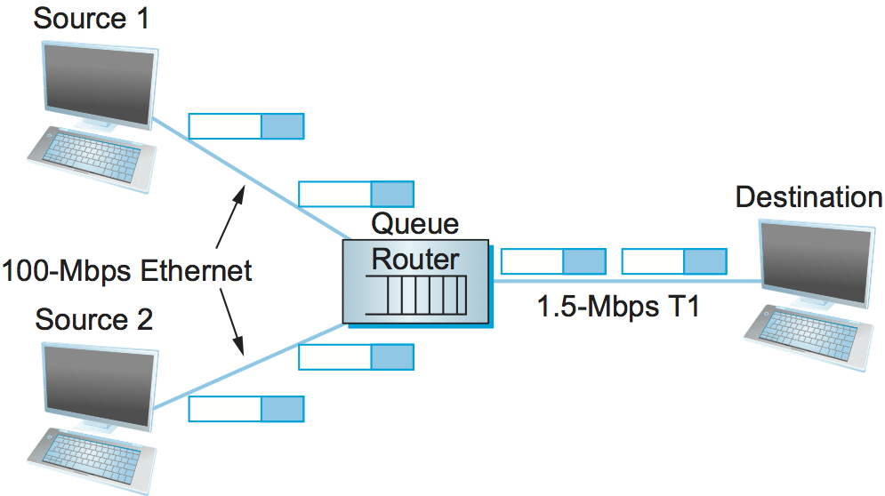
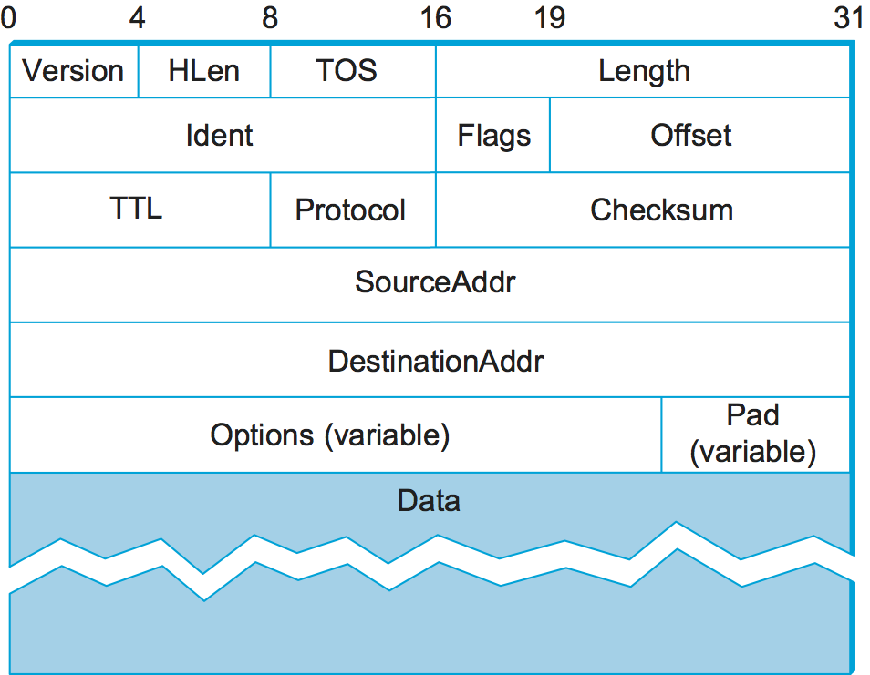
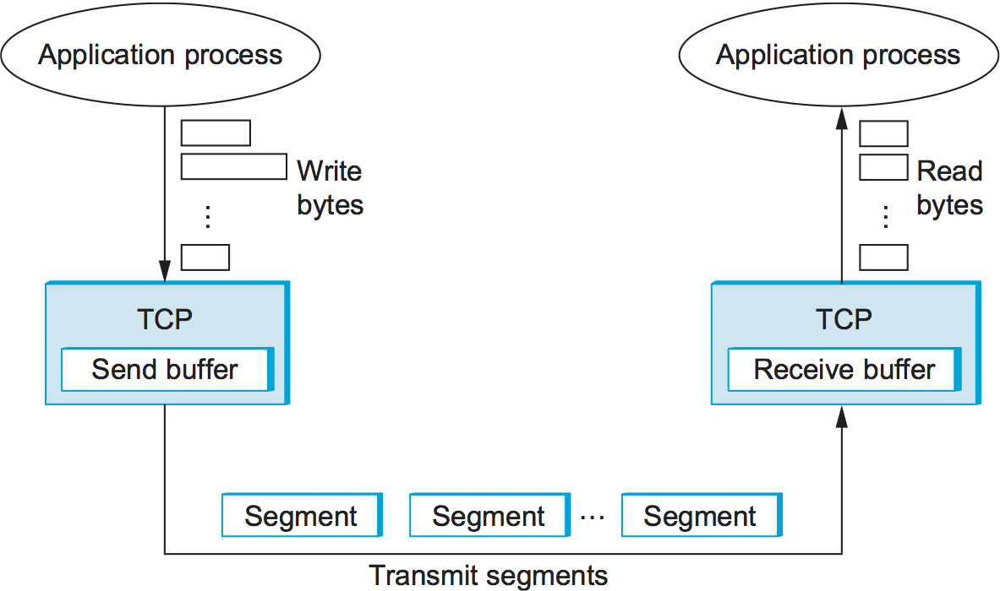
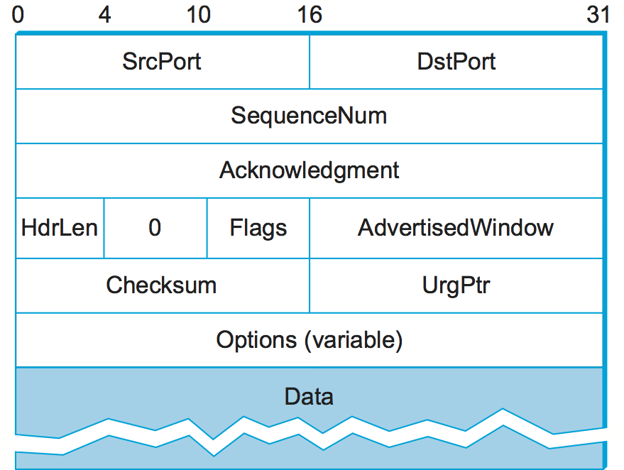
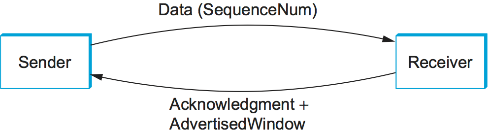
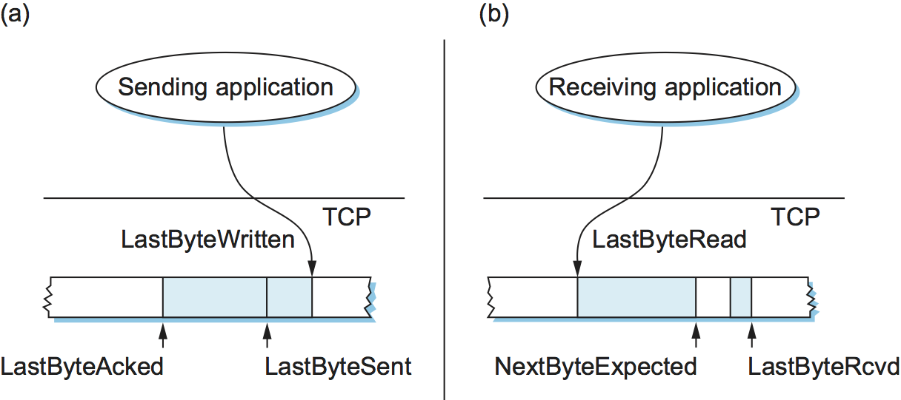

Chapter 2:  Background
======================

..
	This chapter still includes too much detail.
        For my taste, including the IP header is overkill - bsd

To understand the Internet's approach to congestion, it's necessary to
first talk about the assumptions and design decisions built into the
Internet architecture. This chapter does that, and in doing so, gives
enough detail about the TCP/IP protocol stack to understand the
specifics of the congestion control mechanisms introduced in later
chapters. For more complete coverage of TCP and IP, we recommend the
following. 

.. _reading_tcpip:
.. admonition:: Further Reading 

      `Computer Networks: A Systems Approach
      <https://book.systemsapproach.org>`__, 2020.
		
2.1  Best-Effort Packet Delivery
-------------------------------------

The Internet supports a *connectionless, best-effort* packet delivery
service model, as specified by the Internet Protocol (IP) and
implemented by switches and routers. Being *connectionless* means
every IP packet carries enough information for the network to forward
it to its correct destination; there is no setup mechanism to tell the
network what to do when packets arrive.   *Best-effort* means
that if something goes wrong and the packet gets lost, corrupted, or
misdelivered while en route, the network does nothing to recover from
the failure. This approach was intentionally designed to keep routers
as simple as possible, and is generally viewed as an implementation
based on the *end-to-end argument*.\ [#]_

.. [#] `End-to-End Arguments in System Design
       <https://web.mit.edu/Saltzer/www/publications/endtoend/endtoend.pdf>`__,
       J. Saltzer, D. Clark and D. Reed, 1981. 

Best-effort delivery does not just mean that packets can get lost.
Sometimes they can get delivered out of order, and sometimes the same
packet can get delivered more than once. The higher-level protocols or
applications that run above IP need to be aware of all these possible
failure modes.

One consequence of this design is that a given source may have ample
capacity to send traffic into the network at some rate,
but somewhere in the middle of a network its packets encounter a link
that is being used by many different traffic sources. :numref:`Figure
%s <fig-congestion>` illustrates an acute example of this situation—two high-speed links
are leading into a router which then feeds outgoing traffic onto a low-speed link. The router is able to queue (buffer)
packets for a while, but if the problem persists, the queue will first
grow to some length, and eventually (because it is finite) it will
overflow, leading to packet loss.  This situation, where offered load
exceeds link capacity, is the very definition of congestion.

.. _fig-congestion:

   Congestion at a bottleneck router.

Note that avoiding congestion is generally not a problem that can be fully
addressed by routing. 
While it is true that a congested link could be assigned a large
"cost" by a routing protocol, in an effort to make traffic avoid that
link, this can't solve the overall problem of too much traffic being
offered to a bottleneck link. To see this, we need look no further
than the simple network depicted in :numref:`Figure %s
<fig-congestion>`, where all traffic has to flow through the same
router to reach the destination. Although this is an extreme example,
it is common to have at least one link that it is not possible to route
around. This link, and the router that feeds packets into it, can become congested, and there is nothing the
routing mechanism can do about it. This congested router is said to be
the *bottleneck* router, and it feeds the bottleneck link.

Flows and Soft State
~~~~~~~~~~~~~~~~~~~~

Because the Internet assumes a connectionless model, any
connection-oriented service is implemented by an end-to-end transport
protocol running on the end hosts (such as TCP). There is no connection setup phase
implemented within the network (in contrast to some other packet
networks that use virtual circuits), and as a consequence, there is no
mechanism for individual routers to pre-allocate buffer space or link
bandwidth to active connections.

The lack of an explicit connection setup phase does not imply that
routers must be completely unaware of end-to-end connections. IP
packets are switched independently, but it is often the case that a
given pair hosts exchange many packets consecutively, e.g. as a large
video file is downloaded by a client from a server. Furthermore, a given
stream of packets between a pair of hosts often flows through a
consistent set of routers. This idea of a *flow*—a sequence of packets
sent between a source/destination pair and following the same route
through the network—is an important abstraction that we will use in
later chapters.

One of the powers of the flow abstraction is that flows can be defined
at different granularities. For example, a flow can be host-to-host
(i.e., have the same source/destination IP addresses) or
process-to-process (i.e., have the same source/destination host/port
pairs). :numref:`Figure %s <fig-flow>` illustrates several flows
passing through a series of routers.
   
.. _fig-flow:
.. figure:: figures/f06-02-9780123850591.png
   :width: 500px
   :align: center

   Multiple flows passing through a set of routers.
   
Because multiple related packets flow through each router, it sometimes
makes sense to maintain some state information for each flow, which
can be used to make resource allocation decisions about
the packets of that flow. This state is sometimes called
*soft state*. The main difference between soft state and hard state is
that soft state need not always be explicitly created and removed by
signalling. Soft state represents a middle ground between a purely
connectionless network that maintains *no* state at the routers and a
purely connection-oriented network that maintains hard state at the
routers. In general, the correct operation of the network does not
depend on soft state being present (each packet is still routed
correctly without regard to this state), but when a packet happens to
belong to a flow for which the router is currently maintaining soft
state, then the router is better able to handle the packet.

.. sidebar:: Quality-of-Service

	*With best-effort service, all packets are given essentially
        equal treatment, with end hosts given no opportunity to ask
        the network that some packets or flows be given certain
        guarantees or preferential service. Defining a service model
        that supports some kind of preferred service or guarantee—for
        example, guaranteeing the bandwidth needed for a video
        stream—results in an architecture that supports multiple
        qualities of service (QoS).*

	*There is actually a spectrum of possibilities, ranging from a
        purely best-effort service model to one in which individual
        flows receive quantitative guarantees of QoS. There are
        extensions to the Internet's service model that includes
        additional levels of service, but (1) they are not widely
        deployed throughout the Internet, and (2) even when they are
        deployed, they still allow for best-effort traffic, which
        operates according to the congestion control algorithms
        described in the book.*

IP Packet Format
~~~~~~~~~~~~~~~~

For completeness, :numref:`Figure %s <fig-iphead>` gives the IPv4
packet format. The ``SourceAddr`` and ``DestinationAddr`` fields
identify packet flows at the granularity of host pairs. The other
field that is relevant to our discussion is the 8-bit ``TOS`` (type of
service) field. This field has been interpreted in different ways over
the years, but its basic function is to allow packets to be treated
differently based on application needs. We will see how various
congestion control mechanisms have applied different meanings to the
``TOS`` field over time.

.. _fig-iphead:

   IPv4 packet header.

FIFO Queuing
~~~~~~~~~~~~

Each router implements some queuing discipline that governs how
packets are buffered while waiting to be transmitted. The queuing
algorithm can be thought of as allocating both bandwidth (which
packets get transmitted) and buffer space (which packets get
discarded). It also directly affects the latency experienced by a
packet by determining how long a packet waits to be transmitted.

The most common queuing algorithm is *First-In/First-Out (FIFO)*.  The
idea is simple: The first packet that arrives at a router is the first
packet to be transmitted. This is illustrated in :numref:`Figure %s(a)
<fig-fifo>`, which shows a FIFO with “slots” to hold up to eight
packets. Packets are added at the tail as they arrive, and transmitted
from the head. Thus, FIFO ordering is preserved.

Given that the amount of buffer space at each router is
finite, if a packet arrives and the queue (buffer space) is full, then
the router discards that packet, as shown in :numref:`Figure %s(b)
<fig-fifo>`. This is done without regard to which flow the packet
belongs to or how important the packet is. This is sometimes called
*tail drop*, since packets that arrive at the tail end of the FIFO are
dropped if the queue is full.

.. _fig-fifo:
.. figure:: figures/f06-05-9780123850591.png
   :width: 400px
   :align: center

   FIFO queuing (a), and tail drop at a FIFO queue (b).

Note that tail drop and FIFO are two separable ideas. FIFO is a
*scheduling discipline*—it determines the order in which packets are
transmitted. Tail drop is a *drop policy*—it determines which packets
get dropped. Because FIFO and tail drop are the simplest instances of
scheduling discipline and drop policy, respectively, they are
sometimes viewed as a bundle—the default queuing
implementation. Chapter 7 examines other drop policies, which use a
more complex algorithm than “Is there a free buffer?” to decide when
to drop packets. Such a drop policy may be used with FIFO, or with
more complex scheduling disciplines.

.. sidebar:: Fair Queuing

	*Fair Queuing (FQ) is an alternative to FIFO queuing, commonly
        used to implement QoS guarantees.  The idea of FQ is to
        maintain a separate queue for each flow currently being
        handled by the router (for some flow granularity). The router
        then services these queues in round-robin order (in the
        simplest version of FQ). If the router is congested with
        traffic from several flows, FQ ensures that no single flow can
        dominate the outgoing link—each flow will get a share of the
        link.  In this way, a given source cannot arbitrarily increase
        its share of the network’s capacity at the expense of other
        flows.*

	*FQ can be used in conjunction with an end-to-end
        congestion-control mechanism. It simply segregates traffic so
        that ill-behaved traffic sources do not interfere with those
        that are faithfully implementing the end-to-end algorithm. FQ
        also enforces fairness among a collection of flows managed by
        a well-behaved congestion-control algorithm.*

2.2 Reliable Byte-Stream
------------------------------

TCP implements a reliable byte stream—between a pair of processes
running on end hosts—on top of the best-effort service model
supported by IP. This section describes TCP in sufficient detail to
understand the congestion control mechanisms described in later
chapters.

End-to-End Issues
~~~~~~~~~~~~~~~~~

At the heart of TCP is the sliding window algorithm, which in addition
to its familiar acknowledgment/timeout/retransmit mechanism, has to
address the following complications.

First, because TCP supports logical connections between two processes that
are running on any two computers connected to the Internet, it needs an explicit
connection establishment phase during which the two sides agree to
exchange data with each other. One of the things that happens during
connection establishment is that the two parties establish some shared
state to enable the sliding window algorithm to begin. Connection
teardown is needed so each host knows it is OK to free this state.

Second, TCP connections are likely to have widely different round-trip
times. For example, a TCP connection between San Francisco and Boston,
which are separated by several thousand kilometers, might have an RTT
of 100 ms, while a TCP connection between two hosts in the same room
might have an RTT of only 1 ms. The same TCP protocol must be able to
support both of these connections. To make matters worse, the TCP
connection between San Francisco and Boston might have an RTT of
100 ms at 3 a.m., but an RTT of 500 ms at 3 p.m. Variations in the RTT
are even possible during a single TCP connection that lasts only a few
minutes. What this means to the sliding window algorithm is that the
timeout mechanism that triggers retransmissions must be adaptive.

Third, due to the best-effort nature of the Internet, packets may be
reordered while in transit. Packets that are slightly out of order do
not cause a problem since the sliding window algorithm can reorder
packets correctly using the sequence number. The real issue is how far
out of order packets can get or, said another way, how late a packet
can arrive at the destination. In the worst case, a packet can be
delayed in the Internet almost arbitrarily. Each time a packet is
forwarded by a router, the IP time to live (``TTL``) field is
decremented, and eventually it reaches zero, at which time the
packet is discarded (and hence there is no 
danger of it arriving late). Note that TTL is something of a misnomer
and was renamed to the more accurate Hop Count in IPv6. Knowing that
IP throws packets away after 
their ``TTL`` expires, TCP assumes that each packet has a maximum
lifetime. The exact lifetime, known as the *maximum segment lifetime*
(MSL), is an engineering choice. The current recommended setting is
120 seconds. Keep in mind that IP does not directly enforce this
120-second value; it is simply a conservative estimate that TCP makes
of how long a packet might live in the Internet. The implication is
significant—TCP has to be prepared for very old packets to suddenly
show up at the receiver, potentially confusing the sliding window
algorithm.

Fourth, because almost any kind of computer can be connected to the
Internet, the amount of resources dedicated to any given TCP
connection is highly variable, especially considering that any one
host can potentially support hundreds of TCP connections at the same
time. This means that TCP must include a mechanism that each side uses
to “learn” what resources (e.g., how much buffer space) the other side
is able to apply to the connection. This is the flow control issue.

Fifth, the sending side of a TCP connection has no idea what links
will be traversed to reach the destination. For example, the sending
machine might be directly connected to a relatively fast Ethernet—and
capable of sending data at a rate of 10 Gbps—but somewhere out in the
middle of the network, a 1.5 Mbps link must be traversed. And, to make
matters worse, data being generated by many different sources might be
trying to traverse this same slow link. Even a fast link will get
congested if enough flows converge on it. This is the essential factor
leading to congestion, which we will address in later chapters.

Segment Format
~~~~~~~~~~~~~~~~~~~~~~

TCP is a byte-oriented protocol, which means that the sender writes
bytes into a TCP connection and the receiver reads bytes out of the
TCP connection. Although “byte stream” describes the service TCP
offers to application processes, TCP does not, itself, transmit
individual bytes over the Internet. Instead, TCP on the source host
buffers enough bytes from the sending process to fill a reasonably
sized packet and then sends this packet to its peer on the destination
host. TCP on the destination host then empties the contents of the
packet into a receive buffer, and the receiving process reads from
this buffer at its leisure.  This situation is illustrated in
:numref:`Figure %s <fig-tcp-stream>`, which, for simplicity, shows
data flowing in only one direction.
 
.. _fig-tcp-stream:

   How TCP manages a byte stream.

The packets exchanged between TCP peers in :numref:`Figure %s
<fig-tcp-stream>` are called *segments*, since each one carries a
segment of the byte stream. Each TCP segment contains the header
schematically depicted in :numref:`Figure %s <fig-tcp-format>`.  The
following introduces the fields that will be relevant to our discussion.

.. _fig-tcp-format:

   TCP header format.

The ``SrcPort`` and ``DstPort`` fields identify the source and
destination ports, respectively. These two fields, plus the source and
destination IP addresses, combine to uniquely identify each TCP
connection. All state needed to manage a TCP connection, including the
congestion-related state introduced in later chapters, is bound to the
4-tuple: ``(SrcPort, SrcIPAddr, DstPort, DstIPAddr)``.

Note that because TCP connections come and go, it is possible for a
connection between a particular pair of ports to be established, used to
send and receive data, and closed, and then at a later time for the same
pair of ports to be involved in a second connection. We sometimes refer
to this situation as two different *incarnations* of the same connection.

The ``Acknowledgment``, ``SequenceNum``, and ``AdvertisedWindow``
fields are all involved in TCP’s sliding window algorithm. Because TCP
is a byte-oriented protocol, each byte of data has a sequence number.
The ``SequenceNum`` field contains the sequence number for the first
byte of data carried in that segment, and the ``Acknowledgment`` and
``AdvertisedWindow`` fields carry information about the flow of data
going in the other direction. To simplify our discussion, we ignore
the fact that data can flow in both directions, and we concentrate on
data that has a particular ``SequenceNum`` flowing in one direction
and ``Acknowledgment`` and ``AdvertisedWindow`` values flowing in the
opposite direction, as illustrated in :numref:`Figure %s
<fig-tcp-flow>`.

.. _fig-tcp-flow:

   Simplified illustration (showing only one direction)
   of the TCP process, with data flow in one direction and ACKs in
   the other.

The 6-bit ``Flags`` field is used to relay control information between
TCP peers. They include the ``SYN`` and ``FIN`` flags, which are used
when establishing and terminating a connection, and the ``ACK`` flag,
which is set any time the ``Acknowledgment`` field is valid (implying
that the receiver should pay attention to it).

Finally, the TCP header is of variable length (options can be attached
after the mandatory fields), and so the ``HdrLen`` field is included
to give the length of the header in 32-bit words. This field is
relevant when TCP extensions are appended to the end of the header, as
we'll see in later sections. The significance of adding these
extensions as options rather than changing the core of the TCP header
is that hosts can still communicate using TCP even if they do not
implement the options. Hosts that do implement the optional
extensions, however, can take advantage of them. The two sides agree
that they will use the options during TCP’s connection establishment
phase.

Reliable and Ordered Delivery
~~~~~~~~~~~~~~~~~~~~~~~~~~~~~

TCP’s variant of the sliding window algorithm serves two main
purposes: (1) it guarantees the reliable, in-order delivery of data,
and (2) it enforces flow control between the sender and the receiver.
To implement flow control, 
the receiver chooses a sliding window size and *advertises* it to the sender
using the ``AdvertisedWindow`` field in the TCP header. The sender is
then limited to having no more than a value of ``AdvertisedWindow``
bytes of unacknowledged data at any given time. The receiver selects a
suitable value for ``AdvertisedWindow`` based on the amount of memory
allocated to the connection for the purpose of buffering data. The
idea is to keep the sender from over-running the receiver’s buffer.

To see how TCP's sliding window works, consider the
situation illustrated in :numref:`Figure %s <fig-tcp-fc>`. TCP on the
sending side maintains a send buffer. This buffer is used to store
data that has been sent but not yet acknowledged, as well as data that
has been written by the sending application but not transmitted. On
the receiving side, TCP maintains a receive buffer. This buffer holds
data that arrives out of order, as well as data that is in the correct
order (i.e., there are no missing bytes earlier in the stream) but
that the application process has not yet had the chance to read.

.. _fig-tcp-fc:

   Relationship between TCP send buffer (a) and receive
   buffer (b).

To make the following discussion simpler to follow, we initially ignore
the fact that both the buffers and the sequence numbers are of some
finite size and hence will eventually wrap around. Also, we do not
distinguish between a pointer into a buffer where a particular byte of
data is stored and the sequence number for that byte.

..
      Let's double check all of this as we seem to get it wrong
      periodically
      

Looking first at the sending side, three pointers are maintained into
the send buffer, each with an obvious meaning: ``LastByteAcked``,
``LastByteSent``, and ``LastByteWritten``. Clearly,

.. math::

   \mathsf{LastByteAcked} \le \mathsf{LastByteSent} \le \mathsf{LastByteWritten}

since the receiver cannot have acknowledged a byte that has not yet been
sent, and TCP cannot send a byte that the application process has not yet
written.

A similar set of pointers (sequence numbers) are maintained on the
receiving side: ``LastByteRead``, ``NextByteExpected``, and
``LastByteRcvd``. The inequalities are a little less intuitive, however,
because of the problem of out-of-order delivery. In this case:

.. math::

   \mathsf{LastByteRead} < \mathsf{NextByteExpected} \le \mathsf{LastByteRcvd + 1}

since a byte cannot be read by the application until it is received
*and* all preceding bytes have also been received. If data has
arrived in order, ``NextByteExpected`` points to the byte after
``LastByteRcvd``, whereas if data has arrived out of order, then
``NextByteExpected`` points to the start of the first gap in the data,
as in :numref:`Figure %s <fig-tcp-fc>`.

Flow Control
~~~~~~~~~~~~

The discussion up to this point assumes the receiver is able to keep
pace with the sender, but because this is not necessarily the case and
the both the sender and receiver have buffers of some fixed size, the
receiver needs some way to slow down the sender. This is the essence
of flow control.

While we have already pointed out that flow control and congestion
control are different problems, it's important to understand how flow
control works first, because the windowing mechanism used to implement
flow control turns out to have an important role in congestion control
too. Windowing provides the sender with clear instructions on how much
data can be "in flight" (not yet acknowledged) which is essential for
both problems. 

In what follows, we reintroduce the fact that both buffers are of some
finite size, denoted ``SendBufferSize`` and ``RcvBufferSize``,
respectively. The receiver throttles the sender by
advertising a window that is no larger than the amount of data that it
can buffer. Observe that TCP on the receive side must keep

.. math::

   \mathsf{LastByteRcvd - LastByteRead} \le \mathsf{RcvBufferSize}

to avoid overflowing its buffer. It therefore advertises a window size
of

.. math::

   \mathsf{AdvertisedWindow = RcvBufferSize - ((NextByteExpected - 1) - LastByteRead)}

which represents the amount of free space remaining in its buffer. As
data arrives, the receiver acknowledges it as long as all the preceding
bytes have also arrived. In addition, ``LastByteRcvd`` moves to the
right (is incremented), meaning that the advertised window potentially
shrinks. Whether or not it shrinks depends on how fast the local
application process is consuming data. If the local process is reading
data just as fast as it arrives (causing ``LastByteRead`` to be
incremented at the same rate as ``LastByteRcvd``), then the advertised
window stays open (i.e., ``AdvertisedWindow = RcvBufferSize``). If,
however, the receiving process falls behind, perhaps because it performs
a very expensive operation on each byte of data that it reads, then the
advertised window grows smaller with every segment that arrives, until
it eventually goes to 0.

TCP on the send side must then adhere to the advertised window it gets
from the receiver. This means that at any given time, it must ensure
that

.. math::

   \mathsf{LastByteSent - LastByteAcked} \le \mathsf{AdvertisedWindow}

Said another way, the sender computes an *effective* window that limits
how much data it can send:

.. math::

   \mathsf{EffectiveWindow = AdvertisedWindow - (LastByteSent - LastByteAcked)}

Clearly, ``EffectiveWindow`` must be greater than 0 before the source
can send more data. It is possible, therefore, that a segment arrives
acknowledging x bytes, thereby allowing the sender to increment
``LastByteAcked`` by x, but because the receiving process was not
reading any data, the advertised window is now x bytes smaller than the
time before. In such a situation, the sender would be able to free
buffer space, but not to send any more data.

All the while this is going on, the send side must also make sure that
the local application process does not overflow the send buffer—that is,

.. math::

   \mathsf{LastByteWritten - LastByteAcked} \le \mathsf{SendBufferSize}

If the sending process tries to write ``b`` bytes to TCP, but

.. math::

   \mathsf{(LastByteWritten - LastByteAcked) + b > SendBufferSize}

then TCP blocks the sending process and does not allow it to generate
more data.

It is now possible to understand how a slow receiving process
ultimately stops a fast sending process. First, the receive buffer
fills up, which means the advertised window shrinks to 0. An
advertised window of 0 means that the sending side cannot transmit any
data, even though the previously sent data has been successfully
acknowledged. Finally, not being able to transmit any data means that
the send buffer fills up, which ultimately causes TCP to block the
sending process. As soon as the receiving process starts to read data
again, the receive-side TCP is able to open its window back up, which
allows the send-side TCP to transmit data out of its buffer. When this
data is eventually acknowledged, ``LastByteAcked`` is incremented, the
buffer space holding this acknowledged data becomes free, and the
sending process is unblocked and allowed to proceed.

There is only one remaining detail that must be resolved—how does the
sending side know that the advertised window is no longer 0? TCP
*always* sends a segment in response to a received data segment, and
this response contains the latest values for the ``Acknowledge`` and
``AdvertisedWindow`` fields, even if these values have not changed
since the last time they were sent. The problem is this. Once the
receive side has advertised a window size of 0, the sender is not
permitted to send any more data, which means it has no way to discover
that the advertised window is no longer 0 at some time in the
future. TCP on the receive side does not spontaneously send non-data
segments; it only sends them in response to an arriving data segment.

TCP deals with this situation as follows. Whenever the other side
advertises a window size of 0, the sending side persists in sending a
segment with 1 byte of data every so often. It knows that this data
will probably not be accepted, but it tries anyway, because each of
these 1-byte segments triggers a response that contains the current
advertised window, which will eventually be nonzero.  These 1-byte
messages are called *Zero Window Probes* and in practice they are sent
every 5 to 60 seconds.

Triggering Transmission
~~~~~~~~~~~~~~~~~~~~~~~

We next consider the surprisingly subtle issue of how TCP decides to
transmit a segment. If we ignore flow control and assume the window is
wide open, then TCP has three mechanisms to trigger the transmission
of a segment:

* TCP maintains a variable, typically called the *maximum segment
  size* (``MSS``), and it sends a segment as soon as it has collected
  ``MSS`` bytes from the sending process.

* The sending process explicitly asks TCP to send a segment by
  invoking a *push* operation. This causes TCP flush the buffer of
  unsent bytes.

* A timer fires, resulting in a segment that contains as many bytes as
  are currently buffered for transmission.

Of course, we can’t just ignore flow control. If the sender has
``MSS`` bytes of data to send and the window is open at least that
much, then the sender transmits a full segment. Suppose, however, that
the sender is accumulating bytes to send, but the window is currently
closed. Now suppose an ACK arrives that effectively opens the window
enough for the sender to transmit, say, ``MSS/2`` bytes. Should the
sender transmit a half-full segment or wait for the window to open to
a full ``MSS``?

The original specification was silent on this point, and early
implementations of TCP decided to go ahead and transmit a half-full
segment. But it turns out that the strategy of aggressively taking
advantage of any available window led to a situation now known as the
*silly window syndrome*, whereby partial segments could not be
coalesced back into a full segment. This led to the introduction of a
more sophisticated decision process known as Nagle's Algorithm, which
we introduce here because it becomes a central part of the strategy
adopted by the congestion-control mechanisms described in later
chapters.

The central question Nagle answers is this: How long does the sender
wait when the effective window is open less than ``MSS``? If we wait
too long, then we hurt interactive applications. If we don’t wait long
enough, then we risk sending a bunch of tiny packets and falling into
the silly window syndrome. 

While TCP could use a clock-based timer—for example, one that fires
every 100 ms—Nagle introduced an elegant *self-clocking* solution. The
idea is that as long as TCP has any data in flight, the sender will
eventually receive an ACK. This ACK can be treated like a timer
firing, triggering the transmission of more data. Nagle’s algorithm
provides a simple, unified rule for deciding when to transmit:

.. literalinclude:: code/nagle.c

In other words, it’s always OK to send a full segment if the window
allows. It’s also alright to immediately send a small amount of data
if there are currently no segments in transit, but if there is
anything in flight the sender must wait for an ACK before transmitting
the next segment. Thus, an interactive application that continually
writes one byte at a time will send data at a rate of one segment per
RTT. Some segments will contain a single byte, while others will
contain as many bytes as the user was able to type in one round-trip
time.  Because some applications cannot afford such a delay for each
write it does to a TCP connection, the socket interface allows the
application to set the ``TCP_NODELAY`` option, meaning that data is
transmitted as soon as possible.

2.3 High-Speed Networks
--------------------------

TCP was first deployed in the early 1980s, when backbone networks had
link bandwidths measured in the tens of kilobits-per-second. It should
not come as a surprise that significant attention has gone into
adapting TCP for ever-increasing network speeds. In principle, the
resulting changes are independent of the congestion control mechanisms
presented in later chapters, but they were deployed in concert with
those changes, which unfortunately, conflates the two issues. To
further blur the line between accommodating high-speed networks and
addressing congestion, there are extensions to the TCP header that
play a dual role in addressing both. Finally, note that increasing
bandwidth-delay product *does* have an impact on congestion control,
and some of the approaches discussed in later chapters deal with that issue.

This section focuses on the challenges of high-speed networks, and we
postpone the details about the TCP extensions used to address those
challenges until Chapter 4, where we also take the related congestion
control mechanisms into account. For now, we focus on limitations of
the ``SequenceNum`` and ``AdvertisedWindow`` fields, and the
implication they have on TCP’s correctness and performance.

Protecting Against Wraparound
~~~~~~~~~~~~~~~~~~~~~~~~~~~~~

The relevance of the 32-bit sequence number space is that the sequence
number used on a given connection might wrap around—a byte with
sequence number S could be sent at one time, and then at a later time
a second byte with the same sequence number S might be sent. Once
again, we assume that packets cannot survive in the Internet for
longer than the recommended MSL. Thus, we currently need to make sure
that the sequence number does not wrap around within a 120-second
period of time. Whether or not this happens depends on how fast data
can be transmitted over the Internet—that is, how fast the 32-bit
sequence number space can be consumed. (This discussion assumes that
we are trying to consume the sequence number space as fast as
possible, but of course we will be if we are doing our job of keeping
the pipe full.) :numref:`Table %s <tab-eqnum>` shows how long it takes
for the sequence number to wrap around on networks with various
bandwidths.

.. _tab-eqnum:
.. table::  Time Until 32-Bit Sequence Number Space Wraps Around.
   :align: center
   :widths: auto

   +--------------------------+-----------------------+
   | Bandwidth                | Time until Wraparound |
   +==========================+=======================+
   | T1 (1.5 Mbps)            | 6.4 hours             |
   +--------------------------+-----------------------+
   | T3 (45 Mbps)             | 13 minutes            |
   +--------------------------+-----------------------+
   | OC-3 (155 Mbps)          | 4 minutes             |
   +--------------------------+-----------------------+
   | OC-48 (2.5 Gbps)         | 14 seconds            |
   +--------------------------+-----------------------+
   | OC-192 (10 Gbps)         | 3 seconds             |
   +--------------------------+-----------------------+
   | 10GigE (10 Gbps)         | 3 seconds             |
   +--------------------------+-----------------------+

The 32-bit sequence number space is adequate at modest bandwidths, but
given that OC-192 links are now common in the Internet backbone, and
that most servers now come with 10Gig Ethernet (or 10 Gbps) interfaces,
we are now well-past the point where 32 bits is too small.  A TCP
extension doubles the size of the sequence number field to protect
against the ``SequenceNum`` field wrapping. This extension plays a
dual role in congestion control, so we postpone the details until
Chapter 4.

Keeping the Pipe Full
~~~~~~~~~~~~~~~~~~~~~

The relevance of the 16-bit ``AdvertisedWindow`` field is that it must
be big enough to allow the sender to keep the pipe full. Clearly, the
receiver is free to not open the window as large as the
``AdvertisedWindow`` field allows; we are interested in the situation in
which the receiver has enough buffer space to handle as much data as the
largest possible ``AdvertisedWindow`` allows.

In this case, it is not just the network bandwidth but the delay x
bandwidth product that dictates how big the ``AdvertisedWindow`` field
needs to be—the window needs to be opened far enough to allow a full
delay × bandwidth product’s worth of data to be transmitted. Assuming an
RTT of 100 ms (a typical number for a cross-country connection in the
United States), :numref:`Table %s <tab-adv-win>` gives the delay × bandwidth
product for several network technologies.

.. _tab-adv-win:
.. table::  Required Window Size for 100-ms RTT
   :align: center
   :widths: auto   

   +--------------------------+---------------------------+
   | Bandwidth                | Delay × Bandwidth Product |
   +==========================+===========================+
   | T1 (1.5 Mbps)            | 18 KB                     |
   +--------------------------+---------------------------+
   | T3 (45 Mbps)             | 549 KB                    |
   +--------------------------+---------------------------+
   | OC-3 (155 Mbps)          | 1.8 MB                    |
   +--------------------------+---------------------------+
   | OC-48 (2.5 Gbps)         | 29.6 MB                   |
   +--------------------------+---------------------------+
   | OC-192 (10 Gbps)         | 118.4 MB                  |
   +--------------------------+---------------------------+
   | 10GigE (10 Gbps)         | 118.4 MB                  |
   +--------------------------+---------------------------+

In other words, TCP’s ``AdvertisedWindow`` field is in even worse
shape than its ``SequenceNum`` field—it is not big enough to handle
even a T3 connection across the continental United States, since a
16-bit field allows us to advertise a window of only 64 KB.

The fix is an extension to TCP that allows the receiver to advertise a
larger window, thereby allowing the sender to fill larger delay ×
bandwidth pipes that are made possible by high-speed networks. This
extension involves an option that defines a *scaling factor* for the
advertised window. That is, rather than interpreting the number that
appears in the ``AdvertisedWindow`` field as indicating how many bytes
the sender is allowed to have unacknowledged, this option allows the
two sides of TCP to agree that the ``AdvertisedWindow`` field counts
larger chunks (e.g., how many 16-byte units of data the sender can
have unacknowledged). In other words, the window scaling option
specifies how many bits each side should left-shift the
``AdvertisedWindow`` field before using its contents to compute an
effective window.
