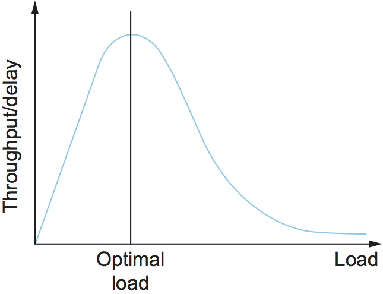

Chapter 2:  Background
======================

*[Enough information about TCP/IP for the subsequent chapters to make
sense. Includes both header field details and abstract models of
behavior. The following is still in cut-and-paste; to be adapted for
our purposes.]*

2.1  Best-Effort Packet Delivery
-------------------------------------

*[This needs way more set-up, but the aspect of IP that is most
relevant (apart from a straightforward statement about its best-effort
service model) is an introduction to how packets are queued at
routers. The following in mostly a cut-and-paste from 6.2.]*

Best-Effort Service Model
~~~~~~~~~~~~~~~~~~~~~~~~~

A good place to start when you build an internetwork is to define its
*service model*, that is, the host-to-host services you want to provide.
The main concern in defining a service model for an internetwork is that
we can provide a host-to-host service only if this service can somehow
be provided over each of the underlying physical networks. For example,
it would be no good deciding that our internetwork service model was
going to provide guaranteed delivery of every packet in 1 ms or less if
there were underlying network technologies that could arbitrarily delay
packets. The philosophy used in defining the IP service model,
therefore, was to make it undemanding enough that just about any network
technology that might turn up in an internetwork would be able to
provide the necessary service.

The IP service model can be thought of as having two parts: an
addressing scheme, which provides a way to identify all hosts in the
internetwork, and a datagram (connectionless) model of data delivery.
This service model is sometimes called *best effort* because, although
IP makes every effort to deliver datagrams, it makes no guarantees. We
postpone a discussion of the addressing scheme for now and look first at
the data delivery model.

The IP datagram is fundamental to the Internet Protocol. Recall from
an earlier section that a datagram is a packet sent in a
connectionless manner over a network. Every datagram carries enough
information to let the network forward the packet to its correct
destination; there is no need for any advance setup mechanism to tell
the network what to do when the packet arrives. You just send it, and
the network makes its best effort to get it to the desired
destination.  The “best-effort” part means that if something goes
wrong and the packet gets lost, corrupted, misdelivered, or in any way
fails to reach its intended destination, the network does nothing—it
made its best effort, and that is all it has to do. It does not make
any attempt to recover from the failure. This is sometimes called an
*unreliable* service.

Best-effort, connectionless service is about the simplest service you
could ask for from an internetwork, and this is its great strength. For
example, if you provide best-effort service over a network that provides
a reliable service, then that’s fine—you end up with a best-effort
service that just happens to always deliver the packets. If, on the
other hand, you had a reliable service model over an unreliable network,
you would have to put lots of extra functionality into the routers to
make up for the deficiencies of the underlying network. Keeping the
routers as simple as possible was one of the original design goals
of IP.

The ability of IP to “run over anything” is frequently cited as one of
its most important characteristics. It is noteworthy that many of the
technologies over which IP runs today did not exist when IP was
invented. So far, no networking technology has been invented that has
proven too bizarre for IP. In principle, IP can run over a network that
transports messages using carrier pigeons.

Best-effort delivery does not just mean that packets can get lost.
Sometimes they can get delivered out of order, and sometimes the same
packet can get delivered more than once. The higher-level protocols or
applications that run above IP need to be aware of all these possible
failure modes.

*[The following is likely repetative. It comes from the Issues Section
of Chapter 6.]*

We begin by defining three salient features of the network architecture.
For the most part, this is a summary of material presented in the
previous chapters that is relevant to the problem of resource
allocation.

Packet-Switched Network
~~~~~~~~~~~~~~~~~~~~~~~

We consider resource allocation in a packet-switched network (or
internet) consisting of multiple links and switches (or routers). Since
most of the mechanisms described in this chapter were designed for use
on the Internet, and therefore were originally defined in terms of
routers rather than switches, we use the term *router* throughout our
discussion. The problem is essentially the same, whether on a network or
an internetwork.

In such an environment, a given source may have more than enough
capacity on the immediate outgoing link to send a packet, but somewhere
in the middle of a network its packets encounter a link that is being
used by many different traffic sources. :numref:`Figure %s <fig-congestion>`
illustrates this situation—two high-speed links are feeding a low-speed
link. This is in contrast to shared-access networks like Ethernet and
wireless networks, where the source can directly observe the traffic on
the network and decide accordingly whether or not to send a packet. We
have already seen the algorithms used to allocate bandwidth on
shared-access networks (e.g., Ethernet and Wi-Fi). These access-control
algorithms are, in some sense, analogous to congestion-control
algorithms in a switched network.

.. _key-congestion:
.. admonition:: Key Takeaway

   Note that congestion control is a different problem than routing.
   While it is true that a congested link could be assigned a large edge
   weight by the routing protocol, and, as a consequence, routers would
   route around it, “routing around” a congested link does not generally
   solve the congestion problem. To see this, we need look no further
   than the simple network depicted in :numref:`Figure %s <fig-congestion>`,
   where all traffic has to flow through the same router to reach the
   destination. Although this is an extreme example, it is common to
   have a certain router that it is not possible to route around. This
   router can become congested, and there is nothing the routing
   mechanism can do about it. This congested router is sometimes called
   the *bottleneck* router.

Connectionless Flows
~~~~~~~~~~~~~~~~~~~~

For much of our discussion, we assume that the network is essentially
connectionless, with any connection-oriented service implemented in the
transport protocol that is running on the end hosts. (We explain the
qualification “essentially” in a moment.) This is precisely the model of
the Internet, where IP provides a connectionless datagram delivery
service and TCP implements an end-to-end connection abstraction. Note
that this assumption does not hold in virtual circuit networks such as
ATM and X.25. In such networks, a connection setup message traverses the
network when a circuit is established. This setup message reserves a set
of buffers for the connection at each router, thereby providing a form
of congestion control—a connection is established only if enough buffers
can be allocated to it at each router. The major shortcoming of this
approach is that it leads to an underutilization of resources—buffers
reserved for a particular circuit are not available for use by other
traffic even if they were not currently being used by that circuit. The
focus of this chapter is on resource allocation approaches that apply in
an internetwork, and thus we focus mainly on connectionless networks.
   
.. _fig-congestion:
.. figure:: figures/f06-01-9780123850591.png
   :width: 500px
   :align: center

   A potential bottleneck router.

We need to qualify the term *connectionless* because our classification
of networks as being either connectionless or connection oriented is a
bit too restrictive; there is a gray area in between. In particular, the
assumption that all datagrams are completely independent in a
connectionless network is too strong. The datagrams are certainly
switched independently, but it is usually the case that a stream of
datagrams between a particular pair of hosts flows through a particular
set of routers. This idea of a *flow*—a sequence of packets sent between
a source/destination pair and following the same route through the
network—is an important abstraction in the context of resource
allocation; it is one that we will use in this chapter.

One of the powers of the flow abstraction is that flows can be defined
at different granularities. For example, a flow can be host-to-host
(i.e., have the same source/destination host addresses) or
process-to-process (i.e., have the same source/destination host/port
pairs). In the latter case, a flow is essentially the same as a
channel, as we have been using that term throughout this book. The
reason we introduce a new term is that a flow is visible to the
routers inside the network, whereas a channel is an end-to-end
abstraction. :numref:`Figure %s <fig-flow>` illustrates several flows
passing through a series of routers.
   
.. _fig-flow:
.. figure:: figures/f06-02-9780123850591.png
   :width: 500px
   :align: center

   Multiple flows passing through a set of routers.
   
Because multiple related packets flow through each router, it sometimes
makes sense to maintain some state information for each flow,
information that can be used to make resource allocation decisions about
the packets that belong to the flow. This state is sometimes called
*soft state*. The main difference between soft state and hard state is
that soft state need not always be explicitly created and removed by
signalling. Soft state represents a middle ground between a purely
connectionless network that maintains *no* state at the routers and a
purely connection-oriented network that maintains hard state at the
routers. In general, the correct operation of the network does not
depend on soft state being present (each packet is still routed
correctly without regard to this state), but when a packet happens to
belong to a flow for which the router is currently maintaining soft
state, then the router is better able to handle the packet.

Note that a flow can be either implicitly defined or explicitly
established. In the former case, each router watches for packets that
happen to be traveling between the same source/destination pair—the
router does this by inspecting the addresses in the header—and treats
these packets as belonging to the same flow for the purpose of
congestion control. In the latter case, the source sends a flow setup
message across the network, declaring that a flow of packets is about to
start. While explicit flows are arguably no different than a connection
across a connection-oriented network, we call attention to this case
because, even when explicitly established, a flow does not imply any
end-to-end semantics and, in particular, does not imply the reliable and
ordered delivery of a virtual circuit. It simply exists for the purpose
of resource allocation. We will see examples of both implicit and
explicit flows in this chapter.

Service Model
~~~~~~~~~~~~~

In the early part of this chapter, we will focus on mechanisms that
assume the best-effort service model of the Internet. With best-effort
service, all packets are given essentially equal treatment, with end
hosts given no opportunity to ask the network that some packets or flows
be given certain guarantees or preferential service. Defining a service
model that supports some kind of preferred service or guarantee—for
example, guaranteeing the bandwidth needed for a video stream—is the
subject of a later section. Such a service model is said to provide
multiple *qualities of service* (QoS). As we will see, there is actually
a spectrum of possibilities, ranging from a purely best-effort service
model to one in which individual flows receive quantitative guarantees
of QoS. One of the greatest challenges is to define a service model that
meets the needs of a wide range of applications and even allows for the
applications that will be invented in the future.

Packet Format
~~~~~~~~~~~~~

Clearly, a key part of the IP service model is the type of packets
that can be carried. The IP datagram, like most packets, consists of a
header followed by a number of bytes of data. The format of the header
is shown in :numref:`Figure %s <fig-iphead>`. Note that we have
adopted a different style of representing packets than the one we used
in previous chapters. This is because packet formats at the
internetworking layer and above, where we will be focusing our
attention for the next few chapters, are almost invariably designed to
align on 32-bit boundaries to simplify the task of processing them in
software. Thus, the common way of representing them (used in Internet
Requests for Comments, for example) is to draw them as a succession of
32-bit words. The top word is the one transmitted first, and the
leftmost byte of each word is the one transmitted first. In this
representation, you can easily recognize fields that are a multiple of
8 bits long. On the odd occasion when fields are not an even multiple
of 8 bits, you can determine the field lengths by looking at the bit
positions marked at the top of the packet.

.. _fig-iphead:

   IPv4 packet header.

Looking at each field in the IP header, we see that the “simple” model
of best-effort datagram delivery still has some subtle features. The
``Version`` field specifies the version of IP. The still-assumed version
of IP is 4, which is typically called *IPv4*. Observe that putting this
field right at the start of the datagram makes it easy for everything
else in the packet format to be redefined in subsequent versions; the
header processing software starts off by looking at the version and then
branches off to process the rest of the packet according to the
appropriate format. The next field, ``HLen``, specifies the length of
the header in 32-bit words. When there are no options, which is most of
the time, the header is 5 words (20 bytes) long. The 8-bit ``TOS`` (type
of service) field has had a number of different definitions over the
years, but its basic function is to allow packets to be treated
differently based on application needs. For example, the ``TOS`` value
might determine whether or not a packet should be placed in a special
queue that receives low delay.

The next 16 bits of the header contain the ``Length`` of the datagram,
including the header. Unlike the ``HLen`` field, the ``Length`` field
counts bytes rather than words. Thus, the maximum size of an IP datagram
is 65,535 bytes. The physical network over which IP is running, however,
may not support such long packets. For this reason, IP supports a
fragmentation and reassembly process. The second word of the header
contains information about fragmentation, and the details of its use are
presented in the following section entitled “Fragmentation and
Reassembly.”

Moving on to the third word of the header, the next byte is the ``TTL``
(time to live) field. Its name reflects its historical meaning rather
than the way it is commonly used today. The intent of the field is to
catch packets that have been going around in routing loops and discard
them, rather than let them consume resources indefinitely. Originally,
``TTL`` was set to a specific number of seconds that the packet would be
allowed to live, and routers along the path would decrement this field
until it reached 0. However, since it was rare for a packet to sit for
as long as 1 second in a router, and routers did not all have access to
a common clock, most routers just decremented the ``TTL`` by 1 as they
forwarded the packet. Thus, it became more of a hop count than a timer,
which is still a perfectly good way to catch packets that are stuck in
routing loops. One subtlety is in the initial setting of this field by
the sending host: Set it too high and packets could circulate rather a
lot before getting dropped; set it too low and they may not reach their
destination. The value 64 is the current default.

The ``Protocol`` field is simply a demultiplexing key that identifies
the higher-level protocol to which this IP packet should be passed.
There are values defined for the TCP (Transmission Control Protocol—6),
UDP (User Datagram Protocol—17), and many other protocols that may sit
above IP in the protocol graph.

The ``Checksum`` is calculated by considering the entire IP header as a
sequence of 16-bit words, adding them up using ones’ complement
arithmetic, and taking the ones’ complement of the result. Thus, if any
bit in the header is corrupted in transit, the checksum will not contain
the correct value upon receipt of the packet. Since a corrupted header
may contain an error in the destination address—and, as a result, may
have been misdelivered—it makes sense to discard any packet that fails
the checksum. It should be noted that this type of checksum does not
have the same strong error detection properties as a CRC, but it is much
easier to calculate in software.

The last two required fields in the header are the ``SourceAddr`` and
the ``DestinationAddr`` for the packet. The latter is the key to
datagram delivery: Every packet contains a full address for its intended
destination so that forwarding decisions can be made at each router. The
source address is required to allow recipients to decide if they want to
accept the packet and to enable them to reply. IP addresses are
discussed in a later section—for now, the important thing to know is
that IP defines its own global address space, independent of whatever
physical networks it runs over. As we will see, this is one of the keys
to supporting heterogeneity.

Finally, there may be a number of options at the end of the header. The
presence or absence of options may be determined by examining the header
length (``HLen``) field. While options are used fairly rarely, a
complete IP implementation must handle them all.

FIFO Queuing
~~~~~~~~~~~~

Regardless of how simple or how sophisticated the rest of the resource
allocation mechanism is, each router must implement some queuing
discipline that governs how packets are buffered while waiting to be
transmitted. The queuing algorithm can be thought of as allocating both
bandwidth (which packets get transmitted) and buffer space (which
packets get discarded). It also directly affects the latency experienced
by a packet by determining how long a packet waits to be transmitted.
This section introduces two common queuing algorithms—first-in,
first-out (FIFO) and fair queuing (FQ)—and identifies several variations
that have been proposed.

The idea of FIFO queuing, also called first-come, first-served (FCFS)
queuing, is simple: The first packet that arrives at a router is the
first packet to be transmitted. This is illustrated in :numref:`Figure
%s(a) <fig-fifo>`, which shows a FIFO with “slots” to hold up to eight
packets. Given that the amount of buffer space at each router is
finite, if a packet arrives and the queue (buffer space) is full, then
the router discards that packet, as shown in :numref:`Figure %s(b)
<fig-fifo>`. This is done without regard to which flow the packet
belongs to or how important the packet is. This is sometimes called
*tail drop*, since packets that arrive at the tail end of the FIFO are
dropped.

.. _fig-fifo:
.. figure:: figures/f06-05-9780123850591.png
   :width: 400px
   :align: center

   FIFO queuing (a), and tail drop at a FIFO queue (b).

Note that tail drop and FIFO are two separable ideas. FIFO is a
*scheduling discipline*—it determines the order in which packets are
transmitted. Tail drop is a *drop policy*—it determines which packets
get dropped. Because FIFO and tail drop are the simplest instances of
scheduling discipline and drop policy, respectively, they are sometimes
viewed as a bundle—the vanilla queuing implementation. Unfortunately,
the bundle is often referred to simply as *FIFO queuing*, when it should
more precisely be called *FIFO with tail drop*. A later section provides
an example of another drop policy, which uses a more complex algorithm
than “Is there a free buffer?” to decide when to drop packets. Such a
drop policy may be used with FIFO, or with more complex scheduling
disciplines.

FIFO with tail drop, as the simplest of all queuing algorithms, is the
most widely used in Internet routers at the time of writing. This simple
approach to queuing pushes all responsibility for congestion control and
resource allocation out to the edges of the network. Thus, the prevalent
form of congestion control in the Internet currently assumes no help
from the routers: TCP takes responsibility for detecting and responding
to congestion. We will see how this works in the next section.

A simple variation on basic FIFO queuing is priority queuing. The idea
is to mark each packet with a priority; the mark could be carried, for
example, in the IP header, as we’ll discuss in a later section. The
routers then implement multiple FIFO queues, one for each priority
class. The router always transmits packets out of the highest-priority
queue if that queue is nonempty before moving on to the next priority
queue. Within each priority, packets are still managed in a FIFO manner.
This idea is a small departure from the best-effort delivery model, but
it does not go so far as to make guarantees to any particular priority
class. It just allows high-priority packets to cut to the front of the
line.

The problem with priority queuing, of course, is that the high-priority
queue can starve out all the other queues; that is, as long as there is
at least one high-priority packet in the high-priority queue,
lower-priority queues do not get served. For this to be viable, there
needs to be hard limits on how much high-priority traffic is inserted in
the queue. It should be immediately clear that we can’t allow users to
set their own packets to high priority in an uncontrolled way; we must
either prevent them from doing this altogether or provide some form of
“pushback” on users. One obvious way to do this is to use economics—the
network could charge more to deliver high-priority packets than
low-priority packets. However, there are significant challenges to
implementing such a scheme in a decentralized environment such as the
Internet.

One situation in which priority queuing is used in the Internet is to
protect the most important packets—typically, the routing updates that
are necessary to stabilize the routing tables after a topology change.
Often there is a special queue for such packets, which can be identified
by the Differentiated Services Code Point (formerly the TOS field) in
the IP header. This is in fact a simple case of the idea of
“Differentiated Services.”

*[I removed the description of Fair Queuing, but we may want to
mention the idea and its relationship to CC, maybe as a sidebar.]*

2.2 Reliable Byte-Stream
--------------------------------

*[I've removed connection setup, but the following needs additional
trimming and re-focusing.]*

End-to-End Issues
~~~~~~~~~~~~~~~~~~~~~~~~~

At the heart of TCP is the sliding window algorithm. Even though this is
the same basic algorithm as is often used at the link level, because TCP
runs over the Internet rather than a physical point-to-point link, there
are many important differences. This subsection identifies these
differences and explains how they complicate TCP. The following
subsections then describe how TCP addresses these and other
complications.

First, whereas the link-level sliding window algorithm presented runs
over a single physical link that always connects the same two computers,
TCP supports logical connections between processes that are running on
any two computers in the Internet. This means that TCP needs an explicit
connection establishment phase during which the two sides of the
connection agree to exchange data with each other. This difference is
analogous to having to dial up the other party, rather than having a
dedicated phone line. TCP also has an explicit connection teardown
phase. One of the things that happens during connection establishment is
that the two parties establish some shared state to enable the sliding
window algorithm to begin. Connection teardown is needed so each host
knows it is OK to free this state.

Second, whereas a single physical link that always connects the same two
computers has a fixed round-trip time (RTT), TCP connections are likely
to have widely different round-trip times. For example, a TCP connection
between a host in San Francisco and a host in Boston, which are
separated by several thousand kilometers, might have an RTT of 100 ms,
while a TCP connection between two hosts in the same room, only a few
meters apart, might have an RTT of only 1 ms. The same TCP protocol must
be able to support both of these connections. To make matters worse, the
TCP connection between hosts in San Francisco and Boston might have an
RTT of 100 ms at 3 a.m., but an RTT of 500 ms at 3 p.m. Variations in
the RTT are even possible during a single TCP connection that lasts only
a few minutes. What this means to the sliding window algorithm is that
the timeout mechanism that triggers retransmissions must be adaptive.
(Certainly, the timeout for a point-to-point link must be a settable
parameter, but it is not necessary to adapt this timer for a particular
pair of nodes.)

A third difference is that packets may be reordered as they cross the
Internet, but this is not possible on a point-to-point link where the
first packet put into one end of the link must be the first to appear at
the other end. Packets that are slightly out of order do not cause a
problem since the sliding window algorithm can reorder packets correctly
using the sequence number. The real issue is how far out of order
packets can get or, said another way, how late a packet can arrive at
the destination. In the worst case, a packet can be delayed in the
Internet until the IP time to live (``TTL``) field expires, at which
time the packet is discarded (and hence there is no danger of it
arriving late). Knowing that IP throws packets away after their ``TTL``
expires, TCP assumes that each packet has a maximum lifetime. The exact
lifetime, known as the *maximum segment lifetime* (MSL), is an
engineering choice. The current recommended setting is 120 seconds. Keep
in mind that IP does not directly enforce this 120-second value; it is
simply a conservative estimate that TCP makes of how long a packet might
live in the Internet. The implication is significant—TCP has to be
prepared for very old packets to suddenly show up at the receiver,
potentially confusing the sliding window algorithm.

Fourth, the computers connected to a point-to-point link are generally
engineered to support the link. For example, if a link’s delay ×
bandwidth product is computed to be 8 KB—meaning that a window size is
selected to allow up to 8 KB of data to be unacknowledged at a given
time—then it is likely that the computers at either end of the link have
the ability to buffer up to 8 KB of data. Designing the system otherwise
would be silly. On the other hand, almost any kind of computer can be
connected to the Internet, making the amount of resources dedicated to
any one TCP connection highly variable, especially considering that any
one host can potentially support hundreds of TCP connections at the same
time. This means that TCP must include a mechanism that each side uses
to “learn” what resources (e.g., how much buffer space) the other side
is able to apply to the connection. This is the flow control issue.

Fifth, because the transmitting side of a directly connected link cannot
send any faster than the bandwidth of the link allows, and only one host
is pumping data into the link, it is not possible to unknowingly congest
the link. Said another way, the load on the link is visible in the form
of a queue of packets at the sender. In contrast, the sending side of a
TCP connection has no idea what links will be traversed to reach the
destination. For example, the sending machine might be directly
connected to a relatively fast Ethernet—and capable of sending data at a
rate of 10 Gbps—but somewhere out in the middle of the network, a
1.5-Mbps link must be traversed. And, to make matters worse, data being
generated by many different sources might be trying to traverse this
same slow link. This leads to the problem of network congestion.
Discussion of this topic is delayed until the next chapter.

We conclude this discussion of end-to-end issues by comparing TCP’s
approach to providing a reliable/ordered delivery service with the
approach used by virtual-circuit-based networks like the historically
important X.25 network. In TCP, the underlying IP network is assumed to
be unreliable and to deliver messages out of order; TCP uses the sliding
window algorithm on an end-to-end basis to provide reliable/ordered
delivery. In contrast, X.25 networks use the sliding window protocol
within the network, on a hop-by-hop basis. The assumption behind this
approach is that if messages are delivered reliably and in order between
each pair of nodes along the path between the source host and the
destination host, then the end-to-end service also guarantees
reliable/ordered delivery.

The problem with this latter approach is that a sequence of hop-by-hop
guarantees does not necessarily add up to an end-to-end guarantee.
First, if a heterogeneous link (say, an Ethernet) is added to one end of
the path, then there is no guarantee that this hop will preserve the
same service as the other hops. Second, just because the sliding window
protocol guarantees that messages are delivered correctly from node A to
node B, and then from node B to node C, it does not guarantee that
node B behaves perfectly. For example, network nodes have been known to
introduce errors into messages while transferring them from an input
buffer to an output buffer. They have also been known to accidentally
reorder messages. As a consequence of these small windows of
vulnerability, it is still necessary to provide true end-to-end checks
to guarantee reliable/ordered service, even though the lower levels of
the system also implement that functionality.

.. _key-e2e:
.. admonition::  Key Takeaway

   This discussion serves to illustrate one of the most important
   principles in system design—the *end-to-end argument*. In a nutshell,
   the end-to-end argument says that a function (in our example,
   providing reliable/ordered delivery) should not be provided in the
   lower levels of the system unless it can be completely and correctly
   implemented at that level. Therefore, this rule argues in favor of
   the TCP/IP approach. This rule is not absolute, however. It does
   allow for functions to be incompletely provided at a low level as a
   performance optimization. This is why it is perfectly consistent with
   the end-to-end argument to perform error detection (e.g., CRC) on a
   hop-by-hop basis; detecting and retransmitting a single corrupt
   packet across one hop is preferable to having to retransmit an entire
   file end-to-end.

Segment Format
~~~~~~~~~~~~~~~~~~~~~~

TCP is a byte-oriented protocol, which means that the sender writes
bytes into a TCP connection and the receiver reads bytes out of the
TCP connection. Although “byte stream” describes the service TCP
offers to application processes, TCP does not, itself, transmit
individual bytes over the Internet. Instead, TCP on the source host
buffers enough bytes from the sending process to fill a reasonably
sized packet and then sends this packet to its peer on the destination
host. TCP on the destination host then empties the contents of the
packet into a receive buffer, and the receiving process reads from
this buffer at its leisure.  This situation is illustrated in
:numref:`Figure %s <fig-tcp-stream>`, which, for simplicity, shows
data flowing in only one direction. Remember that, in general, a
single TCP connection supports byte streams flowing in both
directions.
 
.. _fig-tcp-stream:

   How TCP manages a byte stream.

The packets exchanged between TCP peers in :numref:`Figure %s
<fig-tcp-stream>` are called *segments*, since each one carries a
segment of the byte stream. Each TCP segment contains the header
schematically depicted in :numref:`Figure %s <fig-tcp-format>`. The
relevance of most of these fields will become apparent throughout this
section. For now, we simply introduce them.

.. _fig-tcp-format:
.. figure:: figures/f05-04-9780123850591.png
   :width: 400px
   :align: center

   TCP header format.

The ``SrcPort`` and ``DstPort`` fields identify the source and
destination ports, respectively, just as in UDP. These two fields, plus
the source and destination IP addresses, combine to uniquely identify
each TCP connection. That is, TCP’s demux key is given by the 4-tuple

.. code:: c

   (SrcPort, SrcIPAddr, DstPort, DstIPAddr)

Note that because TCP connections come and go, it is possible for a
connection between a particular pair of ports to be established, used to
send and receive data, and closed, and then at a later time for the same
pair of ports to be involved in a second connection. We sometimes refer
to this situation as two different *incarnations* of the same
connection.

The ``Acknowledgement``, ``SequenceNum``, and ``AdvertisedWindow``
fields are all involved in TCP’s sliding window algorithm. Because TCP
is a byte-oriented protocol, each byte of data has a sequence number.
The ``SequenceNum`` field contains the sequence number for the first
byte of data carried in that segment, and the ``Acknowledgement`` and
``AdvertisedWindow`` fields carry information about the flow of data
going in the other direction. To simplify our discussion, we ignore
the fact that data can flow in both directions, and we concentrate on
data that has a particular ``SequenceNum`` flowing in one direction
and ``Acknowledgement`` and ``AdvertisedWindow`` values flowing in the
opposite direction, as illustrated in :numref:`Figure %s
<fig-tcp-flow>`. The use of these three fields is described more fully
later in this chapter.

.. _fig-tcp-flow:
.. figure:: figures/f05-05-9780123850591.png
   :width: 500px
   :align: center

   Simplified illustration (showing only one direction)
   of the TCP process, with data flow in one direction and ACKs in
   the other.

The 6-bit ``Flags`` field is used to relay control information between
TCP peers. The possible flags include ``SYN``, ``FIN``, ``RESET``,
``PUSH``, ``URG``, and ``ACK``. The ``SYN`` and ``FIN`` flags are used
when establishing and terminating a TCP connection, respectively. Their
use is described in a later section. The ``ACK`` flag is set any time
the ``Acknowledgement`` field is valid, implying that the receiver
should pay attention to it. The ``URG`` flag signifies that this segment
contains urgent data. When this flag is set, the ``UrgPtr`` field
indicates where the nonurgent data contained in this segment begins. The
urgent data is contained at the front of the segment body, up to and
including a value of ``UrgPtr`` bytes into the segment. The ``PUSH``
flag signifies that the sender invoked the push operation, which
indicates to the receiving side of TCP that it should notify the
receiving process of this fact. We discuss these last two features more
in a later section. Finally, the ``RESET`` flag signifies that the
receiver has become confused—for example, because it received a segment
it did not expect to receive—and so wants to abort the connection.

Finally, the ``Checksum`` field is used in exactly the same way as for
UDP—it is computed over the TCP header, the TCP data, and the
pseudoheader, which is made up of the source address, destination
address, and length fields from the IP header. The checksum is required
for TCP in both IPv4 and IPv6. Also, since the TCP header is of variable
length (options can be attached after the mandatory fields), a
``HdrLen`` field is included that gives the length of the header in
32-bit words. This field is also known as the ``Offset`` field, since it
measures the offset from the start of the packet to the start of the
data.

We skip details of connection setup, and jump straight into the
sliding window details needed to understand congestion control.

Reliable and Ordered Delivery
~~~~~~~~~~~~~~~~~~~~~~~~~~~~~

We are now ready to discuss TCP’s variant of the sliding window
algorithm, which serves several purposes: (1) it guarantees the reliable
delivery of data, (2) it ensures that data is delivered in order, and
(3) it enforces flow control between the sender and the receiver. TCP’s
use of the sliding window algorithm is the same as at the link level in
the case of the first two of these three functions. Where TCP differs
from the link-level algorithm is that it folds the flow-control function
in as well. In particular, rather than having a fixed-size sliding
window, the receiver *advertises* a window size to the sender. This is
done using the ``AdvertisedWindow`` field in the TCP header. The sender
is then limited to having no more than a value of ``AdvertisedWindow``
bytes of unacknowledged data at any given time. The receiver selects a
suitable value for ``AdvertisedWindow`` based on the amount of memory
allocated to the connection for the purpose of buffering data. The idea
is to keep the sender from over-running the receiver’s buffer. We
discuss this at greater length below.

To see how the sending and receiving sides of TCP interact with each
other to implement reliable and ordered delivery, consider the
situation illustrated in :numref:`Figure %s <fig-tcp-fc>`. TCP on the
sending side maintains a send buffer. This buffer is used to store
data that has been sent but not yet acknowledged, as well as data that
has been written by the sending application but not transmitted. On
the receiving side, TCP maintains a receive buffer. This buffer holds
data that arrives out of order, as well as data that is in the correct
order (i.e., there are no missing bytes earlier in the stream) but
that the application process has not yet had the chance to read.

.. _fig-tcp-fc:
.. figure:: figures/f05-08-9780123850591.png
   :width: 500px
   :align: center

   Relationship between TCP send buffer (a) and receive
   buffer (b).

To make the following discussion simpler to follow, we initially ignore
the fact that both the buffers and the sequence numbers are of some
finite size and hence will eventually wrap around. Also, we do not
distinguish between a pointer into a buffer where a particular byte of
data is stored and the sequence number for that byte.

Looking first at the sending side, three pointers are maintained into
the send buffer, each with an obvious meaning: ``LastByteAcked``,
``LastByteSent``, and ``LastByteWritten``. Clearly,

::

   LastByteAcked <= LastByteSent

since the receiver cannot have acknowledged a byte that has not yet been
sent, and

::

   LastByteSent <= LastByteWritten

since TCP cannot send a byte that the application process has not yet
written. Also note that none of the bytes to the left of
``LastByteAcked`` need to be saved in the buffer because they have
already been acknowledged, and none of the bytes to the right of
``LastByteWritten`` need to be buffered because they have not yet been
generated.

A similar set of pointers (sequence numbers) are maintained on the
receiving side: ``LastByteRead``, ``NextByteExpected``, and
``LastByteRcvd``. The inequalities are a little less intuitive, however,
because of the problem of out-of-order delivery. The first relationship

::

   LastByteRead < NextByteExpected

is true because a byte cannot be read by the application until it is
received *and* all preceding bytes have also been received.
``NextByteExpected`` points to the byte immediately after the latest
byte to meet this criterion. Second,

::

   NextByteExpected <= LastByteRcvd + 1

since, if data has arrived in order, ``NextByteExpected`` points to the
byte after ``LastByteRcvd``, whereas if data has arrived out of order,
then ``NextByteExpected`` points to the start of the first gap in the
data, as in :numref:`Figure %s <fig-tcp-fc>`. Note that bytes to the left of
``LastByteRead`` need not be buffered because they have already been
read by the local application process, and bytes to the right of
``LastByteRcvd`` need not be buffered because they have not yet arrived.

Flow Control
~~~~~~~~~~~~

Most of the above discussion is similar to that found in the standard
sliding window algorithm; the only real difference is that this time we
elaborated on the fact that the sending and receiving application
processes are filling and emptying their local buffer, respectively.
(The earlier discussion glossed over the fact that data arriving from an
upstream node was filling the send buffer and data being transmitted to
a downstream node was emptying the receive buffer.)

You should make sure you understand this much before proceeding because
now comes the point where the two algorithms differ more significantly.
In what follows, we reintroduce the fact that both buffers are of some
finite size, denoted ``MaxSendBuffer`` and ``MaxRcvBuffer``, although we
don’t worry about the details of how they are implemented. In other
words, we are only interested in the number of bytes being buffered, not
in where those bytes are actually stored.

Recall that in a sliding window protocol, the size of the window sets
the amount of data that can be sent without waiting for acknowledgment
from the receiver. Thus, the receiver throttles the sender by
advertising a window that is no larger than the amount of data that it
can buffer. Observe that TCP on the receive side must keep

::

   LastByteRcvd - LastByteRead <= MaxRcvBuffer

to avoid overflowing its buffer. It therefore advertises a window size
of

::

   AdvertisedWindow = MaxRcvBuffer - ((NextByteExpected - 1) - LastByteRead)

which represents the amount of free space remaining in its buffer. As
data arrives, the receiver acknowledges it as long as all the preceding
bytes have also arrived. In addition, ``LastByteRcvd`` moves to the
right (is incremented), meaning that the advertised window potentially
shrinks. Whether or not it shrinks depends on how fast the local
application process is consuming data. If the local process is reading
data just as fast as it arrives (causing ``LastByteRead`` to be
incremented at the same rate as ``LastByteRcvd``), then the advertised
window stays open (i.e., ``AdvertisedWindow = MaxRcvBuffer``). If,
however, the receiving process falls behind, perhaps because it performs
a very expensive operation on each byte of data that it reads, then the
advertised window grows smaller with every segment that arrives, until
it eventually goes to 0.

TCP on the send side must then adhere to the advertised window it gets
from the receiver. This means that at any given time, it must ensure
that

::

   LastByteSent - LastByteAcked <= AdvertisedWindow

Said another way, the sender computes an *effective* window that limits
how much data it can send:

::

   EffectiveWindow = AdvertisedWindow - (LastByteSent - LastByteAcked)

Clearly, ``EffectiveWindow`` must be greater than 0 before the source
can send more data. It is possible, therefore, that a segment arrives
acknowledging x bytes, thereby allowing the sender to increment
``LastByteAcked`` by x, but because the receiving process was not
reading any data, the advertised window is now x bytes smaller than the
time before. In such a situation, the sender would be able to free
buffer space, but not to send any more data.

All the while this is going on, the send side must also make sure that
the local application process does not overflow the send buffer—that is,

::

   LastByteWritten - LastByteAcked <= MaxSendBuffer

If the sending process tries to write y bytes to TCP, but

::

   (LastByteWritten - LastByteAcked) + y > MaxSendBuffer

then TCP blocks the sending process and does not allow it to generate
more data.

It is now possible to understand how a slow receiving process ultimately
stops a fast sending process. First, the receive buffer fills up, which
means the advertised window shrinks to 0. An advertised window of 0
means that the sending side cannot transmit any data, even though data
it has previously sent has been successfully acknowledged. Finally, not
being able to transmit any data means that the send buffer fills up,
which ultimately causes TCP to block the sending process. As soon as the
receiving process starts to read data again, the receive-side TCP is
able to open its window back up, which allows the send-side TCP to
transmit data out of its buffer. When this data is eventually
acknowledged, ``LastByteAcked`` is incremented, the buffer space holding
this acknowledged data becomes free, and the sending process is
unblocked and allowed to proceed.

There is only one remaining detail that must be resolved—how does the
sending side know that the advertised window is no longer 0? As
mentioned above, TCP *always* sends a segment in response to a received
data segment, and this response contains the latest values for the
``Acknowledge`` and ``AdvertisedWindow`` fields, even if these values
have not changed since the last time they were sent. The problem is
this. Once the receive side has advertised a window size of 0, the
sender is not permitted to send any more data, which means it has no way
to discover that the advertised window is no longer 0 at some time in
the future. TCP on the receive side does not spontaneously send nondata
segments; it only sends them in response to an arriving data segment.

TCP deals with this situation as follows. Whenever the other side
advertises a window size of 0, the sending side persists in sending a
segment with 1 byte of data every so often. It knows that this data will
probably not be accepted, but it tries anyway, because each of these
1-byte segments triggers a response that contains the current advertised
window. Eventually, one of these 1-byte probes triggers a response that
reports a nonzero advertised window.

Note that these 1-byte messages are called *Zero Window Probes* and in
practice they are sent every 5 to 60 seconds. As for what single byte of
data to send in the probe: it’s the next byte of actual data just
outside the window. (It has to be real data in case it’s accepted by the
receiver.)

.. _key-dumb-receiver:
.. admonition::  Key Takeaway

   Note that the reason the sending side periodically sends this probe
   segment is that TCP is designed to make the receive side as simple as
   possible—it simply responds to segments from the sender, and it never
   initiates any activity on its own. This is an example of a
   well-recognized (although not universally applied) protocol design
   rule, which, for lack of a better name, we call the *smart sender/
   dumb receiver* rule. Recall that we saw another example of this rule
   when we discussed the use of NAKs in sliding window algorithm.

Protecting Against Wraparound
~~~~~~~~~~~~~~~~~~~~~~~~~~~~~

This subsection and the next consider the size of the ``SequenceNum``
and ``AdvertisedWindow`` fields and the implications of their sizes on
TCP’s correctness and performance. TCP’s ``SequenceNum`` field is
32 bits long, and its ``AdvertisedWindow`` field is 16 bits long,
meaning that TCP has easily satisfied the requirement of the sliding
window algorithm that the sequence number space be twice as big as the
window size: 2\ :sup:`32` >> 2 × 2\ :sup:`16`. However, this
requirement is not the interesting thing about these two fields.
Consider each field in turn.

The relevance of the 32-bit sequence number space is that the sequence
number used on a given connection might wrap around—a byte with
sequence number S could be sent at one time, and then at a later time
a second byte with the same sequence number S might be sent. Once
again, we assume that packets cannot survive in the Internet for
longer than the recommended MSL. Thus, we currently need to make sure
that the sequence number does not wrap around within a 120-second
period of time. Whether or not this happens depends on how fast data
can be transmitted over the Internet—that is, how fast the 32-bit
sequence number space can be consumed. (This discussion assumes that
we are trying to consume the sequence number space as fast as
possible, but of course we will be if we are doing our job of keeping
the pipe full.) :numref:`Table %s <tab-eqnum>` shows how long it takes
for the sequence number to wrap around on networks with various
bandwidths.

.. _tab-eqnum:
.. table::  Time Until 32-Bit Sequence Number Space Wraps Around.
   :align: center
   :widths: auto

   +--------------------------+-----------------------+
   | Bandwidth                | Time until Wraparound |
   +==========================+=======================+
   | T1 (1.5 Mbps)            | 6.4 hours             |
   +--------------------------+-----------------------+
   | T3 (45 Mbps)             | 13 minutes            |
   +--------------------------+-----------------------+
   | Fast Ethernet (100 Mbps) | 6 minutes             |
   +--------------------------+-----------------------+
   | OC-3 (155 Mbps)          | 4 minutes             |
   +--------------------------+-----------------------+
   | OC-48 (2.5 Gbps)         | 14 seconds            |
   +--------------------------+-----------------------+
   | OC-192 (10 Gbps)         | 3 seconds             |
   +--------------------------+-----------------------+
   | 10GigE (10 Gbps)         | 3 seconds             |
   +--------------------------+-----------------------+

As you can see, the 32-bit sequence number space is adequate at modest
bandwidths, but given that OC-192 links are now common in the Internet
backbone, and that most servers now come with 10Gig Ethernet (or 10
Gbps) interfaces, we’re now well-past the point where 32 bits is too
small. Fortunately, the IETF has worked out an extension to TCP that
effectively extends the sequence number space to protect against the
sequence number wrapping around. This and related extensions are
described in a later section.

Keeping the Pipe Full
~~~~~~~~~~~~~~~~~~~~~

The relevance of the 16-bit ``AdvertisedWindow`` field is that it must
be big enough to allow the sender to keep the pipe full. Clearly, the
receiver is free to not open the window as large as the
``AdvertisedWindow`` field allows; we are interested in the situation in
which the receiver has enough buffer space to handle as much data as the
largest possible ``AdvertisedWindow`` allows.

In this case, it is not just the network bandwidth but the delay x
bandwidth product that dictates how big the ``AdvertisedWindow`` field
needs to be—the window needs to be opened far enough to allow a full
delay × bandwidth product’s worth of data to be transmitted. Assuming an
RTT of 100 ms (a typical number for a cross-country connection in the
United States), :numref:`Table %s <tab-adv-win>` gives the delay × bandwidth
product for several network technologies.

.. _tab-adv-win:
.. table::  Required Window Size for 100-ms RTT
   :align: center
   :widths: auto   

   +--------------------------+---------------------------+
   | Bandwidth                | Delay × Bandwidth Product |
   +==========================+===========================+
   | T1 (1.5 Mbps)            | 18 KB                     |
   +--------------------------+---------------------------+
   | T3 (45 Mbps)             | 549 KB                    |
   +--------------------------+---------------------------+
   | Fast Ethernet (100 Mbps) | 1.2 MB                    |
   +--------------------------+---------------------------+
   | OC-3 (155 Mbps)          | 1.8 MB                    |
   +--------------------------+---------------------------+
   | OC-48 (2.5 Gbps)         | 29.6 MB                   |
   +--------------------------+---------------------------+
   | OC-192 (10 Gbps)         | 118.4 MB                  |
   +--------------------------+---------------------------+
   | 10GigE (10 Gbps)         | 118.4 MB                  |
   +--------------------------+---------------------------+

As you can see, TCP’s ``AdvertisedWindow`` field is in even worse shape
than its ``SequenceNum`` field—it is not big enough to handle even a T3
connection across the continental United States, since a 16-bit field
allows us to advertise a window of only 64 KB. The very same TCP
extension mentioned above provides a mechanism for effectively
increasing the size of the advertised window.

Triggering Transmission
~~~~~~~~~~~~~~~~~~~~~~~

We next consider a surprisingly subtle issue: how TCP decides to
transmit a segment. As described earlier, TCP supports a byte-stream
abstraction; that is, application programs write bytes into the stream,
and it is up to TCP to decide that it has enough bytes to send a
segment. What factors govern this decision?

If we ignore the possibility of flow control—that is, we assume the
window is wide open, as would be the case when a connection first
starts—then TCP has three mechanisms to trigger the transmission of a
segment. First, TCP maintains a variable, typically called the *maximum
segment size* (``MSS``), and it sends a segment as soon as it has
collected ``MSS`` bytes from the sending process. ``MSS`` is usually set
to the size of the largest segment TCP can send without causing the
local IP to fragment. That is, ``MSS`` is set to the maximum
transmission unit (MTU) of the directly connected network, minus the
size of the TCP and IP headers. The second thing that triggers TCP to
transmit a segment is that the sending process has explicitly asked it
to do so. Specifically, TCP supports a *push* operation, and the sending
process invokes this operation to effectively flush the buffer of unsent
bytes. The final trigger for transmitting a segment is that a timer
fires; the resulting segment contains as many bytes as are currently
buffered for transmission. However, as we will soon see, this “timer”
isn’t exactly what you expect.

Silly Window Syndrome
~~~~~~~~~~~~~~~~~~~~~

Of course, we can’t just ignore flow control, which plays an obvious
role in throttling the sender. If the sender has ``MSS`` bytes of data
to send and the window is open at least that much, then the sender
transmits a full segment. Suppose, however, that the sender is
accumulating bytes to send, but the window is currently closed. Now
suppose an ACK arrives that effectively opens the window enough for the
sender to transmit, say, ``MSS/2`` bytes. Should the sender transmit a
half-full segment or wait for the window to open to a full ``MSS``? The
original specification was silent on this point, and early
implementations of TCP decided to go ahead and transmit a half-full
segment. After all, there is no telling how long it will be before the
window opens further.

It turns out that the strategy of aggressively taking advantage of any
available window leads to a situation now known as the *silly window
syndrome*. :numref:`Figure %s <fig-sillywindow>` helps visualize what
happens.  If you think of a TCP stream as a conveyor belt with “full”
containers (data segments) going in one direction and empty containers
(ACKs) going in the reverse direction, then ``MSS``-sized segments
correspond to large containers and 1-byte segments correspond to very
small containers. As long as the sender is sending ``MSS``-sized
segments and the receiver ACKs at least one ``MSS`` of data at a time,
everything is good (:numref:`Figure %s(a) <fig-sillywindow>`). But,
what if the receiver has to reduce the window, so that at some time
the sender can’t send a full ``MSS`` of data? If the sender
aggressively fills a smaller-than-\ ``MSS`` empty container as soon as
it arrives, then the receiver will ACK that smaller number of bytes,
and hence the small container introduced into the system remains in
the system indefinitely.  That is, it is immediately filled and
emptied at each end and is never coalesced with adjacent containers to
create larger containers, as in :numref:`Figure %s(b)
<fig-sillywindow>`. This scenario was discovered when early
implementations of TCP regularly found themselves filling the network
with tiny segments.

.. _fig-sillywindow:
.. figure:: figures/f05-09-9780123850591.png
   :width: 500px
   :align: center

   Silly window syndrome. (a) As long as the sender sends
   MSS-sized segments and the receiver ACKs one MSS at a time, the
   system works smoothly. (b) As soon as the sender sends less than
   one MSS, or the receiver ACKs less than one MSS, a small
   "container" enters the system and continues to circulate.

Note that the silly window syndrome is only a problem when either the
sender transmits a small segment or the receiver opens the window a
small amount. If neither of these happens, then the small container is
never introduced into the stream. It’s not possible to outlaw sending
small segments; for example, the application might do a *push* after
sending a single byte. It is possible, however, to keep the receiver
from introducing a small container (i.e., a small open window). The rule
is that after advertising a zero window the receiver must wait for space
equal to an ``MSS`` before it advertises an open window.

Since we can’t eliminate the possibility of a small container being
introduced into the stream, we also need mechanisms to coalesce them.
The receiver can do this by delaying ACKs—sending one combined ACK
rather than multiple smaller ones—but this is only a partial solution
because the receiver has no way of knowing how long it is safe to delay
waiting either for another segment to arrive or for the application to
read more data (thus opening the window). The ultimate solution falls to
the sender, which brings us back to our original issue: When does the
TCP sender decide to transmit a segment?

Nagle’s Algorithm
~~~~~~~~~~~~~~~~~

Returning to the TCP sender, if there is data to send but the window is
open less than ``MSS``, then we may want to wait some amount of time
before sending the available data, but the question is how long? If we
wait too long, then we hurt interactive applications like Telnet. If we
don’t wait long enough, then we risk sending a bunch of tiny packets and
falling into the silly window syndrome. The answer is to introduce a
timer and to transmit when the timer expires.

While we could use a clock-based timer—for example, one that fires
every 100 ms—Nagle introduced an elegant *self-clocking* solution. The
idea is that as long as TCP has any data in flight, the sender will
eventually receive an ACK. This ACK can be treated like a timer
firing, triggering the transmission of more data. Nagle’s algorithm
provides a simple, unified rule for deciding when to transmit:

::

   When the application produces data to send
       if both the available data and the window >= MSS
           send a full segment
       else
           if there is unACKed data in flight
               buffer the new data until an ACK arrives
           else
               send all the new data now

In other words, it’s always OK to send a full segment if the window
allows. It’s also all right to immediately send a small amount of data
if there are currently no segments in transit, but if there is anything
in flight the sender must wait for an ACK before transmitting the next
segment. Thus, an interactive application like Telnet that continually
writes one byte at a time will send data at a rate of one segment per
RTT. Some segments will contain a single byte, while others will contain
as many bytes as the user was able to type in one round-trip time.
Because some applications cannot afford such a delay for each write it
does to a TCP connection, the socket interface allows the application to
turn off Nagel’s algorithm by setting the ``TCP_NODELAY`` option.
Setting this option means that data is transmitted as soon as possible.

TCP Extensions
~~~~~~~~~~~~~~

We have mentioned at four different points in this chapter that there
are now extensions to TCP that help to mitigate some problem that TCP
faced as the underlying network got faster. These extensions are
designed to have as small an impact on TCP as possible. In particular,
they are realized as options that can be added to the TCP header. (We
glossed over this point earlier, but the reason why the TCP header has a
``HdrLen`` field is that the header can be of variable length; the
variable part of the TCP header contains the options that have been
added.) The significance of adding these extensions as options rather
than changing the core of the TCP header is that hosts can still
communicate using TCP even if they do not implement the options. Hosts
that do implement the optional extensions, however, can take advantage
of them. The two sides agree that they will use the options during TCP’s
connection establishment phase.

The first extension helps to improve TCP’s timeout mechanism. Instead of
measuring the RTT using a coarse-grained event, TCP can read the actual
system clock when it is about to send a segment, and put this time—think
of it as a 32-bit *timestamp*\ —in the segment’s header. The receiver then
echoes this timestamp back to the sender in its acknowledgment, and the
sender subtracts this timestamp from the current time to measure the
RTT. In essence, the timestamp option provides a convenient place for
TCP to store the record of when a segment was transmitted; it stores the
time in the segment itself. Note that the endpoints in the connection do
not need synchronized clocks, since the timestamp is written and read at
the same end of the connection.

The second extension addresses the problem of TCP’s 32-bit
``SequenceNum`` field wrapping around too soon on a high-speed network.
Rather than define a new 64-bit sequence number field, TCP uses the
32-bit timestamp just described to effectively extend the sequence
number space. In other words, TCP decides whether to accept or reject a
segment based on a 64-bit identifier that has the ``SequenceNum`` field
in the low-order 32 bits and the timestamp in the high-order 32 bits.
Since the timestamp is always increasing, it serves to distinguish
between two different incarnations of the same sequence number. Note
that the timestamp is being used in this setting only to protect against
wraparound; it is not treated as part of the sequence number for the
purpose of ordering or acknowledging data.

The third extension allows TCP to advertise a larger window, thereby
allowing it to fill larger delay × bandwidth pipes that are made
possible by high-speed networks. This extension involves an option that
defines a *scaling factor* for the advertised window. That is, rather
than interpreting the number that appears in the ``AdvertisedWindow``
field as indicating how many bytes the sender is allowed to have
unacknowledged, this option allows the two sides of TCP to agree that
the ``AdvertisedWindow`` field counts larger chunks (e.g., how many
16-byte units of data the sender can have unacknowledged). In other
words, the window scaling option specifies how many bits each side
should left-shift the ``AdvertisedWindow`` field before using its
contents to compute an effective window.

The fourth extension allows TCP to augment its cumulative acknowledgment
with selective acknowledgments of any additional segments that have been
received but aren’t contiguous with all previously received segments.
This is the *selective acknowledgment*, or *SACK*, option. When the SACK
option is used, the receiver continues to acknowledge segments
normally—the meaning of the ``Acknowledge`` field does not change—but it
also uses optional fields in the header to acknowledge any additional
blocks of received data. This allows the sender to retransmit just the
segments that are missing according to the selective acknowledgment.

Without SACK, there are only two reasonable strategies for a sender. The
pessimistic strategy responds to a timeout by retransmitting not just
the segment that timed out, but any segments transmitted subsequently.
In effect, the pessimistic strategy assumes the worst: that all those
segments were lost. The disadvantage of the pessimistic strategy is that
it may unnecessarily retransmit segments that were successfully received
the first time. The other strategy is the optimistic strategy, which
responds to a timeout by retransmitting only the segment that timed out.
In effect, the optimistic approach assumes the rosiest scenario: that
only the one segment has been lost. The disadvantage of the optimistic
strategy is that it is very slow, unnecessarily, when a series of
consecutive segments has been lost, as might happen when there is
congestion. It is slow because each segment’s loss is not discovered
until the sender receives an ACK for its retransmission of the previous
segment. So it consumes one RTT per segment until it has retransmitted
all the segments in the lost series. With the SACK option, a better
strategy is available to the sender: retransmit just the segments that
fill the gaps between the segments that have been selectively
acknowledged.

These extensions, by the way, are not the full story. We’ll see some
more extensions in the next chapter when we look at how TCP handles
congestion. The Internet Assigned Numbers Authority (IANA) keeps track
of all the options that are defined for TCP (and for many other Internet
protocols). See the references at the end of the chapter for a link to
IANA’s protocol number registry.

2.3 Taxonomy of Solutions
-------------------------

*[Need to introduce this material after discussing the service model.]*

There are countless ways in which resource allocation mechanisms differ,
so creating a thorough taxonomy is a difficult proposition. For now, we
describe three dimensions along which resource allocation mechanisms can
be characterized; more subtle distinctions will be called out during the
course of this chapter.

Router-Centric versus Host-Centric
~~~~~~~~~~~~~~~~~~~~~~~~~~~~~~~~~~

Resource allocation mechanisms can be classified into two broad groups:
those that address the problem from inside the network (i.e., at the
routers or switches) and those that address it from the edges of the
network (i.e., in the hosts, perhaps inside the transport protocol).
Since it is the case that both the routers inside the network and the
hosts at the edges of the network participate in resource allocation,
the real issue is where the majority of the burden falls.

In a router-centric design, each router takes responsibility for
deciding when packets are forwarded and selecting which packets are to
be dropped, as well as for informing the hosts that are generating the
network traffic how many packets they are allowed to send. In a
host-centric design, the end hosts observe the network conditions (e.g.,
how many packets they are successfully getting through the network) and
adjust their behavior accordingly. Note that these two groups are not
mutually exclusive. For example, a network that places the primary
burden for managing congestion on routers still expects the end hosts to
adhere to any advisory messages the routers send, while the routers in
networks that use end-to-end congestion control still have some policy,
no matter how simple, for deciding which packets to drop when their
queues do overflow.

Reservation-Based versus Feedback-Based
~~~~~~~~~~~~~~~~~~~~~~~~~~~~~~~~~~~~~~~

A second way that resource allocation mechanisms are sometimes
classified is according to whether they use *reservations* or
*feedback*. In a reservation-based system, some entity (e.g., the end
host) asks the network for a certain amount of capacity to be allocated
for a flow. Each router then allocates enough resources (buffers and/or
percentage of the link’s bandwidth) to satisfy this request. If the
request cannot be satisfied at some router, because doing so would
overcommit its resources, then the router rejects the reservation. This
is analogous to getting a busy signal when trying to make a phone call.
In a feedback-based approach, the end hosts begin sending data without
first reserving any capacity and then adjust their sending rate
according to the feedback they receive. This feedback can be either
*explicit* (i.e., a congested router sends a “please slow down” message
to the host) or *implicit* (i.e., the end host adjusts its sending rate
according to the externally observable behavior of the network, such as
packet losses).

Note that a reservation-based system always implies a router-centric
resource allocation mechanism. This is because each router is
responsible for keeping track of how much of its capacity is currently
available and deciding whether new reservations can be admitted. Routers
may also have to make sure each host lives within the reservation it
made. If a host sends data faster than it claimed it would when it made
the reservation, then that host’s packets are good candidates for
discarding, should the router become congested. On the other hand, a
feedback-based system can imply either a router- or host-centric
mechanism. Typically, if the feedback is explicit, then the router is
involved, to at least some degree, in the resource allocation scheme. If
the feedback is implicit, then almost all of the burden falls to the end
host; the routers silently drop packets when they become congested.

Reservations do not have to be made by end hosts. It is possible for a
network administrator to allocate resources to flows or to larger
aggregates of traffic, as we will see in a later section.

Window Based versus Rate Based
~~~~~~~~~~~~~~~~~~~~~~~~~~~~~~

A third way to characterize resource allocation mechanisms is according
to whether they are *window based* or *rate based*. This is one of the
areas, noted above, where similar mechanisms and terminology are used
for both flow control and congestion control. Both flow-control and
resource allocation mechanisms need a way to express, to the sender, how
much data it is allowed to transmit. There are two general ways of doing
this: with a *window* or with a *rate*. We have already seen
window-based transport protocols, such as TCP, in which the receiver
advertises a window to the sender. This window corresponds to how much
buffer space the receiver has, and it limits how much data the sender
can transmit; that is, it supports flow control. A similar
mechanism—window advertisement—can be used within the network to reserve
buffer space (i.e., to support resource allocation). TCP’s
congestion-control mechanisms are window based.

It is also possible to control a sender’s behavior using a rate—that is,
how many bits per second the receiver or network is able to absorb.
Rate-based control makes sense for many multimedia applications, which
tend to generate data at some average rate and which need at least some
minimum throughput to be useful. For example, a video codec might
generate video at an average rate of 1 Mbps with a peak rate of 2 Mbps.
As we will see later in this chapter, rate-based characterization of
flows is a logical choice in a reservation-based system that supports
different qualities of service—the sender makes a reservation for so
many bits per second, and each router along the path determines if it
can support that rate, given the other flows it has made commitments to.

Summary of Resource Allocation Taxonomy
~~~~~~~~~~~~~~~~~~~~~~~~~~~~~~~~~~~~~~~

Classifying resource allocation approaches at two different points along
each of three dimensions, as we have just done, would seem to suggest up
to eight unique strategies. While eight different approaches are
certainly possible, we note that in practice two general strategies seem
to be most prevalent; these two strategies are tied to the underlying
service model of the network.

On the one hand, a best-effort service model usually implies that
feedback is being used, since such a model does not allow users to
reserve network capacity. This, in turn, means that most of the
responsibility for congestion control falls to the end hosts, perhaps
with some assistance from the routers. In practice, such networks use
window-based information. This is the general strategy adopted in the
Internet.

On the other hand, a QoS-based service model probably implies some form
of reservation. Support for these reservations is likely to require
significant router involvement, such as queuing packets differently
depending on the level of reserved resources they require. Moreover, it
is natural to express such reservations in terms of rate, since windows
are only indirectly related to how much bandwidth a user needs from the
network. We discuss this topic in a later section.

2.4 Evaluation Criteria
-----------------------

*[We should introduce these concepts in Chapter 1, but it probably
doesn't make sense to go into any detail until after we have more
backgound definitions in place.  Also, this needs to be expanded to
include other criteria, like goodput, stability, and persistent queues.]*

The final issue is one of knowing whether a resource allocation
mechanism is good or not. Recall that in the problem statement at the
start of this chapter we posed the question of how a network
*effectively* and *fairly* allocates its resources. This suggests at
least two broad measures by which a resource allocation scheme can be
evaluated. We consider each in turn.

Effective Resource Allocation
~~~~~~~~~~~~~~~~~~~~~~~~~~~~~

A good starting point for evaluating the effectiveness of a resource
allocation scheme is to consider the two principal metrics of
networking: throughput and delay. Clearly, we want as much throughput
and as little delay as possible. Unfortunately, these goals are often
somewhat at odds with each other. One sure way for a resource allocation
algorithm to increase throughput is to allow as many packets into the
network as possible, so as to drive the utilization of all the links up
to 100%. We would do this to avoid the possibility of a link becoming
idle because an idle link necessarily hurts throughput. The problem with
this strategy is that increasing the number of packets in the network
also increases the length of the queues at each router. Longer queues,
in turn, mean packets are delayed longer in the network.

To describe this relationship, some network designers have proposed
using the ratio of throughput to delay as a metric for evaluating the
effectiveness of a resource allocation scheme. This ratio is sometimes
referred to as the *power* of the network:

::

   Power = Throughput / Delay

Note that it is not obvious that power is the right metric for judging
resource allocation effectiveness. For one thing, the theory behind
power is based on an M/M/1 queuing network that assumes infinite
queues;\ [#]_ real networks have finite buffers and sometimes have to
drop packets.  For another, power is typically defined relative to a
single connection (flow); it is not clear how it extends to multiple,
competing connections. Despite these rather severe limitations,
however, no alternatives have gained wide acceptance, and so power
continues to be used.

.. [#] Since this is not a queuing theory book, we provide only this
       brief description of an M/M/1 queue. The 1 means it has a
       single server, and the Ms mean that the distribution of both
       packet arrival and service times is *Markovian,* that is,
       exponential.

The objective is to maximize this ratio, which is a function of how
much load you place on the network. The load, in turn, is set by the
resource allocation mechanism. :numref:`Figure %s <fig-power>` gives a
representative power curve, where, ideally, the resource allocation
mechanism would operate at the peak of this curve. To the left of the
peak, the mechanism is being too conservative; that is, it is not
allowing enough packets to be sent to keep the links busy. To the
right of the peak, so many packets are being allowed into the network
that increases in delay due to queuing are starting to dominate any
small gains in throughput.

Interestingly, this power curve looks very much like the system
throughput curve in a timesharing computer system. System throughput
improves as more jobs are admitted into the system, until it reaches a
point when there are so many jobs running that the system begins to
thrash (spends all of its time swapping memory pages) and the throughput
begins to drop.
   
.. _fig-power:

   Ratio of throughput to delay as a function of load.

As we will see in later sections of this chapter, many
congestion-control schemes are able to control load in only very crude
ways; that is, it is simply not possible to turn the “knob” a little
and allow only a small number of additional packets into the
network. As a consequence, network designers need to be concerned
about what happens even when the system is operating under extremely
heavy load—that is, at the rightmost end of the curve in
:numref:`Figure %s <fig-power>`. Ideally, we would like to avoid the
situation in which the system throughput goes to zero because the
system is thrashing. In networking terminology, we want a system that
is *stable*—where packets continue to get through the network even
when the network is operating under heavy load. If a mechanism is not
stable, the network may experience *congestion collapse*.

Fair Resource Allocation
~~~~~~~~~~~~~~~~~~~~~~~~

The effective utilization of network resources is not the only criterion
for judging a resource allocation scheme. We must also consider the
issue of fairness. However, we quickly get into murky waters when we try
to define what exactly constitutes fair resource allocation. For
example, a reservation-based resource allocation scheme provides an
explicit way to create controlled unfairness. With such a scheme, we
might use reservations to enable a video stream to receive 1 Mbps across
some link while a file transfer receives only 10 kbps over the same
link.

In the absence of explicit information to the contrary, when several
flows share a particular link, we would like for each flow to receive
an equal share of the bandwidth. This definition presumes that a
*fair* share of bandwidth means an *equal* share of bandwidth. But,
even in the absence of reservations, equal shares may not equate to
fair shares.  Should we also consider the length of the paths being
compared? For example, as illustrated in :numref:`Figure %s
<fig-path-len>`, what is fair when one four-hop flow is competing with
three one-hop flows?
   
.. _fig-path-len:
.. figure:: figures/f06-04-9780123850591.png
   :width: 600px
   :align: center

   One four-hop flow competing with three one-hop flows.

Assuming that fair implies equal and that all paths are of equal length,
networking researcher Raj Jain proposed a metric that can be used to
quantify the fairness of a congestion-control mechanism. Jain’s fairness
index is defined as follows. Given a set of flow throughputs

.. math::

   (x_{1}, x_{2}, \ldots , x_{n})

(measured in consistent units such as bits/second), the following
function assigns a fairness index to the flows:

.. math::

   f(x_{1}, x_{2}, \ldots ,x_{n}) = \frac{( \sum_{i=1}^{n} x_{i}
   )^{2}} {n  \sum_{i=1}^{n} x_{i}^{2}}

The fairness index always results in a number between 0 and 1, with 1
representing greatest fairness. To understand the intuition behind this
metric, consider the case where all *n* flows receive a throughput of
1 unit of data per second. We can see that the fairness index in this
case is

.. math::

   \frac{n^2}{n \times n} = 1

Now, suppose one flow receives a throughput of :math:`1 + \Delta`. 
Now the fairness index is

.. math::

   \frac{((n - 1) + 1 + \Delta)^2}{n(n - 1 + (1 + \Delta)^2)}
   = \frac{n^2 + 2n\Delta + \Delta^2}{n^2 + 2n\Delta + n\Delta^2}

Note that the denominator exceeds the numerator by :math:`(n-1)\Delta^2`.
Thus, whether the odd flow out was getting more or less than all the
other flows (positive or negative :math:`\Delta`), the fairness index has 
now dropped below one. Another simple case to
consider is where only *k* of the *n* flows receive equal throughput,
and the remaining *n-k* users receive zero throughput, in which case the
fairness index drops to \ *k/n*.
  
