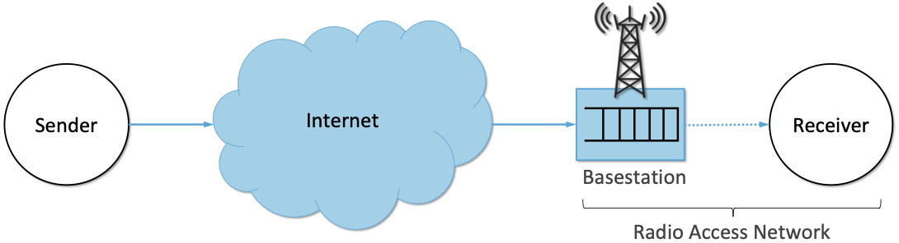

Chapter 7:  Beyond TCP
======================

As exploration of the design space for congestion control has
continued, a number of new algorithms and protocols have emerged.
These differ from what we've seen in earlier chapters mostly in that
they target specific use cases, rather than the arbitrarily complex
and heterogeneous network environments that TCP supports. The
exception may be QUIC, which started with the goal of improving HTTP
performance specifically, but has now developed into something of a
general TCP alternative.

This chapter is not exhaustive, but we instead survey a few specific
use cases. These include tuning TCP performance for data centers;
sending background traffic over an extended period of time using only
excess capacity; optimizing HTTP-based web traffic without being
backward-compatible with TCP; supporting real-time streaming in a way
that is TCP-friendly; and accommodating mobile cellular networks with
unique radio-induced behavior.

7.1 Data Centers (DCTCP)
---------------------------

There have been several efforts to optimize TCP for cloud data
centers, where *Data Center TCP* was one of the first. There are
several aspects of the data center environment that warrant an
approach that differs from more traditional TCP. These include:

* Round trip time for intra-DC traffic are small;
  
* Buffers in data center switches are also typically small;
  
* All the switches are under common administrative control, and thus
  can be required to meet certain standards;
  
* A great deal of traffic has low latency requirements;
  
* That traffic competes with high bandwidth flows.

It should be noted that DCTCP is not just a version of TCP, but
rather, a system design that changes both the switch behavior and the
end host response to congestion information received from switches.

The central insight in DCTCP is that using loss as the main signal of
congestion in the data center environment is insufficient. By the time a queue
has built up enough to overflow, low latency traffic is already failing
to meet its deadlines, negatively impacting performance. Thus DCTCP
uses a version of ECN to provide an early signal of congestion. But
whereas the original design of ECN treated an ECN marking much like a
dropped packet, and cut the congestion window in half, DCTCP takes a
more finely-tuned approach. DCTCP tries to estimate the fraction
of bytes that are encountering congestion rather than making the simple
binary decision that congestion is present. It then scales
the congestion window based on this estimate. The standard TCP algorithm
still kicks in should a packet actually be lost. The approach is
designed to keep queues short by reacting early to congestion while
not over-reacting to the point that they run empty and sacrifice
throughput. 

The key challenge in this approach is to estimate the fraction of bytes
encountering congestion. Each switch is simple. If a packet arrives and
the switch sees the queue length (K) is above some threshold; e.g.,

.. math:: \mathsf{K} > \mathsf{(RTT × C)\ /\ 7}

where C is the link rate in packets per second, then the switch sets the
CE bit in the IP header. The complexity of RED is not required.

The receiver then maintains a boolean variable for every flow, which
we’ll denote ``DCTCP.CE``, and sets it initially to false. When sending
an ACK, the receiver sets the ECE (Echo Congestion Experienced) flag
in the TCP header if and only if ``DCTCP.CE`` is true. It also
implements the following state machine in response to every received
packet:

-  If the CE bit is set and ``DCTCP.CE=False``, set ``DCTCP.CE`` to True and
   send an immediate ACK.

-  If the CE bit is not set and ``DCTCP.CE=True``, set ``DCTCP.CE`` to False
   and send an immediate ACK.

-  Otherwise, ignore the CE bit.

The non-obvious consequence of the “otherwise” case is that the
receiver continues to send delayed ACKs once every *n* packets, as
long as a stream of packets with a constant CE value is
received. Delayed ACKs have proven important to maintaining high
performance.

At the end of each observation window (a period usually chosen to be
approximately the RTT), the sender computes the fraction of bytes that
encountered congestion during that window as the
ratio of the bytes marked with CE to total bytes transmitted. DCTCP
grows the congestion window in exactly the 
same way as the standard algorithm, but it reduces the window in
proportion to how many bytes encountered congestion during the last
observation window.

Specifically, a new variable called ``DCTCP.Alpha`` is initialized to
1 and updated at the end of the observation window as follows:

.. math:: \mathsf{DCTCP.Alpha} = \mathsf{DCTCP.Alpha × (1 - g) + g × M}

``M`` is the faction of bytes marked, and ``g`` is the estimation gain, a
constant (set by the implementation) that determines how rapidly
``DCTCP.Alpha`` changes in response to marking of packets. When there
is sustained congestion, ``DCTCP.Alpha`` approaches 1, and when there
is sustained lack of congestion, ``DCTCP.Alpha`` decays to zero. This
causes gentle reaction to newly arrived congestion and more severe
reaction to sustained congestion, as the congestion window is calculated
as follows:

.. math:: \mathsf{CongestionWindow} = \mathsf{CongestionWindow × (1 - DCTCP.Alpha\ /\ 2)}

To summarize, CE marking to indicate incipient congestion happens
early and often, but the reaction to such marking is more measured
than in standard TCP, to avoid the over-reaction that would lead to
queues running empty.

The paper that lays out all the arguments for DCTCP including a study
of the data center traffic characteristics that motivated its design
is a "test of time" award winner from SIGCOMM.

.. _reading_dctcp:
.. admonition::  Further Reading

   Alizadeh, M., et al. `Data
   Center TCP (DCTCP)
   <http://dl.acm.org/citation.cfm?doid=1851182.1851192>`__.  
   ACM SIGCOMM, August 2010.

7.2 Background Transport (LEDBAT)
----------------------------------

In sharp contrast to low-latency data center environments, there are
many applications that need to transfer a large amount of data over an
extended period of time. File-sharing protocols such as BitTorrent and
software-updates are two examples. LEDBAT (Low Extra Delay Background
Transport) is targeted at these applications.

One of the common themes among various efforts to improve TCP's
congestion control algorithm has been the idea of co-existence with
standard TCP. It is well-known that an algorithm could "outperform"
TCP by simply being more aggressive in its response to
congestion. Hence, there is an implicit assumption that new congestion
control algorithms should be evaluated alongside standard TCP to ensure
they are not just stealing bandwidth from less aggressive TCP
implementations.

LEDBAT takes this idea in a the opposite direction by creating a
congestion control protocol that is purposely *less* aggressive than
TCP. The idea is to take advantage of bandwidth that is available when
links are uncongested, but to quickly back off and leave the bandwidth
free for other, standard flows when they arrive. In addition, as the
name suggests, LEDBAT tries not to create significant queuing delays,
unlike the typical behavior of TCP when filling a bottleneck link.

Like TCP Vegas, LEDBAT aims to detect the onset of congestion before
it is severe enough to cause loss. However, LEDBAT takes a different
approach to making this determination, using one-way measurements of delay as
the primary input to the process. This is a relatively novel approach
that makes sense in an era where reasonably accurate but not perfectly
synchronized clocks are assumed to be the norm.

To calculate one-way delay, the sender puts a timestamp in each
transmitted packet, and the receiver compares this against local
system time to measure the delay experienced by the packet. It then
sends this calculated value back to the sender. Even though the clocks
are not precisely synchronized, *changes* in this delay can be used to
infer the buildup of queues. It is assumed that the clocks do not have
large relative "skew", i.e., their relative offset does not change too quickly, which
is a reasonable assumption in practice.

The sender monitors the measured delay, and estimates the fixed
component (which would be due to speed of light and other fixed
delays) to be the lowest value seen over a certain (configurable) time
interval. Estimates from the more distant past are eliminated
to allow for the possibility of a new routing path changing the fixed delay.  Any delay larger than this 
minimum is assumed to be due to queuing delay.

Having established a "base" delay, the sender subtracts this from the
measured delay to obtain the queuing delay, and optionally uses a
filtering algorithm to reduce short-term noise in the estimate. This
estimated queuing delay is then compared to a target delay. When the delay is below target, the
congestion window is allowed to grow, and when the delay is above
target, the congestion window is reduced, with the rate of growth and
decrease being proportional to the distance from the target. The
growth rate is capped to be no faster than the growth of standard
TCP's window in its additive increase phase. 

LEDBAT's algorithm for setting ``CongestionWindow`` when an
ACK is received can be summarized as follows:

.. math:: \mathsf{CongestionWindow}\  = \mathsf{CongestionWindow + (GAIN × off\_target × bytes\_newly\_acked × MSS / CongestionWindow)}

where ``GAIN`` is a configuration parameter between 0 and 1, off\_target is
the gap between the measured queuing delay and the target, expressed
as a fraction of the target, and bytes\_newly\_acked is the number of
bytes acknowledged in the current ACK. Thus, the congestion window
grows more quickly the further the measured delay is below the target, but never
faster one ``MSS`` per RTT. And it falls faster in proportion to how far the queue length is
above the target. ``CongestionWindow`` is also reduced in response to losses,
timeouts, and long idle periods, much like with TCP.

Hence, LEDBAT can do a good job of using available bandwidth that is
free, but avoids creating long standing queues, as it aims to keep the
delay around the target (which is a configurable number, suggested to
be on the order of 100 ms). If other traffic starts to compete with
LEDBAT traffic, LEDBAT will back off as it aims to prevent the queue getting
longer. 

LEDBAT is defined as an experimental protocol by the IETF, and allows
a considerable degree of implementation flexibility such as the choice
of filtering on delay estimates and a range of configuration
parameters. Further details can be found in the RFC.

.. _reading_ledbat:
.. admonition::  Further Reading

   Shalunov, S., et al. `Low Extra Delay Background Transport (LEDBAT)
   <https://www.rfc-editor.org/info/rfc6817>`__.  
   RFC 6817, December 2012.

.. for another day
   7.3 Public Cloud (OnRamp)
   -------------------------

.. On-Ramp focuses on yet another part of the design space: transient
   congestion in public clouds. Again, a different set of constraints
   leads to a different point in the design space.   

7.3 HTTP Performance (QUIC)
---------------------------

HTTP has been around since the invention of the World Wide Web in the
1990s and from its inception it has run over TCP. HTTP/1.0, the
original version, had quite a number of performance problems due to
the way it used TCP, such as the fact that every request for an object
required a new TCP connection to be set up and then closed after the
reply was returned. HTTP/1.1 was proposed at an early stage to make
better use of TCP. TCP continued to be the protocol used by HTTP for
another twenty-plus years.

In fact, TCP continued to be problematic as a protocol to support the
Web, especially because a reliable, ordered byte stream isn't exactly
the right model for Web traffic. In particular, since most web pages
contain many objects, it makes sense to be able to request many
objects in parallel, but TCP only provides a single byte stream. If
one packet is lost, TCP waits for its retransmission and successful
delivery before continuing, while HTTP would have been happy to receive
other objects that were not affected by that single lost
packet. Opening multiple TCP connections would appear to be a solution to this,
but that has its own set of drawbacks including a lack of shared
information about congestion across connections.

Other factors such as the rise of high-latency
wireless networks, the availability of multiple networks for a single
device (e.g., Wi-Fi and cellular), and the increasing use of
encrypted, authenticated connections on the Web also contributed to
the realization that the transport layer for HTTP would benefit from a
new approach. The protocol that emerged to fill this need was QUIC.

QUIC originated at Google in 2012 and was subsequently developed as a
proposed standard at the IETF. It has already seen a solid amount
of deployment (in most Web browsers and quite a number of popular Web
sites). Deployability was a key consideration for the designers of the
protocol. There are a lot of moving parts to QUIC—its specification
spans three RFCs of several hundred pages—but we focus here on its
approach to congestion control, which embraces many of the ideas we
have seen to date in this book.

Like TCP, QUIC builds congestion control into the transport, but it
does so in a way that recognizes that there is no single perfect
congestion control algorithm. Instead, there is an assumption that
different senders may use different algorithms. The baseline algorithm
in the QUIC specification is similar to TCP NewReno, but a sender can
unilaterally choose a different algorithm to use, such as CUBIC. QUIC
provides all the machinery to detect lost packets in support of
various congestion control algorithms. 

A number of design features of QUIC make the detection of loss and
congestion more robust than in TCP. For example, whereas TCP uses the
same sequence number for a packet whether it is being sent for the
first time or retransmitted, QUIC sequence numbers (called packet
numbers) are strictly increasing. A higher packet number signifies
that the packet was sent later, and a lower packet number signifies
that the packet was sent earlier. This means that it is always
possible to distinguish between a packet that has been transmitted for
the first time and one that has been retransmitted due to a loss or
timeout.

Note also that whereas TCP sequence numbers refer to bytes in the
transmitted byte stream, QUIC packet numbers refer to entire
packets. The packet number space for QUIC is large enough to avoid
wraparound issues (up to 2^62 - 1).

QUIC builds selective acknowledgments into the protocol, with support
for more than the three ranges of packets that can be acknowledged in
the TCP SACK option. This improves performance in high loss
environments, enabling forward progress to be made as long as some
packets are getting received successfully.

QUIC adopts a more robust approach to determining
packet loss than the duplicate ACKs on which TCP Fast Recovery relies. The approach was
developed independent of QUIC under the name RACK-TLP: Recent
Acknowledgments and Tail Loss Probes. A key insight is that
duplicate ACKs fail to trigger loss recovery when the sender doesn't
send enough data after the lost packet to trigger the duplicate ACKs,
or when retransmitted packets are themselves lost. Conversely, packet
reordering may also trigger fast recovery when in fact no packets have
been lost. QUIC takes the ideas of RACK-TLP to address this by using a
pair of mechanisms:

- A packet is considered lost if a packet with a higher number has
  been acknowledged, and the packet was sent "long enough in the
  past" or K packets before the acknowledged packet (K is a
  parameter).

- Probe packets are sent after waiting a "probe timeout interval" for an ACK to
  arrive, in an effort to trigger an ACK that will provide information
  about lost packets.

The first bullet ensures that modest amounts of packet reordering
are not interpreted as loss events. K is recommended to be initially
set to 3, but can be updated if there is evidence of greater
misordering. And the definition of "long enough in the past" is a
little more than the measured RTT.

The second bullet ensures that, even if
duplicate ACKs are not generated by data packets,  probe
packets are sent to elicit further ACKs, thus exposing gaps in the
received packet stream. The "probe timeout
interval" is calculated to be just long enough to account for all the
delays that an ACK might have encountered, using both the estimated RTT
and an estimate of its variance. 

QUIC is a most interesting development in the world of transport
protocols. Many of the limitations of TCP have been known for decades,
but QUIC represents one of the most successful efforts to date to
stake out a different point in the design space. It has also 
built in decades worth of experience refining TCP congestion control
into the baseline specification. Because QUIC was
inspired by experience with HTTP and the Web—which arose long after
TCP was well established in the Internet—it presents a fascinating
case study in the unforeseen consequences of layered designs and in
the evolution of the Internet. There is a lot more to it that we can
cover here. The definitive reference for QUIC is RFC 9000, but
congestion control is covered in the separate RFC 9002.

.. _reading_quic:
.. admonition::  Further Reading

   Iyengar, J.  and Swett, I., Eds.
   `QUIC Loss Detection and Congestion Control
   <https://www.rfc-editor.org/info/rfc9002>`__.  
   RFC 9002, May 2021.

7.4 TCP-Friendly Protocols (TFRC)
---------------------------------

As noted at various points throughout this book, it is easy to make
transport protocols that out-perform TCP, since TCP in all its forms
backs off when it detects congestion. Any protocol which does *not*
respond to congestion with a reduction in sending rate will eventually
get a bigger share of the bottleneck link than any TCP or TCP-like
traffic that it competes against. In the limit, this would likely lead
back to the congestion collapse that was starting to become common
when TCP congestion control was first developed. Hence, there is a
strong interest in making sure that the vast majority of traffic on
the Internet is in some sense "TCP-friendly".

When we use the term "TCP-friendly" we are saying that we expect a
similar congestion response to that of TCP. LEDBAT could be considered
"more than TCP-friendly" in the sense that it backs off even more
aggressively to congestion than TCP by reducing its window size at the
first hint of delay. But there is a class of applications for which
being TCP-friendly requires a bit more thought because they do not use
a window-based congestion scheme. These are typically "real time"
applications involving streaming multimedia.

Multimedia applications such as video streaming and telephony can
adjust their sending rate by changing coding parameters, with a
trade-off between bandwidth and quality. However, they cannot suddenly
reduce sending rate by a large amount without a perceptible impact on
the quality, and they generally need to choose among a finite set of
quality levels. These considerations lead to rate-based approaches
rather than window-based, as discussed in Section 3.1.

The approach to TCP-friendliness for these applications is to try to
pick a sending rate similar to that which would be achieved by TCP
under similar conditions, but to do so in a way that keeps the rate
from fluctuating too wildly. Underpinning this idea is a body of
research going back many years on modeling the throughput of TCP. A
simplified version of the TCP throughput equation is given in RFC 5348
which defines the standard for TFRC. With a few variables set to
recommended values, the equation for target transmit rate X in
bits/sec is:

.. math::

   \mathsf{X} = \frac{s}{R\times\sqrt{2p/3} + 12\sqrt{3p/8}\times p
   \times (1 + 32 p^2)}

Where:

- *s* is the segment size (excluding IP and transport headers);
- *R* is the RTT in seconds;
- *p* is the number of "loss events" as a fraction of packets
  transmitted.

While the derivation of this formula is interesting in its own right
(see the second reference below),
the key idea here is that we have a pretty good idea of how much
bandwidth a TCP connection will be able to deliver if we know the RTT
and the loss rate of the path. So TFRC tries to steer applications
that cannot implement a window-based congestion control algorithm to
arrive at the same throughput as TCP would under the same conditions.

The only issues remaining to be addressed are the measurement of *p*
and *R*, and then deciding how the application should respond to
changes in *X*. Like some of the other protocols we have seen, TFRC
uses timestamps to measure RTT more accurately than TCP
originally did. Packet sequence numbers are used to determine packet
loss at the receiver, with consecutive losses grouped into a single
loss event. From this information the loss event rate *p* can be
calculated at the receiver who then reflects it back to the sender.

Exactly how the application responds to a change in rate will of
course depend on the application. The basic idea would be that an
application can choose among a set of coding rates, and it picks the
highest quality that can be accommodated with the rate that TFRC
dictates. 

While the concept of TFRC is solid, it has had limited deployment for
a number of reasons. One is that a simpler solution for some types of
streaming traffic emerged in the form of *DASH (Dynamic Adaptive
Streaming over HTTP)*. DASH is only suitable for non-real-time media
(e.g. watching movies) but that turns out to be a large percentage of
the media traffic that runs across the Internet—in fact, it is a large
percentage of *all* Internet traffic.

DASH lets TCP (or potentially QUIC) take care
of congestion control; the application measures the
throughput that TCP is delivering, then adjusts the quality of the
video stream accordingly to avoid starvation at the receiver. This
approach has proven to be suitable for video entertainment, but since
it depends on a moderately large amount of buffering at the receiver
to smooth out the fluctuations in TCP throughput, it is not really
suitable for interactive audio or video. One of the key realizations
that made DASH feasible was the idea that one could encode video at
multiple quality levels with different bandwidth requirements, and
store them all in advance on a streaming server. Then, as soon as the observed
throughput of the network drops, the server can drop to a lower
quality stream, and then ramp up to higher quality as conditions
permit. The client can send information back to the server, such as
how much buffered video it still has awaiting playback, to help the
server choose a suitable quality and bandwidth stream. The cost of
this approach is additional media storage on the server, but that cost
has become rather unimportant in the modern streaming video era.

Another limitation of TFRC as defined is that it uses loss as its
primary signal of congestion but does not respond to the delay that
precedes loss. While this was the state of the art when work on TFRC
was undertaken, the field of TCP congestion control has now moved on
to take delay into account, as in the case of TCP Vegas and BBR (see
Chapter 5). And this is particularly problematic when you consider
that the class of multimedia applications that really need something
other than DASH are precisely those applications for which delay is
important. For this reason, work continues at the time of writing to
define standards for TCP-friendly congestion control for real-time
traffic. The IETF RMCAT (RTP Media Congestion Avoidance Techniques)
working group is the home of this work. The specification of TFRC
below therefore is not the final work, but gives useful background on
how one might go about implementing a TCP-friendly
protocol.

.. _reading_tfrc:
.. admonition::  Further Reading

   Floyd, S., Handley, M., Padhye, J. and Widmer, J.
   `TCP Friendly Rate Control (TFRC): Protocol Specification
   <https://www.rfc-editor.org/info/rfc5348>`__.  
   RFC 5348, September 2008.

   
.. _reading_tcpeq:
.. admonition::  Further Reading

   Padhye, J., Firoiu, V., Towsley, D. and Kurose, J.
   `Modeling TCP Throughput: A Simple Model and its Empirical Validation
   <https://conferences.sigcomm.org/sigcomm/1998/tp/paper25.pdf>`__.  
   ACM SIGCOMM, September 1998.

   
7.5 Mobile Cellular Networks
----------------------------

We conclude with a look at a use case that continues to attract
significant attention from the research community: the interplay
between congestion control and the mobile cellular network.
Historically, the TCP/IP Internet and the mobile cellular network
evolved independently, with the latter serving as the "last mile" for
end-to-end TCP connections since the introduction of broadband service
with 3G. With the rollout of 5G now ramping up, we can expect the
mobile network will play an increasingly important role in providing
Internet connectivity, putting increased focus on how it impacts
congestion control.

While a mobile wireless connection could be viewed as no different
than any other hop along an end-to-end path through the Internet, for
historical reasons hinted at in the previous paragraph, it has been
treated as a special case, with the end-to-end path logically divided
into the two segments depicted in :numref:`Figure %s <fig-mobile>`:
the wired segment through the Internet and the wireless last-hop over
the Radio Access Network (RAN). This "special case" perspective is
warranted because (1) the wireless link is typically the bottleneck
due to the scarcity of radio spectrum, and (2) the bandwidth available
in the RAN can be highly variable due to a combination of device
mobility and radio interference.
   
.. _fig-mobile:

   End-to-end path that includes a last-hop wireless link, where the
   basestation buffers packets awaiting transmission over the Radio
   Access Network (RAN).

Although the internals of the RAN are largely closed and proprietary,
researchers have experimentally observed that there is significant
buffering at the edge, presumably to absorb the expected contention
for the radio link, and yet keep sufficient work "close by" for
whenever capacity does open up. As noted by Haiqing Jiang and
colleagues in their 2012 CellNet workshop paper, this large buffer is
problematic for TCP congestion control because it causes the sender to
overshoot the actual bandwidth available on the radio link, and in the
process, introduces significant delay and jitter. Jim Gettys has
named this phenomenon *bufferbloat*, and mobile basestations are just
one example of where it has a noticeable impact.

.. _reading_bloat:
.. admonition::  Further Reading

   H. Jiang, Z. Liu, Y. Wang, K. Lee and I. Rhee.
   `Understanding Bufferbloat in Cellular Networks
   <https://conferences.sigcomm.org/sigcomm/2012/paper/cellnet/p1.pdf>`__
   ACM SIGCOMM Workshop on Cellular Networks, August 2012. 

   J. Gettys. `Bufferbloat: Dark Buffers in the Internet
   <https://ieeexplore.ieee.org/document/5755608>`__. IEEE
   Explorer, April 2011.

The Jiang paper suggests possible solutions, and generally observes
that delay-based approaches like Vegas outperform loss-based
approaches like Reno or CUBIC, but the problem has remained largely
unresolved for nearly a decade. With the promise of open source
software-based implementations of the RAN now on the horizon (see our
companion 5G and SDN books for more details), it might soon be
possible to take a cross-layer approach, whereby the RAN provides an
interface that give higher layers of the protocol stack (e.g., the AQM
mechanisms described in Chapter 6) visibility into what goes on inside
the basestation. Recent research by Xie, Yi, and Jamieson suggests
such an approach might prove effective, although their implementation
uses end-device feedback instead of having the RAN directly involved.
How ever it's implemented, the idea is to have the receiver explicitly
tell the sender how much bandwidth is available on the last hop, with
the sender then having to judge whether the last-hop—or some other
point along the Internet segment—is the actual bottleneck.

.. _reading_ran:
.. admonition::  Further Reading

   Y. Xie, F. Yi, and K. Jamieson. `PBE-CC: Congestion Control via
   Endpoint-Centric, Physical-Layer Bandwidth Measurements
   <https://arxiv.org/abs/2002.03475>`__. SIGCOMM 2020.

   L. Peterson and O. Sunay. `5G Mobile Networks: A Systems Approach
   <https://5G.systemsapproach.org>`__.  January 2020.
   
   L. Peterson, C. Cascone, B. O'Connor, T. Vachuska, and
   and B. Davie. `Software-Defined Networks: A Systems Approach
   <https://sdn.systemsapproach.org>`__.  November 2021.

The other aspect of cellular networks that makes them a novel
challenge for TCP congestion control is that the bandwidth of a link,
as seen by a TCP flow traversing it, is not constant. As noted by the
BBR authors, the scheduler for a wireless link can use the number of
queued packets for a given client as an input to its scheduling
algorithm, and hence the "reward" for building up a queue can be an
increase in bandwidth provided by the scheduler. BBR has attempted to
address this in its design by ensuring that it is aggressive enough to
queue at least some packets in the buffers of wireless links.

Past research inquiries aside, it's interesting to ask if the wireless
link will remain all that unique going forward. If you take a
compartmentalized view of the world, and you're a mobile network
operator, then your goal has historically been to maximize utilization
of the scarce radio spectrum under widely varying conditions. Keeping
the offered workload as high as possible, with deep queues, is a
proven way to do that. This certainly made sense when broadband
connectivity was the new service and voice/text were the dominate use
cases, but today 5G is all about delivering good TCP performance. The
focus should be on end-to-end goodput and maximizing the
throughput/latency ratio (i.e., the power curve discussed in Section
3.2). But will there be an opportunity for improvement?

We believe the answer to this question is yes. In addition to
providing more visibility into the RAN scheduler and queues mentioned
earlier, three other factors have the potential to change the
equation. First, 5G deployments will likely support *network slicing*,
a mechanism that isolates different traffic classes. This means each
slice has its own queue, where these queues can be sized and scheduled
in different ways. Second, the proliferation of *small cells* will
likely reduce the number of flows competing for bandwidth at a given
basestation. Third, it will become increasingly common for
5G-connected devices to be served from a nearby edge cloud. This means
end-to-end TCP connections will have much shorter round-trip times,
which will make the congestion control algorithm more responsive to
changes in the available capacity in the RAN. There are no guarantees,
of course, but all of this is to say that we can expect ample
opportunities to tweak congestion control algorithms well into the
future.
